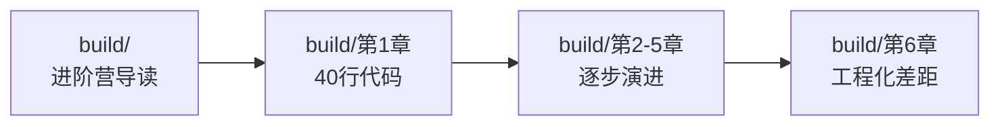

# 第 0 章：开始之前

> 目标：用 5 分钟判断"这套教程适合我吗？"，并做好最小准备。

## 0.1 先看看最终效果

在投入时间学习之前，先看看你将能做出什么。

### 效果演示

一个运行中的 nanobot 是这样的：

```text
用户：今天北京天气怎么样？
Bot：让我查一下... [调用 weather skill]
Bot：北京今天多云，温度 15°C，空气质量良好。

用户：1000 美元等于多少人民币？
Bot：让我查询最新汇率... [调用 exchange-rate skill]
Bot：根据当前汇率，1000 美元约等于 7,234 人民币（数据来源：ExchangeRate-API）

用户：帮我总结一下今天的新闻
Bot：[自动搜索最新新闻并生成摘要]
```

**关键特点：**
- ✅ 能在 Telegram/Discord 等平台上工作
- ✅ 可以用 Markdown 定制性格和行为规则
- ✅ 能执行命令、查询数据、读写文件
- ✅ 可以动态学习新技能（Skill 系统）
- ✅ 有长期记忆，能记住你的偏好

> **视频演示占位**：[📺 观看 2 分钟演示视频](# "TODO: 添加演示视频链接")

## 0.2 这套教程适合我吗？

### 三种典型用户

根据你的目标和背景，选择对应的路径：

#### 🎯 类型 A：我只想用 nanobot

**你的画像：**
- 会用命令行（知道怎么 `cd` 到目录、运行命令）
- 能编辑文本文件（JSON、Markdown）
- 有一个 LLM API Key（OpenAI、Claude、或国内的 DeepSeek 等）
- 目标：快速做出一个能用的 Bot，部署到 Telegram

**推荐路径：**


**预计时间：** 2-3 小时

---

#### 🎯 类型 B：我想理解 nanobot 的设计

**你的画像：**
- 有一定编程基础（任何语言都行）
- 想理解 AI Agent 的架构设计
- 好奇"为什么这样设计"
- 目标：理解 Skill、Memory、MessageBus 等核心概念

**推荐路径：**


**预计时间：** 1-2 天

---

#### 🎯 类型 C：我要从零写一个 Agent 框架

**你的画像：**
- 熟悉 Python（异步编程、类设计）
- 想深入理解 ReAct Loop、工具调用、上下文管理
- 目标：手写一个教学版 Agent，理解工程化差距

**推荐路径：**


**预计时间：** 3-5 天

---

### 如果你不确定自己是哪类用户

做这个快速测试：

1. **你是否能独立安装 Python 包？**
   - ✅ 能 → 继续
   - ❌ 不能 → 建议先学习 Python 基础

2. **你是否有一个可用的 LLM API Key？**
   - ✅ 有 → 继续
   - ❌ 没有 → 先去 [OpenRouter](https://openrouter.ai/keys) 注册一个（支持多种模型，按使用付费）

3. **你的目标是什么？**
   - 🎯 "我想快速做出一个 Telegram Bot" → 类型 A
   - 🎯 "我想理解 AI Agent 的架构设计" → 类型 B
   - 🎯 "我想自己实现一个 Agent 框架" → 类型 C

## 0.3 最小前置条件检查

在开始第 1 章之前，请确认以下条件：

### 必须满足（否则第 1 章会卡住）

- [ ] **Python 版本 >= 3.11**
  ```bash
  python3 --version
  # 应该输出：Python 3.11.x 或更高
  ```

- [ ] **能创建虚拟环境**
  ```bash
  python3 -m venv test_venv
  # 如果报错 "No module named venv"
  # Ubuntu/Debian: sudo apt install python3-venv
  # macOS: 通常自带
  # Windows: 重新安装 Python 时勾选 "pip"
  ```

- [ ] **有一个 LLM API Key**
  - OpenAI / Claude / DeepSeek / 智谱 / 通义千问 等任意一个
  - 或使用 [OpenRouter](https://openrouter.ai/keys)（聚合多家模型）
  - 💡 第一次建议用 OpenRouter，配置最简单

- [ ] **知道你的模型名称**
  - 不是 "GPT-4"，而是 provider 控制台里能直接调用的完整名称
  - 例如 OpenRouter 是 `openai/gpt-4-turbo`
  - 例如 DeepSeek 是 `deepseek-chat`

### 推荐满足（否则某些功能受限）

- [ ] **命令行工具可用**
  ```bash
  # 检查是否已安装
  which curl    # HTTP 请求工具（很多 Skill 需要）
  which git     # 版本控制（如果要用 github skill）
  ```

- [ ] **如果要部署到 Telegram**
  - 已创建 Telegram Bot（通过 @BotFather）
  - 拿到了 Bot Token（类似 `123456:ABC-DEF...`）
  - 知道自己的 Telegram 数字用户 ID（不是用户名）
    - 获取方式：给 @userinfobot 发消息

## 0.4 快速诊断脚本

如果你不确定环境是否准备好，运行这个诊断脚本：

```bash
# 下载诊断脚本（未来提供）
# curl -fsSL https://raw.githubusercontent.com/HKUDS/nanobot/main/scripts/check-env.sh | bash

# 或手动检查：
echo "=== 环境检查 ==="
python3 --version
python3 -m pip --version
python3 -c "import sys; print(f'Python {sys.version_info.major}.{sys.version_info.minor}')"
which curl
which git
echo "✓ 基础环境检查完成"
```

**预期输出：**
```
=== 环境检查 ===
Python 3.11.5
pip 23.x.x from ...
Python 3.11
/usr/bin/curl
/usr/bin/git
✓ 基础环境检查完成
```

如果某个命令报错，记下是哪一项，然后查看 [附录：环境预检](appendix-environment-precheck.md) 的对应部分。

## 0.5 API Key 准备清单

这是最容易出问题的环节，提前确认可以省很多时间：

### ✅ 检查清单

- [ ] **我有一个有效的 API Key**
  - 不是过期的、不是余额为 0 的
  
- [ ] **我知道这个 Key 属于哪个 provider**
  - OpenAI？Claude/Anthropic？DeepSeek？OpenRouter？
  
- [ ] **我知道这个 provider 支持的模型名称**
  - 去 provider 的文档或控制台确认
  - 例如 OpenRouter：https://openrouter.ai/models
  
- [ ] **我已经测试过这个 Key 能正常调用**
  - 可以用官方的 API 测试工具试一次
  - 或者用简单的 `curl` 命令验证

### 💡 第一次推荐配置

如果你还在纠结用哪个 provider，第一次建议这样：

| 选项 | 推荐原因 | 注意事项 |
|------|---------|---------|
| **OpenRouter** | 支持几十种模型，按用量付费，配置最简单 | 需要充值少量美金 |
| **DeepSeek** | 国内访问快，价格便宜，中文支持好 | 需要实名认证 |
| **Ollama（本地）** | 完全免费，数据不出本地 | 需要较好的硬件（16GB+ 内存） |

## 0.6 常见"开始前"问题

### Q1：我没有信用卡，能用 nanobot 吗？

**能。** 有几个选择：
- 使用国内的 DeepSeek / 智谱 / 通义千问（支持支付宝/微信）
- 使用本地模型（Ollama + Llama3 等）
- 使用 OpenRouter 的试用额度（新用户有少量免费额度）

### Q2：我完全不懂 Python，能学这个教程吗？

**不建议。** 这个教程假设你：
- 知道怎么用命令行运行 Python 脚本
- 能看懂基本的 Python 代码（函数、类、变量）
- 能编辑 JSON 和 Markdown 文件

如果这些都不会，建议先学 1-2 天 Python 基础，再回来。

### Q3：我需要了解机器学习或 AI 原理吗？

**不需要。** 这个教程是"使用 LLM API"，不是"训练 LLM"。你只需要：
- 理解"发送消息给 AI，AI 返回回复"这个流程
- 不需要懂 Transformer、反向传播、梯度下降

### Q4：Windows 用户能跟着做吗？

**能。** 大部分命令在 Windows 上也能工作，但有几点注意：
- 路径分隔符是 `\` 而不是 `/`
- 虚拟环境激活命令是 `.venv\Scripts\activate`
- 建议使用 PowerShell 或 Git Bash，而不是 CMD

## 0.7 如果你卡住了

### 三个救命稻草

1. **附录：环境预检** → 专门排查"还没开始就卡住"的问题
2. **附录：常见坑与排障** → 按症状查解决方案
3. **GitHub Issues** → 搜索或提问

### 最高效的提问方式

如果要提 issue 或求助，请提供：

```markdown
**我的环境：**
- OS: macOS 13.5 / Ubuntu 22.04 / Windows 11
- Python: 3.11.5
- nanobot: 0.x.y

**我在做什么：**
（第几章、第几步、什么命令）

**出现了什么错误：**
（完整的错误信息，不要截图）

**我已经尝试过：**
（你已经试过的解决方案）
```

---

## 0.8 准备好了？开始吧

如果上面的检查清单都通过了，你现在可以：

👉 **类型 A 用户**：直接去 [第 1 章：5 分钟跑起来](01-quick-start.md)

👉 **类型 B 用户**：先读 [第 1-3 章](01-quick-start.md)，再去 [进阶营](build/README.md)

👉 **类型 C 用户**：直接去 [进阶营导读](build/README.md)

---

**如果你还有疑问：**
- 不确定环境是否准备好 → 先看 [附录：环境预检](appendix-environment-precheck.md)
- 不确定该走哪条路线 → 先走类型 A 的路线，做完第 1-3 章再决定
