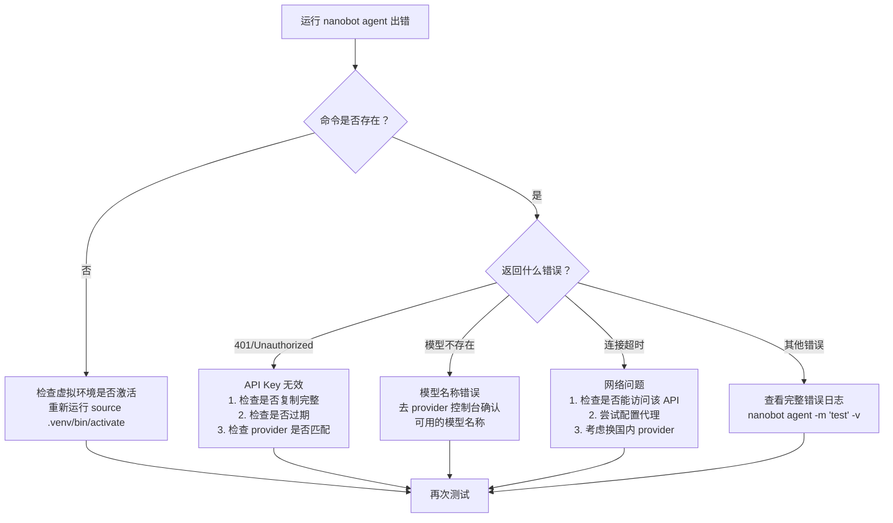
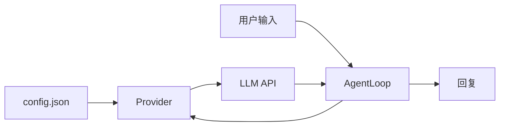

# 第 1 章：5 分钟看到效果

> 目标：让 nanobot 跑起来，看到第一次正常回复。

> 💡 **如果你还没做环境检查**，强烈建议先看 [第 0 章：开始之前](00-before-you-start.md)。提前 3 分钟排查环境问题，可以省掉后面 30 分钟的排错时间。

---

## 1.1 最快路线：一键开始（推荐首次使用）

如果你只想快速看到效果，不想理解每个配置的含义，直接用交互式向导：

```bash
# 第一步：创建工作目录
mkdir nanobot-demo && cd nanobot-demo

# 第二步：创建虚拟环境
python3 -m venv .venv
source .venv/bin/activate  # Windows: .venv\Scripts\activate

# 第三步：安装
pip install nanobot-ai

# 第四步：交互式初始化（会引导你完成所有配置）
nanobot onboard --wizard
```

**`--wizard` 会做什么：**
1. ✅ 引导你选择 provider（OpenRouter / OpenAI / DeepSeek / Ollama 等）
2. ✅ 引导你输入 API Key
3. ✅ 引导你选择模型
4. ✅ 自动创建配置文件和工作区
5. ✅ 验证配置是否可用

### ⚡ 立即验证

配置完成后，立即测试：

```bash
nanobot agent -m "你好，请用一句话介绍你自己"
```

**预期结果：**
```
你好，我是 nanobot，一个基于 LLM 的 AI 助手，可以帮助你完成各种任务。
```

✅ **如果看到了正常回复** → 恭喜！你已经成功了，可以跳到 [第 2 章](02-soul.md)

❌ **如果报错了** → 往下看"遇到问题了？"部分

---

## 1.2 标准路线：手动安装（理解每一步）

如果你想理解每个步骤在做什么，或者 `--wizard` 不适合你的环境，用这个路线。

### 步骤 1：安装 nanobot

```bash
# 推荐：在虚拟环境里安装
python3 -m venv .venv
source .venv/bin/activate  # Windows: .venv\Scripts\activate

# 升级 pip（避免安装问题）
python -m pip install -U pip

# 安装 nanobot
python -m pip install nanobot-ai
```

**验证安装：**
```bash
nanobot --version
# 应该输出：🐈 nanobot v0.x.y
```

<details>
<summary>📝 如果命令不存在，点击展开排查</summary>

**症状：** `nanobot: command not found`

**原因：** 安装目录不在 PATH 中

**解决方案：**
1. 确认虚拟环境已激活（命令行前面应该有 `(.venv)`）
2. 重新激活虚拟环境：`source .venv/bin/activate`
3. 如果还不行，用完整路径运行：`.venv/bin/nanobot --version`

</details>

<details>
<summary>🔧 其他安装方式</summary>

**从源码安装（方便看代码）：**
```bash
git clone https://github.com/HKUDS/nanobot.git
cd nanobot
pip install -e .
```

**用 uv 安装（如果你已经装了 uv）：**
```bash
uv tool install nanobot-ai
```

</details>

---

### 步骤 2：初始化工作区

```bash
nanobot onboard
```

**这一步做了什么：**
1. 创建配置文件：`~/.nanobot/config.json`
2. 创建工作区：`~/.nanobot/workspace/`
3. 从模板复制必要文件：`SOUL.md`、`AGENTS.md`、`USER.md`、`TOOLS.md`

**预期输出：**
```
✓ Created config at ~/.nanobot/config.json
✓ Created workspace at ~/.nanobot/workspace

🐈 nanobot is ready!

Next steps:
  1. Add your API key to ~/.nanobot/config.json
  2. Chat: nanobot agent -m "Hello!"
```

---

### 步骤 3：配置 API Key

现在需要编辑配置文件，告诉 nanobot 使用哪个 LLM。

**打开配置文件：**
```bash
# macOS/Linux
nano ~/.nanobot/config.json

# 或用你喜欢的编辑器
code ~/.nanobot/config.json  # VS Code
vim ~/.nanobot/config.json   # Vim
```

**填入你的配置：**

<details>
<summary>📌 配置示例：OpenRouter（推荐第一次使用）</summary>

```json
{
  "providers": {
    "openrouter": {
      "apiKey": "sk-or-v1-你的密钥"
    }
  },
  "agents": {
    "defaults": {
      "provider": "openrouter",
      "model": "openai/gpt-4-turbo"
    }
  }
}
```

**为什么推荐 OpenRouter：**
- ✅ 支持几十种模型（OpenAI、Claude、Llama 等）
- ✅ 按用量付费，不需要订阅
- ✅ 配置最简单，只需要一个 API Key
- ✅ 新用户有少量免费额度

**获取 API Key：** https://openrouter.ai/keys

</details>

<details>
<summary>📌 配置示例：DeepSeek（国内推荐）</summary>

```json
{
  "providers": {
    "deepseek": {
      "apiKey": "你的DeepSeek密钥"
    }
  },
  "agents": {
    "defaults": {
      "provider": "deepseek",
      "model": "deepseek-chat"
    }
  }
}
```

**获取 API Key：** https://platform.deepseek.com/

</details>

<details>
<summary>📌 配置示例：OpenAI</summary>

```json
{
  "providers": {
    "openai": {
      "apiKey": "sk-你的OpenAI密钥"
    }
  },
  "agents": {
    "defaults": {
      "provider": "openai",
      "model": "gpt-4-turbo"
    }
  }
}
```

**获取 API Key：** https://platform.openai.com/api-keys

</details>

<details>
<summary>📌 配置示例：Ollama（本地模型，免费）</summary>

```json
{
  "providers": {
    "ollama": {
      "apiBase": "http://localhost:11434"
    }
  },
  "agents": {
    "defaults": {
      "provider": "ollama",
      "model": "llama3"
    }
  }
}
```

**前提：** 你需要先安装并运行 Ollama
```bash
# 安装 Ollama（参考 https://ollama.ai）
# 下载模型
ollama pull llama3
# 启动 Ollama 服务（会在后台运行）
ollama serve
```

</details>

---

### 步骤 4：第一次对话

配置完成后，立即测试：

```bash
nanobot agent -m "你好，请用一句话介绍你自己"
```

**预期结果：**
```
你好，我是 nanobot，一个基于 LLM 的 AI 助手，可以帮助你完成各种任务。
```

或者进入交互模式（推荐）：
```bash
nanobot agent
```

交互模式下：
- 直接输入消息按回车发送
- 输入 `exit` 或按 `Ctrl+C` 退出

---

## 1.3 遇到问题了？快速诊断

如果第一次对话没有成功，用这个决策树快速定位问题：



### 常见错误速查表

| 症状 | 原因 | 解决方案 |
|------|------|---------|
| `nanobot: command not found` | PATH 问题 | 重新激活虚拟环境 |
| `401 Unauthorized` | API Key 无效 | 检查 config.json 中的 apiKey |
| `Model not found` | 模型名称错误 | 去 provider 文档确认正确的模型名 |
| `Connection timeout` | 网络问题 | 检查网络或换 provider |
| `No module named 'nanobot'` | 安装失败 | 重新运行 `pip install nanobot-ai` |

### 深度排查

如果上面的快速方案都不行，用详细日志模式运行：

```bash
# 启用详细日志
nanobot agent -m "test" --verbose

# 或者设置环境变量
export NANOBOT_LOG_LEVEL=DEBUG
nanobot agent -m "test"
```

然后将完整的错误日志粘贴到 [GitHub Issues](https://github.com/HKUDS/nanobot/issues)。

---

## 1.4 成功的标准

完成这一章后，你应该能确认以下 3 点：

- [x] `nanobot --version` 能输出版本号
- [x] `~/.nanobot/config.json` 已存在且 API Key 已配置
- [x] `nanobot agent -m "你好"` 能返回正常回复（不是错误信息）

**只要这 3 点都成立，你就成功了！** 现在可以继续下一章。

---

## 1.5 理解原理（可选展开）

<details>
<summary>🧠 点击展开：nanobot 是怎么跑起来的？</summary>

当你执行 `nanobot agent` 时，背后发生了什么？



### 三个核心组件

**1. Config（配置）**
- 存储 API Key、模型名称、工作区路径等
- 位置：`~/.nanobot/config.json`

**2. Provider（提供商适配器）**
- 负责和不同 LLM API 通信
- 屏蔽 OpenAI、Claude、DeepSeek 等不同接口的差异
- 源码：`nanobot/providers/`

**3. AgentLoop（核心引擎）**
- 管理对话历史（messages）
- 处理工具调用（下一章会讲）
- 组装 System Prompt（第 2 章会讲）
- 源码：`nanobot/agent/loop.py`

### 一次对话的完整流程

```
1. 你输入："今天天气怎么样？"
   ↓
2. AgentLoop 组装 messages：
   [
     {role: "system", content: "你是 nanobot..."},
     {role: "user", content: "今天天气怎么样？"}
   ]
   ↓
3. Provider 发送给 LLM API
   ↓
4. LLM 返回回复
   ↓
5. AgentLoop 把回复追加到 messages
   ↓
6. 打印回复给你
```

**关键设计：** messages 是有状态的列表，每次对话都带上完整历史，所以 Bot 能"记住"你之前说了什么。

</details>

<details>
<summary>🗂️ 点击展开：工作区文件结构</summary>

初始化后，工作区 `~/.nanobot/workspace/` 的结构：

```
workspace/
├── AGENTS.md     ← Bot 的行为规则
├── SOUL.md       ← Bot 的人格
├── USER.md       ← 用户画像
├── TOOLS.md      ← 工具使用说明
├── memory/
│   ├── MEMORY.md ← 长期记忆
│   └── history.jsonl ← 历史摘要归档
└── skills/       ← 自定义技能目录
```

这些文件会在每次对话时被读取并注入到 System Prompt 中。**修改它们就能改变 Bot 的行为——不需要写代码。**

下一章会详细讲解如何定制这些文件。

</details>

---

## 1.6 这一章先不要做的事

为了提高成功率，第一次跟做时先不要：

- ❌ 同时尝试三种安装方式
- ❌ 一边改 provider，一边改模型，一边改工作区路径
- ❌ 一上来就接 Telegram 或 Docker
- ❌ 还没跑通 CLI 就开始写 Skill

**先把 CLI 的第一次回复拿到手，后面每一章都会轻松很多。**

---

## 下一步

✅ **如果你已经看到正常回复** → 继续 [第 2 章：用 Markdown 定义 Bot](02-soul.md)

❌ **如果还是卡住了** → 去 [附录：常见坑与排障](appendix-troubleshooting.md) 查看详细解决方案

🤔 **如果想理解更深层的原理** → 去 [进阶营第 1 章：最简 Agent](build/01-simplest-agent.md) 看 40 行代码如何实现对话
