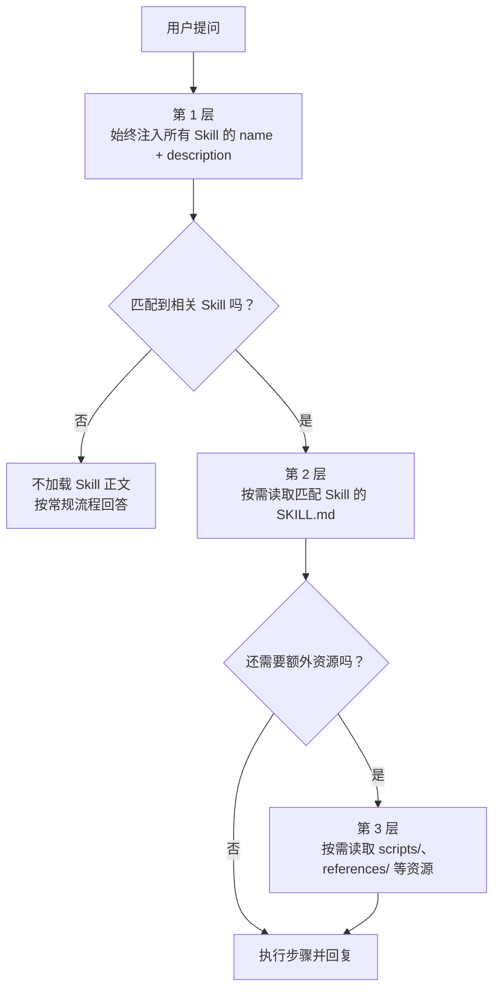

# 第 3 章：教 Bot 新技能

> 目标：理解 Skill 系统的设计原理，创建自己的第一个 Skill。

## 3.1 什么是 Skill？

Skill 是一个 Markdown 文件，**教会 Bot 如何做某件特定的事**。

打个比方：
- `SOUL.md` 决定了 Bot **是谁**（性格）
- `AGENTS.md` 决定了 Bot **怎么做事**（通用规则）
- Skill 决定了 Bot **会做什么**（具体能力）

一个 Skill 最简单的形式就是一个文件夹 + 一个 `SKILL.md`：

```
skills/
└── my-skill/
    └── SKILL.md
```

## 3.2 看一个真实例子

nanobot 内置了一个 `weather` 技能，只有 50 行（`nanobot/skills/weather/SKILL.md`）：

```markdown
---
name: weather
description: Get current weather and forecasts (no API key required).
metadata: {"nanobot":{"emoji":"..","requires":{"bins":["curl"]}}}
---

# Weather

Two free services, no API keys needed.

## wttr.in (primary)

Quick one-liner:
\```bash
curl -s "wttr.in/London?format=3"
# Output: London: +8C
\```
...
```

结构非常简单：

| 部分 | 内容 | 作用 |
|------|------|------|
| **Frontmatter** | `name` + `description` | 告诉 Agent "我是什么、什么时候该用我" |
| **Body** | Markdown 正文 | 具体的使用指南，Agent 被触发后才会读 |

## 3.3 Skill 的触发机制

这是理解 Skill 系统的关键。

**Agent 不会一次性读取所有 Skill 的完整内容**——那样会占满上下文窗口。它用的是**渐进式加载**：

```
第 1 层：始终加载  → 所有 Skill 的 name + description（几十个词）
第 2 层：按需加载  → 被触发的 Skill 的 SKILL.md 正文
第 3 层：按需加载  → Skill 附带的 scripts/、references/ 等资源
```

对应源码可以从 `nanobot/agent/context.py` 的 skills summary 注入逻辑开始看：

```python
# 第 1 层：Skills 摘要始终注入到 system prompt
skills_summary = self.skills.build_skills_summary()
if skills_summary:
    parts.append(render_template("agent/skills_section.md", skills_summary=skills_summary))
```

当前摘要是轻量 Markdown 列表，长这样：

```markdown
- **weather** — Get current weather and forecasts  `/path/to/weather/SKILL.md`
- **github** — Interact with GitHub using the `gh` CLI  `/path/to/github/SKILL.md`
```

如果某个 Skill 声明了本机依赖（例如 `curl`、`gh` 或某个环境变量）但当前环境不满足，摘要里会标出 unavailable，Agent 就不应该强行使用它。

当用户问"今天天气怎么样"时，Agent 看到摘要里有一个 `weather` Skill，就用 `read_file` 工具读取完整的 `SKILL.md`，学会怎么用 `curl` 查天气，然后执行命令返回结果。

用图来看，这个过程更接近下面这样：



这里最关键的不是“能不能加载 Skill”，而是**什么时候才加载**。先放一个很薄的摘要层，只有在提问真的命中场景时，才继续读正文和附带资源。

### 为什么这么设计？

LLM 的上下文窗口是**共享资源**。System Prompt + 对话历史 + 记忆 + 工具定义 + Skill，全部共享一个窗口。如果把 10 个 Skill 的完整内容全塞进去，光 Skill 就占了几千个 token，留给对话的空间就少了。

渐进式加载的好处：
- 100 个 Skill 只占约 1000 个 token（只有名字和描述）
- 每次对话最多加载 1-2 个相关 Skill 的完整内容
- 用户感知不到任何延迟

## 3.4 实操：创建你的第一个 Skill

我们来做一个"查汇率"的 Skill。

### 第一步：创建文件

```bash
mkdir -p ~/.nanobot/workspace/skills/exchange-rate
```

创建 `~/.nanobot/workspace/skills/exchange-rate/SKILL.md`：

```markdown
---
name: exchange-rate
description: Query real-time exchange rates between currencies. Use when the user asks about currency conversion, exchange rates, or foreign currency prices.
---

# Exchange Rate

Use the free ExchangeRate API (no key required).

## Query current rate

\```bash
# USD to CNY
curl -s "https://open.er-api.com/v6/latest/USD" | python3 -c "
import sys, json
data = json.load(sys.stdin)
rates = data['rates']
print(f\"1 USD = {rates['CNY']} CNY\")
print(f\"1 USD = {rates['EUR']} EUR\")
print(f\"1 USD = {rates['JPY']} JPY\")
"
\```

## Convert amount

\```bash
# Convert any amount: FROM_CURRENCY TO_CURRENCY AMOUNT
curl -s "https://open.er-api.com/v6/latest/$FROM" | python3 -c "
import sys, json
data = json.load(sys.stdin)
rate = data['rates']['$TO']
amount = $AMOUNT
print(f'{amount} $FROM = {amount * rate:.2f} $TO (rate: {rate})')
"
\```

Replace $FROM, $TO, $AMOUNT with actual values.

## Supported currencies

Common: USD, CNY, EUR, GBP, JPY, KRW, HKD, TWD, SGD, AUD, CAD
Full list: https://open.er-api.com/v6/latest/USD
```

### 第二步：测试

```bash
nanobot agent -m "1000 美元等于多少人民币？"
```

Bot 会发现你的 `exchange-rate` Skill，读取它，然后用 `curl` 查询实时汇率并计算。

如果第一次没有触发，不一定说明 Skill 无效，常见原因有三类：

- `description` 写得太短，模型不知道什么时候该用
- 运行环境缺少 `curl` 或 `python3`
- 当前模型倾向于直接回答，没有主动读 `SKILL.md`

更稳妥的测试问法是：

```bash
nanobot agent -m "请用 exchange-rate skill 查询 1000 美元等于多少人民币，并说明你使用了什么数据来源"
```

### 第一次没触发时，先这样查

不要一上来就怀疑整个 Skill 系统坏了。绝大多数情况下，问题都在下面 4 层里：

1. **路径层**：文件是否真的在 `~/.nanobot/workspace/skills/exchange-rate/SKILL.md`
2. **元信息层**：frontmatter 里是否至少有 `name` 和清晰的 `description`
3. **环境层**：本机是否真的有 `curl`、`python3` 这类依赖
4. **提问层**：你的问题是否真的覆盖了 `description` 里描述的触发场景

建议你按这个顺序测，而不是来回改很多地方：

```bash
# 1. 先确认文件在不在
ls ~/.nanobot/workspace/skills/exchange-rate

# 2. 再看内容是不是你以为的那份
sed -n '1,80p' ~/.nanobot/workspace/skills/exchange-rate/SKILL.md

# 3. 再确认依赖命令在不在
which curl
which python3
```

然后再用更强触发的问法测试：

```bash
nanobot agent -m "请使用 exchange-rate skill 查询 1000 美元等于多少人民币，并告诉我数据来源"
```

这一步的目标不是“让 Bot 显得聪明”，而是先确认：**它到底有没有读取你的 Skill，并尝试按 Skill 行动。**

### 第三步：理解发生了什么

完整的调用链：

```
用户："1000 美元等于多少人民币？"
  ↓
Agent 看到 Skills 摘要中有 exchange-rate（匹配 "currency conversion"）
  ↓
Agent 调用 read_file 读取 SKILL.md 全文
  ↓
Agent 根据 SKILL.md 中的指令，调用 exec 执行 curl 命令
  ↓
Agent 拿到汇率数据，计算结果，回复用户
```

## 3.5 Skill 的高级结构

简单 Skill 只需要一个 `SKILL.md`。复杂 Skill 可以带资源文件：

```
my-skill/
├── SKILL.md           ← 必须有（入口）
├── scripts/           ← 可执行脚本（确定性操作）
│   └── process.py
├── references/        ← 参考文档（按需读取）
│   ├── api-docs.md
│   └── schema.md
└── assets/            ← 资源文件（模板、图片等）
    └── template.html
```

| 目录 | 用途 | 什么时候用 |
|------|------|-----------|
| `scripts/` | 确定性的可执行代码 | 同样的操作需要反复执行时（如 PDF 旋转、数据格式转换） |
| `references/` | 文档参考资料 | Agent 需要查阅的专业知识（如 API 文档、数据库 Schema） |
| `assets/` | 输出资源 | 模板、图标等需要被复制/使用的文件 |

### 什么时候写进 Skill，什么时候下沉成 Tool 或 scripts/

这是最容易混淆的边界。

适合写进 Skill 的内容：

- 什么时候该用某种能力
- 一段任务说明或工作方法
- 少量可直接执行的命令模板
- 某个领域里的操作顺序和注意事项

不适合只写在 Skill 里的内容：

- 稳定、反复执行的解析逻辑
- 需要强输入输出约束的步骤
- 很长的 shell one-liner
- 容易因为模型改写而出错的核心计算

经验法则：

- 如果你在教 Agent **“什么时候做、怎么做”**，优先写 Skill
- 如果你在追求 **“稳定地做对”**，优先下沉成 Tool 或 `scripts/`

例如本章的汇率例子，第一次教学可以直接把命令写进 `SKILL.md`。但如果你准备长期使用，更稳的做法通常是：

1. 把汇率查询和换算逻辑写进 `scripts/convert.py`
2. 在 `SKILL.md` 里只保留“什么时候该调用它”和“调用格式”
3. 让 Agent 通过现有工具去执行这个脚本

### 真实案例：github Skill

nanobot 内置的 `github` Skill 就是一个好例子：

```markdown
---
name: github
description: "Interact with GitHub using the `gh` CLI. ..."
metadata: {"nanobot":{"requires":{"bins":["gh"]}}}
---
```

注意 `metadata` 中的 `requires.bins`：它声明了这个 Skill 需要系统安装 `gh`（GitHub CLI）。如果没安装，Skill 会被标记为 `available="false"`，Agent 不会尝试使用它。

## 3.6 Frontmatter 详解

```yaml
---
name: my-skill              # 必填：Skill 名称
description: ...             # 必填：描述（触发依据！）
always: true                 # 可选：始终加载到上下文（如 memory Skill）
metadata: {"nanobot": {...}} # 可选：依赖声明、图标等
---
```

### description 是最重要的字段

`description` 是 Agent 判断"要不要读这个 Skill"的**首要线索**，也是你最该认真写的字段。写不好，Skill 往往就不会被触发；但它也不是唯一变量，用户问题表述、当前模型偏好、环境里是否有可用依赖，都会影响最终行为。

好的写法：
```yaml
description: Query real-time exchange rates between currencies. Use when the user asks about currency conversion, exchange rates, or foreign currency prices.
```

差的写法：
```yaml
description: Exchange rate tool
```

原则：**告诉 Agent 这个 Skill 干什么 + 什么情况下该用它。**

再给两组更直观的对照：

好的写法：

```yaml
description: Summarize Git diffs and explain likely risks. Use when the user asks for code review, change summary, or regression analysis.
```

差的写法：

```yaml
description: Git helper
```

好的写法：

```yaml
description: Format raw JSON into readable output. Use when the user provides JSON text or asks to pretty-print API responses.
```

差的写法：

```yaml
description: JSON
```

补一个教学版约束：为了兼容进阶营里简化版的 `SkillsLoader`，这里建议先把 `description` 写成**单行**。真实 nanobot 的 frontmatter 解析更完整，但教学版为了突出原理，故意只演示最小实现。

### always 标记

设置 `always: true` 的 Skill 会在每次对话时**完整加载**到 System Prompt 中（而不是只加载摘要）。

内置的 `memory` Skill 就是 `always: true`——因为记忆管理规则需要 Agent 时刻遵守。但大多数 Skill 不需要设置这个，按需加载效率更高。

对应源码可以从 `nanobot/agent/context.py` 中 always skills 的拼装逻辑继续追：

```python
always_skills = self.skills.get_always_skills()
if always_skills:
    always_content = self.skills.load_skills_for_context(always_skills)
    if always_content:
        parts.append(f"# Active Skills\n\n{always_content}")
```

## 3.7 Skill 的加载优先级

nanobot 会从两个地方查找 Skill（可从 `nanobot/agent/skills.py` 的 `list_skills` / `load_skill` 逻辑继续追）：

```
1. workspace/skills/（用户自定义） ← 优先级高
2. nanobot/skills/  （内置）       ← 优先级低
```

如果两个地方有同名 Skill，**workspace 中的优先**。你可以用这个机制覆盖内置 Skill 的行为。

## 3.8 验证与排障

创建 Skill 后，建议按这个顺序检查：

1. 路径是否正确：`~/.nanobot/workspace/skills/<skill-name>/SKILL.md`
2. frontmatter 是否至少包含 `name` 和 `description`
3. Skill 依赖的命令是否存在，比如 `curl`、`gh`、`python3`
4. 提问是否真的覆盖了 `description` 里描述的使用场景

常见问题：

- Skill 不触发：先改进 `description`，把“做什么”和“什么时候用”写清楚
- Skill 被列出但不可用：通常是 `metadata.requires` 中声明的依赖没安装
- Skill 内容很长但效果差：优先把正文改成短步骤、明确命令、明确输入输出，不要堆背景介绍
- 自定义 Skill 没覆盖内置 Skill：检查目录名是否完全同名，而不只是 frontmatter 里的 `name`

如果你还想进一步降低测试波动，优先用这 3 类问法：

1. **直接点名 Skill**：`请用 exchange-rate skill 查询 1000 美元等于多少人民币`
2. **点名任务 + 数据来源**：`请查询当前 USD/CNY 汇率，并告诉我你使用了什么来源`
3. **点名动作**：`请先读取相关 Skill，再完成汇率换算`

当这 3 类问法都稳定后，再慢慢把提问放回更自然的日常表达。

如果你现在的困惑已经变成“到底是 Skill 路径、frontmatter、依赖命令，还是提问方式出了问题”，可以直接跳到[附录：常见坑与排障](appendix-troubleshooting.md)里的 Skill 排障部分。

## 3.9 练习

1. **入门**：创建一个 `translator` Skill，让 Bot 在翻译时遵循特定规则（比如保留专有名词不翻译）
2. **进阶**：创建一个带 `scripts/` 的 Skill，比如一个自动格式化 JSON 的工具
3. **挑战**：创建一个带 `references/` 的 Skill，比如一个查询你公司内部 API 文档的技能
