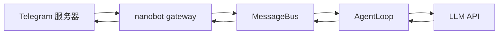
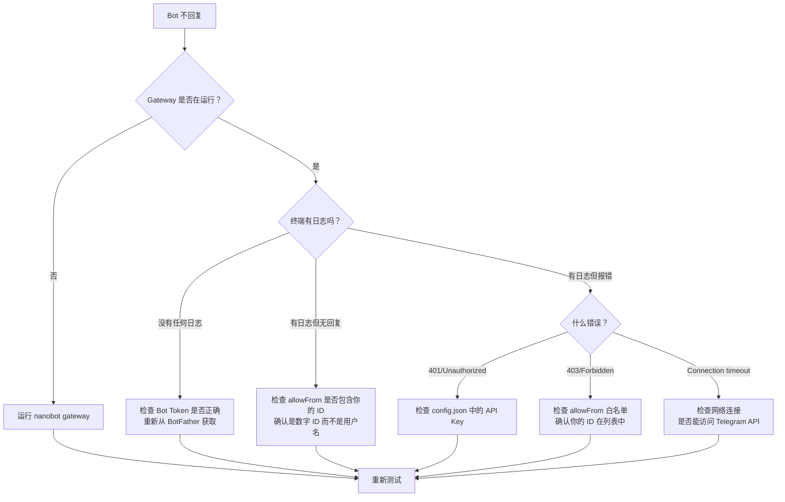

# 第 5 章：部署到 Telegram

> 目标：把你的 Bot 接到 Telegram，让它在真实聊天场景中工作。

> ⚠️ **重要提示**：如果你还没完成 [第 4 章：本地完整验收](04-local-integration.md)，**强烈建议先回去完成**。否则一旦 Telegram 上收不到回复，你很难判断是平台问题还是 Bot 本身的问题。

---

## 5.1 从 CLI 到 Gateway

前面章节我们一直用 `nanobot agent` 在终端里聊天。现在要把 Bot 部署到真实的聊天平台。

### 关键区别

| | CLI 模式 | Gateway 模式 |
|---|---|---|
| 命令 | `nanobot agent` | `nanobot gateway` |
| 用户界面 | 终端 | Telegram / Discord / 其他平台 |
| 运行方式 | 聊完就退出 | 持续运行，等待消息 |
| 消息来源 | 键盘输入 | 聊天平台 API |
| 适用场景 | 开发调试 | 生产使用 |

### Gateway 的工作原理



**核心设计：MessageBus**
- Gateway 不直接和 AgentLoop 通信
- 中间有一层 MessageBus（消息总线）
- 这样设计的好处：可以同时接入多个平台（Telegram + Discord + Slack）

---

## 5.2 接平台前的最后确认

在继续之前，花 30 秒确认这 3 件事：

### 检查清单

- [ ] **第 1 章**：`nanobot agent -m "你好"` 能返回正常回复
- [ ] **第 2 章**：修改过 `SOUL.md`，观察到回复风格变化
- [ ] **第 3 章**：至少有一个 Skill 成功触发过
- [ ] **第 4 章**：完成了三轮本地验收，记录了输入输出

**如果有任何一项还没完成，建议先回到对应章节。**

> 💡 **为什么这么强调？** 因为一旦部署到 Telegram，出问题时你会面临更多变量：网络延迟、平台限制、webhook 配置等。如果 Bot 本身就没调好，这些额外变量会让排查变得非常困难。

---

## 5.3 实操：连接 Telegram

Telegram 是最容易上手的平台：无需服务器、无需域名、配置简单。

### 步骤 1：创建 Telegram Bot

1. 在 Telegram 里搜索 `@BotFather`
2. 发送 `/newbot`
3. 按提示设置 Bot 的显示名称（如 "我的财务顾问"）
4. 设置 Bot 的用户名（必须以 `bot` 结尾，如 `my_finance_bot`）
5. 创建成功后，复制得到的 **Bot Token**

**Bot Token 格式：**
```
123456789:ABCdefGHIjklMNOpqrsTUVwxyz
```

⚠️ **重要：** 这个 Token 相当于密码，不要泄露给任何人！

---

### 步骤 2：获取你的 Telegram 数字用户 ID

`allowFrom` 需要的不是用户名（如 `@username`），而是你的 **数字用户 ID**。

#### 方法 A：使用 ID 查询 Bot（推荐）

1. 在 Telegram 中搜索 `@userinfobot`
2. 给它发送任意消息
3. 它会返回你的用户 ID，类似：`Your ID: 123456789`

#### 方法 B：临时开放后从日志获取（不推荐）

1. 暂时把 `allowFrom` 设为 `["*"]`
2. 给 Bot 发一条消息
3. 从 `nanobot gateway` 的日志中找到你的 ID
4. **立即**把 `allowFrom` 改回只允许你自己

⚠️ **方法 B 有安全风险，只应在测试环境使用！**

---

### 步骤 3：配置 config.json

编辑 `~/.nanobot/config.json`，添加或修改以下部分：

```json
{
  "providers": {
    "openrouter": {
      "apiKey": "sk-or-v1-你的密钥"
    }
  },
  "agents": {
    "defaults": {
      "provider": "openrouter",
      "model": "openai/gpt-4-turbo"
    }
  },
  "tools": {
    "restrictToWorkspace": true
  },
  "channels": {
    "telegram": {
      "enabled": true,
      "token": "你的Bot Token",
      "allowFrom": ["你的Telegram数字用户ID"]
    }
  }
}
```

### 配置字段详解

| 字段 | 说明 | 示例值 | 注意事项 |
|------|------|--------|---------|
| `channels.telegram.enabled` | 是否启用 Telegram 频道 | `true` | 必须设为 true |
| `channels.telegram.token` | Bot Token | `123456:ABC...` | 从 BotFather 获取 |
| `channels.telegram.allowFrom` | 白名单（数字用户 ID） | `["123456789"]` | **不是用户名！** |
| `tools.restrictToWorkspace` | 限制文件操作在工作区内 | `true` | 第一次上线建议设为 true |

### ⚠️ 最容易配错的字段：`allowFrom`

这是第一次部署时最常见的问题：

| 错误配置 | 结果 | 正确配置 |
|---------|------|---------|
| `"allowFrom": ["@username"]` | ❌ Bot 不会回复 | `"allowFrom": ["123456789"]` |
| `"allowFrom": []` | ❌ 拒绝所有人（包括你） | `"allowFrom": ["123456789"]` |
| `"allowFrom": ["*"]` | ⚠️ 任何人都能用（不安全） | `"allowFrom": ["123456789"]` |

**记住：`allowFrom` 里填的是纯数字 ID，不是用户名，也不带 `@`。**

---

### 步骤 4：启动 Gateway

```bash
nanobot gateway
```

**预期输出：**
```
🐈 Starting nanobot gateway on port 18790...
✓ Channels enabled: telegram
✓ Listening for messages...
```

**保持这个终端窗口运行。** Gateway 是一个持续运行的服务，不像 `nanobot agent` 那样聊完就退出。

---

### 步骤 5：第一次对话

1. 在 Telegram 中找到你的 Bot（通过用户名搜索）
2. 点击 **Start** 或发送 `/start`
3. 发送一条消息：`你好，请介绍一下你自己`

**预期结果：**
- Bot 在几秒内回复
- 回复内容符合你在 `SOUL.md` 中定义的风格

**同时观察终端：**
```
[2026-06-15 10:30:15] Received message from 123456789
[2026-06-15 10:30:16] Processing: 你好，请介绍一下你自己
[2026-06-15 10:30:18] Response sent
```

---

## 5.4 验证部署是否成功

用这三轮对话验证完整功能：

### 第 1 轮：基本对话

**在 Telegram 中发送：**
```
你好，请用一句话介绍你自己
```

**检查点：**
- [ ] Bot 在 10 秒内回复
- [ ] 回复风格符合 `SOUL.md` 的定义
- [ ] 终端显示了消息处理日志

---

### 第 2 轮：验证人格和规则

**在 Telegram 中发送：**
```
我每个月能存 5000 元，应该先做什么理财准备？
```

**检查点：**
- [ ] 回复开头先复述了问题
- [ ] 有结构化的分段（问题理解、分析、建议等）
- [ ] 没有激进的投资建议
- [ ] 符合第 4 章本地验收时的表现

---

### 第 3 轮：验证 Skill

**在 Telegram 中发送：**
```
1000 美元等于多少人民币？请说明数据来源。
```

**检查点：**
- [ ] Bot 给出了具体的换算结果
- [ ] 说明了数据来源（ExchangeRate-API）
- [ ] 终端显示了工具调用日志（`[Tool] exec(...)`）
- [ ] 符合第 4 章本地验收时的表现

---

## 5.5 遇到问题了？快速诊断

如果 Telegram 上没有收到回复，用这个决策树诊断：



### 常见问题速查表

| 症状 | 最可能的原因 | 快速排查 |
|------|------------|---------|
| Bot 完全不回复，终端无日志 | Bot Token 错误 | 重新复制 Token，注意不要有多余空格 |
| Bot 不回复，终端显示"Forbidden" | 不在白名单中 | 确认 `allowFrom` 中有你的数字 ID |
| Bot 回复但内容是错误信息 | LLM API 配置问题 | 检查 `providers` 和 `model` 配置 |
| Bot 回复很慢（>30秒） | 模型响应慢或网络问题 | 尝试换一个更快的模型 |
| 工具调用失败 | 工作区权限或依赖问题 | 先在 CLI 模式验证工具能否正常工作 |

---

### 详细排查步骤

#### 问题 1：Gateway 运行但没有任何日志

**可能原因：** Bot Token 配置错误

**排查方法：**
```bash
# 1. 检查 config.json 中的 token
cat ~/.nanobot/config.json | grep -A 5 "telegram"

# 2. 确认 token 格式正确（应该是 数字:字母）
# 正确格式：123456789:ABCdefGHI...
# 错误格式：sk-or-v1-... (这是 LLM API Key，不是 Bot Token)

# 3. 重新从 BotFather 获取 Token
# 在 Telegram 中给 @BotFather 发送 /mybots
# 选择你的 Bot -> API Token
```

---

#### 问题 2：终端显示"Forbidden"或"User not allowed"

**可能原因：** allowFrom 配置错误

**排查方法：**
```bash
# 1. 确认你的 Telegram 数字 ID
# 给 @userinfobot 发消息，获取你的 ID

# 2. 检查 config.json
cat ~/.nanobot/config.json | grep -A 3 "allowFrom"

# 3. 确认配置正确
# ✅ 正确："allowFrom": ["123456789"]
# ❌ 错误："allowFrom": ["@username"]
# ❌ 错误："allowFrom": []

# 4. 临时调试（仅用于测试！）
# 可以暂时设为 ["*"] 测试连接，确认后立即改回自己的 ID
```

---

#### 问题 3：Bot 回复了但内容不对

**可能原因：** Bot 本身没配置好

**解决方案：**
1. **回到 CLI 模式验证**
   ```bash
   # 按 Ctrl+C 停止 gateway
   nanobot agent -m "测试消息"
   ```
   
2. **如果 CLI 也不对** → 回到第 2-4 章重新配置

3. **如果 CLI 正常但 Telegram 不对** → 检查是否有特定于 channel 的配置冲突

---

## 5.6 保持 Gateway 持续运行

现在 Gateway 能工作了，但有个问题：**关闭终端窗口后，Gateway 就停止了。**

### 方案 A：使用 screen 或 tmux（临时方案）

```bash
# 使用 screen
screen -S nanobot
nanobot gateway
# 按 Ctrl+A 然后按 D 来 detach

# 重新连接
screen -r nanobot

# 使用 tmux
tmux new -s nanobot
nanobot gateway
# 按 Ctrl+B 然后按 D 来 detach

# 重新连接
tmux attach -t nanobot
```

---

### 方案 B：使用 systemd（推荐用于 Linux 服务器）

<details>
<summary>点击展开：systemd 配置</summary>

**1. 创建 service 文件**

```bash
sudo nano /etc/systemd/system/nanobot.service
```

**2. 填入以下内容**

```ini
[Unit]
Description=Nanobot Gateway
After=network.target

[Service]
Type=simple
User=你的用户名
WorkingDirectory=/home/你的用户名
ExecStart=/home/你的用户名/.venv/bin/nanobot gateway
Restart=on-failure
RestartSec=10

[Install]
WantedBy=multi-user.target
```

**3. 启用并启动服务**

```bash
sudo systemctl daemon-reload
sudo systemctl enable nanobot
sudo systemctl start nanobot

# 查看状态
sudo systemctl status nanobot

# 查看日志
sudo journalctl -u nanobot -f
```

</details>

---

### 方案 C：使用 Docker（最灵活）

<details>
<summary>点击展开：Docker 配置</summary>

**待补充：** Docker 部署方案会在后续版本中详细说明。

如果你熟悉 Docker，可以参考 nanobot 官方文档中的 Docker 部署指南。

</details>

---

## 5.7 安全建议

在正式使用前，确认这些安全设置：

### 检查清单

- [ ] **限制白名单**：`allowFrom` 只包含你信任的用户
- [ ] **限制工作区**：`tools.restrictToWorkspace` 设为 `true`
- [ ] **保护 Token**：不要把 `config.json` 提交到公开的 Git 仓库
- [ ] **监控日志**：定期查看 Gateway 日志，发现异常访问
- [ ] **API Key 额度**：设置 LLM API 的消费上限

### 特别提醒

```json
// ❌ 危险配置（不要在生产环境使用）
{
  "channels": {
    "telegram": {
      "allowFrom": ["*"]  // 任何人都能用！
    }
  },
  "tools": {
    "restrictToWorkspace": false  // 可以访问系统任何文件！
  }
}
```

```json
// ✅ 安全配置
{
  "channels": {
    "telegram": {
      "allowFrom": ["123456789", "987654321"]  // 只允许特定用户
    }
  },
  "tools": {
    "restrictToWorkspace": true  // 限制在工作区内
  }
}
```

---

## 5.8 进阶：接入其他平台

nanobot 支持多个平台同时运行。

### Discord

<details>
<summary>点击展开：Discord 配置</summary>

```json
{
  "channels": {
    "discord": {
      "enabled": true,
      "token": "你的Discord Bot Token",
      "allowFrom": ["Discord用户ID"]
    }
  }
}
```

获取 Discord Bot Token：
1. 访问 https://discord.com/developers/applications
2. 创建新应用
3. 在 Bot 标签页获取 Token

</details>

---

### Slack

<details>
<summary>点击展开：Slack 配置</summary>

```json
{
  "channels": {
    "slack": {
      "enabled": true,
      "token": "你的Slack Bot Token",
      "allowFrom": ["Slack用户ID"]
    }
  }
}
```

Slack 配置相对复杂，建议参考官方文档。

</details>

---

## 小结

完成这一章后，你应该能：

| 能力 | 状态 |
|------|------|
| 在 Telegram 上和 Bot 对话 | ✅ |
| Bot 风格符合配置文件定义 | ✅ |
| Skill 能正常触发 | ✅ |
| 理解 Gateway 和 MessageBus 的作用 | ✅ |
| 知道如何排查"不回复"问题 | ✅ |

---

## 下一步

✅ **如果 Telegram 部署成功** → 继续 [第 6 章：多场景案例库](06-use-cases.md)

⚠️ **如果 Bot 不回复** → 按照本章的诊断树逐步排查

🤔 **如果想理解 MessageBus 原理** → 去 [进阶营第 4 章：消息总线](build/04-message-bus.md)
