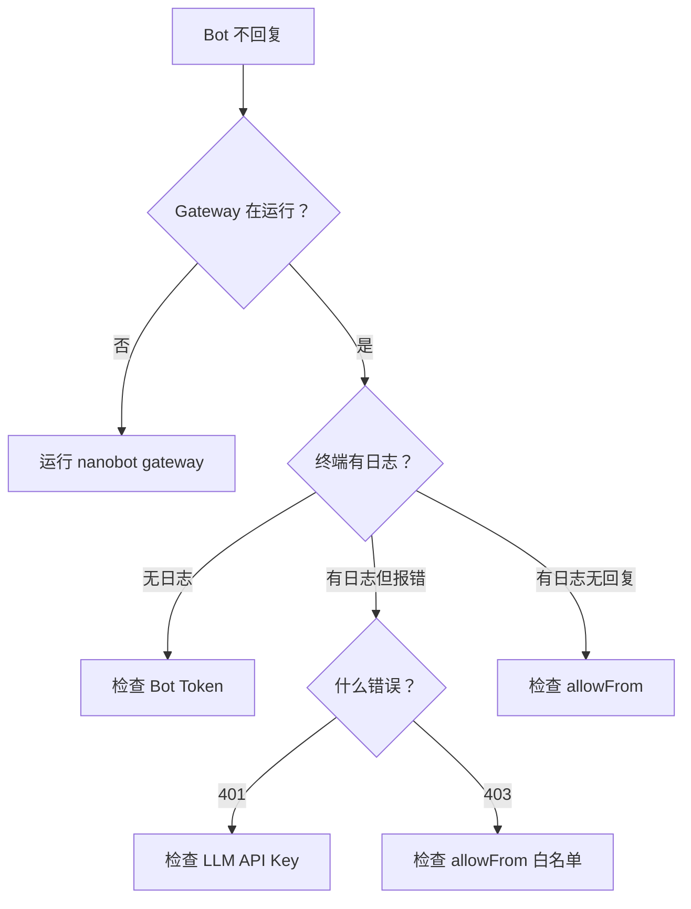

# 统一排障手册

> 目标：提供系统化的问题诊断和解决方案，按层级组织。

## 使用说明

本手册按**问题层级**组织，从底层到高层：
1. **环境问题** → Python、依赖、网络
2. **配置问题** → API Key、模型、路径
3. **行为问题** → 人格、规则、Skill
4. **部署问题** → Telegram、Docker、持续运行

**如何使用：**
1. 先判断你的问题属于哪一层
2. 跳转到对应章节
3. 按照诊断步骤逐一排查
4. 如果问题仍未解决，在 GitHub Issues 提问

---

## 第1层：环境问题

### 症状识别

- 命令不存在（`nanobot: command not found`）
- 安装失败（`pip install` 报错）
- 依赖缺失（`No module named 'xxx'`）
- 网络连接问题

---

### 问题 1.1：命令不存在

**症状：**
```bash
$ nanobot --version
bash: nanobot: command not found
```

**诊断步骤：**

```bash
# 1. 检查是否安装成功
pip show nanobot-ai

# 2. 检查虚拟环境
which python
# 应该输出类似：/path/to/.venv/bin/python

# 3. 检查命令是否在虚拟环境中
ls .venv/bin/ | grep nanobot
```

**解决方案：**

| 情况 | 解决方案 |
|------|---------|
| `pip show` 找不到包 | 重新安装：`pip install nanobot-ai` |
| 虚拟环境未激活 | 激活：`source .venv/bin/activate` (Linux/Mac) 或 `.venv\Scripts\activate` (Windows) |
| 安装到了其他环境 | 确认 `which pip` 和 `which python` 属于同一环境 |

---

### 问题 1.2：依赖安装失败

**症状：**
```bash
$ pip install nanobot-ai
ERROR: Could not find a version that satisfies the requirement...
```

**诊断步骤：**

```bash
# 1. 检查 Python 版本
python --version
# 需要 >= 3.11

# 2. 检查 pip 版本
pip --version

# 3. 升级 pip
python -m pip install --upgrade pip

# 4. 检查网络连接
ping pypi.org
```

**解决方案：**

| 情况 | 解决方案 |
|------|---------|
| Python < 3.11 | 升级 Python 或使用 pyenv/conda 安装新版本 |
| pip 版本过低 | `python -m pip install --upgrade pip` |
| 网络问题 | 使用镜像源：`pip install -i https://pypi.tuna.tsinghua.edu.cn/simple nanobot-ai` |

---

### 问题 1.3：缺少系统依赖

**症状：**
```bash
# Skill 执行失败
Error: curl: command not found
Error: python3: command not found
```

**诊断步骤：**

```bash
# 检查常用依赖
which curl
which python3
which git
```

**解决方案：**

```bash
# Ubuntu/Debian
sudo apt update
sudo apt install curl python3 git

# macOS
brew install curl python3 git

# Windows
# 使用 Git Bash 或安装 WSL
```

---

## 第2层：配置问题

### 症状识别

- `401 Unauthorized`
- `Model not found`
- `Config file not found`
- Bot 完全不回复

---

### 问题 2.1：API Key 错误

**症状：**
```bash
$ nanobot agent -m "test"
Error: 401 Unauthorized
```

**诊断步骤：**

```bash
# 1. 检查配置文件是否存在
ls -la ~/.nanobot/config.json

# 2. 查看配置内容
cat ~/.nanobot/config.json | grep -A 3 "apiKey"

# 3. 验证 API Key 格式
# OpenRouter: sk-or-v1-...
# OpenAI: sk-...
# DeepSeek: sk-...
```

**解决方案：**

| 情况 | 解决方案 |
|------|---------|
| Key 复制不完整 | 重新复制完整的 Key，注意不要有空格 |
| Key 过期 | 去 provider 控制台重新生成 |
| Provider 不匹配 | 检查 `provider` 字段是否与 Key 匹配 |

---

### 问题 2.2：模型名称错误

**症状：**
```bash
Error: Model 'gpt-4' not found
```

**诊断步骤：**

```bash
# 1. 确认当前配置的 provider 和 model
cat ~/.nanobot/config.json | grep -A 2 "defaults"

# 2. 去 provider 文档查看正确的模型名称
# OpenRouter: https://openrouter.ai/models
# DeepSeek: deepseek-chat
# OpenAI: gpt-4-turbo
```

**解决方案：**

常见错误：

| 错误配置 | 正确配置 | Provider |
|---------|---------|----------|
| `"model": "gpt-4"` | `"model": "openai/gpt-4-turbo"` | OpenRouter |
| `"model": "deepseek"` | `"model": "deepseek-chat"` | DeepSeek |
| `"model": "claude-3"` | `"model": "claude-3-opus-20240229"` | Anthropic |

---

### 问题 2.3：工作区路径错误

**症状：**
```bash
Error: Workspace not found
```

**诊断步骤：**

```bash
# 1. 检查工作区是否存在
ls -la ~/.nanobot/workspace/

# 2. 检查必要文件
ls ~/.nanobot/workspace/*.md

# 3. 重新初始化
nanobot onboard
```

**解决方案：**

如果工作区损坏或缺失，重新初始化：
```bash
# 备份现有配置（如果有）
cp ~/.nanobot/config.json ~/config.json.backup

# 重新初始化
nanobot onboard

# 恢复配置
cp ~/config.json.backup ~/.nanobot/config.json
```

---

## 第3层：行为问题

### 症状识别

- Bot 能回复，但风格不对
- 规则不生效
- Skill 不触发
- 工具调用失败

---

### 问题 3.1：人格和规则不生效

**症状：**
修改了 `SOUL.md` 或 `AGENTS.md`，但回复风格没变化。

**诊断步骤：**

```bash
# 1. 确认文件已保存
cat ~/.nanobot/workspace/SOUL.md | head -20

# 2. 确认文件路径正确
ls -la ~/.nanobot/workspace/*.md

# 3. 测试是否读取文件
nanobot agent -m "请告诉我你的性格特点" --verbose
```

**可能原因：**

| 原因 | 表现 | 解决方案 |
|------|------|---------|
| 文件未保存 | 内容没有变化 | 重新编辑并保存 |
| 改动太弱 | 模型理解不到位 | 使用更明确、更极端的描述 |
| 文件内容冲突 | 行为不一致 | 检查不同文件是否有矛盾的指令 |
| 模型能力不足 | 复杂规则无法遵守 | 简化规则或换更强的模型 |

**改进建议：**

❌ **太抽象：**
```markdown
# SOUL.md
- 专业、友好
```

✅ **具体明确：**
```markdown
# SOUL.md
- 每次回复开头先说"让我想想..."
- 用第一人称（"我认为"而不是"可以认为"）
- 回复结尾用 🤔 emoji
```

---

### 问题 3.2：Skill 不触发

**症状：**
创建了 Skill，但 Bot 从不使用它。

**诊断决策树：**

```mermaid
flowchart TD
    start[Skill 不触发] --> q1{文件路径正确？}
    q1 -- 否 --> fix1[应该是<br/>~/.nanobot/workspace/skills/skill-name/SKILL.md]
    q1 -- 是 --> q2{frontmatter 正确？}
    q2 -- 否 --> fix2[检查 name 和 description 字段]
    q2 -- 是 --> q3{依赖满足？}
    q3 -- 否 --> fix3[安装缺失的命令<br/>如 curl, python3]
    q3 -- 是 --> q4{description 清晰？}
    q4 -- 否 --> fix4[改进 description<br/>说明何时使用]
    q4 -- 是 --> fix5[使用更明确的提问方式<br/>如"请用 XXX skill..."]
```

**快速诊断脚本：**

```bash
#!/bin/bash
# check-skill.sh <skill-name>

SKILL_NAME=$1
SKILL_PATH=~/.nanobot/workspace/skills/$SKILL_NAME

echo "=== Skill 诊断 ==="

# 检查路径
if [ -f "$SKILL_PATH/SKILL.md" ]; then
    echo "✓ 文件存在"
else
    echo "✗ 文件不存在: $SKILL_PATH/SKILL.md"
    exit 1
fi

# 检查 frontmatter
if head -n 5 "$SKILL_PATH/SKILL.md" | grep -q "^name:"; then
    echo "✓ 包含 name 字段"
else
    echo "✗ 缺少 name 字段"
fi

if head -n 5 "$SKILL_PATH/SKILL.md" | grep -q "^description:"; then
    echo "✓ 包含 description 字段"
else
    echo "✗ 缺少 description 字段"
fi

echo ""
echo "=== Frontmatter 内容 ==="
sed -n '/^---$/,/^---$/p' "$SKILL_PATH/SKILL.md"
```

**使用方法：**
```bash
bash check-skill.sh exchange-rate
```

---

### 问题 3.3：工具调用失败

**症状：**
Skill 触发了，但执行时报错。

**常见错误：**

| 错误信息 | 原因 | 解决方案 |
|---------|------|---------|
| `curl: command not found` | 系统缺少 curl | `sudo apt install curl` (Linux) 或 `brew install curl` (Mac) |
| `python3: command not found` | 系统缺少 python3 | 安装 Python 3.11+ |
| `Permission denied` | 文件权限问题 | `chmod +x script.sh` |
| `Connection timeout` | 网络问题 | 检查网络连接或使用代理 |

**手动测试工具：**

```bash
# 测试 exec 工具
nanobot agent -m "请执行命令：echo 'test'"

# 测试 read_file 工具
nanobot agent -m "请读取文件：~/.nanobot/workspace/SOUL.md"

# 测试 web_search 工具
nanobot agent -m "请搜索：nanobot github"
```

---

## 第4层：部署问题

### 症状识别

- Telegram Bot 不回复
- Gateway 崩溃
- 多实例冲突
- 日志看不到消息

---

### 问题 4.1：Telegram Bot 完全不回复

**症状：**
Gateway 运行中，但 Telegram 上发消息没有任何反应。

**诊断决策树：**



**快速检查清单：**

```bash
# 1. Gateway 是否运行
ps aux | grep "nanobot gateway"

# 2. 检查 Bot Token
cat ~/.nanobot/config.json | grep -A 3 "telegram"

# 3. 检查 allowFrom
cat ~/.nanobot/config.json | grep "allowFrom"

# 4. 获取你的 Telegram ID
# 给 @userinfobot 发消息

# 5. 查看实时日志
nanobot gateway --verbose
```

**常见配置错误：**

❌ **错误配置：**
```json
{
  "channels": {
    "telegram": {
      "token": "sk-or-v1-...",  // 这是 LLM API Key，不是 Bot Token！
      "allowFrom": ["@username"]  // 应该是数字 ID！
    }
  }
}
```

✅ **正确配置：**
```json
{
  "channels": {
    "telegram": {
      "token": "123456:ABCdefGHI...",  // Telegram Bot Token
      "allowFrom": ["123456789"]  // 数字用户 ID
    }
  }
}
```

---

### 问题 4.2：Gateway 频繁崩溃

**症状：**
```bash
$ nanobot gateway
... (运行一段时间后)
Error: Connection reset by peer
(进程退出)
```

**诊断步骤：**

```bash
# 1. 查看完整日志
nanobot gateway --verbose 2>&1 | tee gateway.log

# 2. 检查内存使用
free -h

# 3. 检查磁盘空间
df -h

# 4. 检查网络稳定性
ping -c 10 api.telegram.org
```

**解决方案：**

| 原因 | 解决方案 |
|------|---------|
| 网络不稳定 | 增加重试机制，使用 systemd 自动重启 |
| 内存不足 | 减少并发会话，或升级服务器 |
| 上下文过长 | 配置自动压缩：`"maxMessages": 50` |

**使用 systemd 自动重启：**

```ini
# /etc/systemd/system/nanobot.service
[Unit]
Description=Nanobot Gateway
After=network.target

[Service]
Type=simple
User=your-username
WorkingDirectory=/home/your-username
ExecStart=/home/your-username/.venv/bin/nanobot gateway
Restart=on-failure
RestartSec=10

[Install]
WantedBy=multi-user.target
```

---

## 通用调试技巧

### 1. 启用详细日志

```bash
# CLI 模式
nanobot agent -m "test" --verbose

# Gateway 模式
nanobot gateway --verbose

# 设置环境变量
export NANOBOT_LOG_LEVEL=DEBUG
nanobot gateway
```

---

### 2. 隔离问题层级

**从底层到高层测试：**

```bash
# Level 1: 测试 Python 环境
python --version

# Level 2: 测试 nanobot 安装
nanobot --version

# Level 3: 测试 LLM 连接
nanobot agent -m "test"

# Level 4: 测试文件读取
cat ~/.nanobot/workspace/SOUL.md

# Level 5: 测试 Skill
nanobot agent -m "请用 weather skill 查询天气"

# Level 6: 测试 Gateway
nanobot gateway
```

**每一层都通过后，再测试下一层。**

---

### 3. 最小化配置测试

如果问题难以定位，尝试最小化配置：

```json
{
  "providers": {
    "openrouter": {
      "apiKey": "your-key"
    }
  },
  "agents": {
    "defaults": {
      "provider": "openrouter",
      "model": "openai/gpt-4-turbo"
    }
  }
}
```

删除所有其他配置，逐步添加，找到导致问题的配置项。

---

## 仍然无法解决？

如果按照上述步骤仍然无法解决问题，请：

1. **收集信息：**
   - OS 和 Python 版本
   - nanobot 版本
   - 完整的错误日志
   - 配置文件（脱敏后）

2. **搜索已知问题：**
   - https://github.com/HKUDS/nanobot/issues

3. **提交 Issue：**
   - 使用模板：[新建 Issue](https://github.com/HKUDS/nanobot/issues/new)
   - 提供完整的复现步骤

---

## 附录：快速参考

### 常用命令

```bash
# 查看版本
nanobot --version

# 初始化
nanobot onboard

# CLI 模式
nanobot agent
nanobot agent -m "消息"

# Gateway 模式
nanobot gateway
nanobot gateway --verbose

# 查看配置
cat ~/.nanobot/config.json

# 查看工作区
ls -la ~/.nanobot/workspace/

# 查看 Skills
ls -la ~/.nanobot/workspace/skills/
```

---

### 重要文件路径

```
~/.nanobot/
├── config.json           # 配置文件
└── workspace/
    ├── SOUL.md           # 人格
    ├── AGENTS.md         # 规则
    ├── USER.md           # 用户画像
    ├── TOOLS.md          # 工具约束
    ├── memory/
    │   └── MEMORY.md     # 长期记忆
    └── skills/           # 自定义 Skills
        └── skill-name/
            └── SKILL.md
```

---

### 有用的资源

- [GitHub 仓库](https://github.com/HKUDS/nanobot)
- [官方文档](https://github.com/HKUDS/nanobot)
- [示例 Skills](https://github.com/HKUDS/nanobot/tree/main/nanobot/skills)
