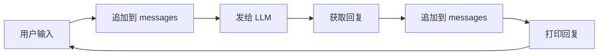

# 第 1 章：最简 Agent

> 用 40 行代码写一个能对话的 AI。

## 本章目标

写一个最小的程序：接收用户输入 → 发给 LLM → 打印回复 → 循环。

---

## 上一章回顾

这是进阶营的第一章，没有"上一章"。如果你是从新手村过来的，你已经知道：
- nanobot 能做什么（新手村第 0-6 章）
- 如何配置和使用 nanobot（第 1-3 章）

现在我们要从零开始，手写一个教学版 Agent，理解它的核心原理。

---

## 为什么从 40 行开始？

**问题：** 一个能对话的 AI Agent 最少需要多少代码？

**答案：** 40 行就够了。

这 40 行代码包含了 Agent 的最核心要素：
1. 连接 LLM
2. 管理对话历史
3. 多轮交互

其他功能（工具、记忆、多平台）都是在这个基础上添加的。

---

## 完整代码

```python
"""mini_agent.py — 最简 Agent，40 行"""

from openai import OpenAI

# 连接 LLM（OpenAI 兼容接口）
client = OpenAI(
    base_url="https://openrouter.ai/api/v1",  # 换成你的 provider
    api_key="sk-or-v1-你的密钥",               # 换成你的 key
)
MODEL = "openai/gpt-4-turbo"                   # 换成你的模型

def chat(messages: list[dict]) -> str:
    """调用 LLM，返回回复文本。"""
    response = client.chat.completions.create(
        model=MODEL,
        messages=messages,
        temperature=0.1,
    )
    return response.choices[0].message.content or ""

def main():
    print("Mini Agent (输入 exit 退出)\n")

    messages = [
        {"role": "system", "content": "你是一个有帮助的AI助手。"},
    ]

    while True:
        user_input = input("You: ").strip()
        if not user_input or user_input.lower() in ("exit", "quit"):
            break

        messages.append({"role": "user", "content": user_input})
        reply = chat(messages)
        messages.append({"role": "assistant", "content": reply})
        print(f"\nBot: {reply}\n")

if __name__ == "__main__":
    main()
```

运行：
```bash
python mini_agent.py
```

---

## 核心机制解析

### 关键设计：messages 列表是有状态的



**为什么需要保存历史？**

```python
# 第一轮对话
messages = [
    {"role": "system", "content": "你是助手"},
    {"role": "user", "content": "我叫小明"}
]
# Bot: 你好，小明！

# 第二轮对话（带上第一轮的历史）
messages = [
    {"role": "system", "content": "你是助手"},
    {"role": "user", "content": "我叫小明"},
    {"role": "assistant", "content": "你好，小明！"},
    {"role": "user", "content": "我叫什么名字？"}  # ← 新问题
]
# Bot: 你叫小明。  # ← 能回答，因为有历史
```

如果不保存历史，第二轮对话就会"失忆"。

---

## 对应 nanobot 的什么？

这 40 行代码对应 nanobot 中的两个核心模块：

### 1. Provider（`nanobot/providers/`）

我们的 `chat()` 函数 = nanobot 的 Provider

```python
# 我们的教学版
def chat(messages: list[dict]) -> str:
    response = client.chat.completions.create(...)
    return response.choices[0].message.content

# nanobot 的生产版（简化）
class LLMProvider(ABC):
    async def chat(self, messages, tools=None, ...) -> LLMResponse:
        """调用 LLM 并返回结构化响应"""
```

**教学版 vs 生产版：**

| 方面 | 教学版（本章） | nanobot 生产版 | 差距原因 |
|------|---------------|---------------|---------|
| 同步/异步 | 同步 | 异步 | 生产环境需要处理并发 |
| 错误处理 | 无 | 重试 + 熔断 | 网络不稳定时需要容错 |
| Provider 支持 | 只有 OpenAI-compatible | 支持 Claude, Gemini, 本地模型等 | 真实场景需要多种选择 |
| 工具调用 | 无 | 支持 function calling | Agent 的核心能力（下一章会加） |

---

### 2. Session（`nanobot/session/manager.py`）

我们的 `messages` 列表 = nanobot 的 Session

```python
# 我们的教学版
messages = [...]  # 内存中的列表

# nanobot 的生产版（简化）
@dataclass
class Session:
    key: str  # "telegram:123456"
    messages: list[dict]
    last_consolidated: int  # 已整合的消息数
```

**教学版 vs 生产版：**

| 方面 | 教学版 | nanobot 生产版 | 差距原因 |
|------|--------|---------------|---------|
| 持久化 | 无（重启就丢） | 保存到磁盘 | 生产环境需要跨会话记忆 |
| 上下文管理 | 无限增长 | 自动压缩旧消息 | 避免撑爆上下文窗口 |
| 多用户 | 不支持 | 每个用户独立 session | 真实场景有多用户 |

---

## 局限性（为什么需要后续章节）

这个 40 行的 Agent 只能**聊天**。它不能：

| 不能做的事 | 原因 | 哪一章解决 |
|-----------|------|-----------|
| 执行命令、读写文件 | 没有工具系统 | 第 2 章 |
| 记住跨会话的信息 | 没有持久化 | 第 3 章 |
| 接入 Telegram 等平台 | 只有终端交互 | 第 4 章 |
| 动态学习新能力 | 没有 Skill 系统 | 第 5 章 |

---

## 最小验证步骤

运行代码前，先确认：
- [ ] 已安装 `openai` 库：`pip install openai`
- [ ] 已配置正确的 `base_url`、`api_key`、`MODEL`

运行后，验证：

**测试 1：基本对话**
```
You: 你好
Bot: 你好！有什么我可以帮助你的吗？
```

**测试 2：上下文记忆**
```
You: 我叫小明
Bot: 你好，小明！

You: 我叫什么名字？
Bot: 你叫小明。  # ← 关键：能记住第一轮的内容
```

**测试 3：退出**
```
You: exit
# 程序正常退出
```

---

## 常见失败点

| 症状 | 原因 | 解决方案 |
|------|------|---------|
| `401 Unauthorized` | API Key 无效 | 检查 `api_key` 是否正确 |
| `Model not found` | 模型名称错误 | 去 provider 文档确认模型名 |
| 第二轮像没记忆 | `messages` 没正确维护 | 确认 `messages.append()` 的顺序 |
| 返回空字符串 | response 结构不符合预期 | 打印 `response` 查看实际结构 |

---

## 本章你真正学到的抽象

这一章最重要的不是 40 行代码本身，而是两个基础抽象：

1. **Provider**：负责把 `messages` 发给模型，再把回复取回来
2. **Session**：一组按顺序累积的消息历史

**为什么这两个抽象重要？**

后面所有复杂能力，几乎都建立在这两个前提之上：
- 工具调用需要 Provider 支持 function calling（第 2 章）
- 记忆需要 Session 持久化（第 3 章）
- 多平台需要多个 Session 并存（第 4 章）
- Skill 需要动态修改 system message（第 5 章）

没有稳定的消息格式和对话状态，这些能力都无从谈起。

---

## 配套示例

- 对应代码快照：[examples/hero/ch01-mini-agent.py](../examples/hero/ch01-mini-agent.py)
- 配套目录说明：[examples/hero/README.md](../examples/hero/README.md)

---

## 下一步

✅ **验证通过** → 继续 [第 2 章：工具系统](02-tool-system.md)

❌ **验证失败** → 检查上面的"常见失败点"

🤔 **想先看实际效果** → 回到 [新手村第 1 章](../zero/01-quick-start.md) 直接用 nanobot
