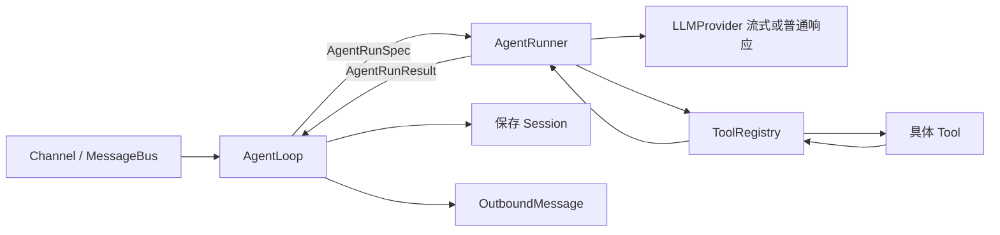

# 第 2 章：工具系统

> 让 Agent 从"只会说话"变成"能做事"。这是 chatbot 和 agent 的分水岭。

## 相对上一章，只新增了什么

如果你刚从第 1 章过来，先不要急着看完整代码。本章其实只新增了 3 个东西：

1. `Tool`：把“能做什么”声明给模型
2. `ToolRegistry`：把工具的注册和执行入口统一起来
3. `ReAct Loop`：让模型可以“想一下 -> 调工具 -> 看结果 -> 再想一下”

你可以先把本章当成是在回答一个问题：**为什么同样是聊天，加入工具后它就成了 Agent？**

## 核心概念

"聊天机器人"只能生成文字。"Agent"能**采取行动**——执行命令、读写文件、搜索网页。

这靠的是 **Function Calling**（工具调用）：LLM 不直接输出结果，而是输出"我想调用某个工具"，我们执行工具后把结果反馈给 LLM，LLM 再继续思考。

```
用户：我的磁盘还剩多少空间？
  ↓
LLM：我需要调用 exec 工具，命令是 "df -h"
  ↓
我们：执行 "df -h"，拿到输出
  ↓
LLM：根据输出，你的磁盘还剩 42GB 可用空间。
```

这就是 **ReAct 循环**（Reasoning + Acting）——Agent 的核心。

## 第一步：定义工具基类

每个工具需要三样东西：名字、描述（告诉 LLM 什么时候该用）、参数格式（JSON Schema）。

```python
from abc import ABC, abstractmethod
from typing import Any

class Tool(ABC):
    """工具基类——对应 nanobot/agent/tools/base.py"""

    @property
    @abstractmethod
    def name(self) -> str: ...

    @property
    @abstractmethod
    def description(self) -> str: ...

    @property
    @abstractmethod
    def parameters(self) -> dict[str, Any]: ...

    @abstractmethod
    async def execute(self, **kwargs) -> str: ...

    def to_schema(self) -> dict:
        """转换为 OpenAI function calling 格式"""
        return {
            "type": "function",
            "function": {
                "name": self.name,
                "description": self.description,
                "parameters": self.parameters,
            },
        }
```

nanobot v0.2.2 的 [`Tool` 基类](https://github.com/HKUDS/nanobot/blob/e2e75c913f3524d4bc5b23487a4eed5329eef182/nanobot/agent/tools/base.py)还包含参数校验和类型转换，但核心仍是工具名称、描述、参数和执行入口。

## 第二步：实现具体工具

### exec 工具——执行 Shell 命令

!!! danger "这里只展示工具调用主线，不要复制运行"
    黑名单挡不住 Shell 组合语法，`create_subprocess_shell` 也不能限制绝对路径、符号链接或网络访问。下面三个工具只用于看懂接口；可运行练习请使用[加固后的配套示例](../examples/hero/ch02-mini-agent-with-tools.py)，它使用临时工作区、无 Shell 参数执行和只读命令白名单。即使如此，教学防护也不是生产沙箱。

```python
import asyncio

class ExecTool(Tool):
    """执行 Shell 命令——对应 nanobot/agent/tools/shell.py"""

    @property
    def name(self) -> str:
        return "exec"

    @property
    def description(self) -> str:
        return "Execute a shell command and return its output."

    @property
    def parameters(self) -> dict:
        return {
            "type": "object",
            "properties": {
                "command": {"type": "string", "description": "Shell command to run"},
            },
            "required": ["command"],
        }

    async def execute(self, command: str, **kwargs) -> str:
        # 安全防护：屏蔽危险命令
        for pattern in ["rm -rf", "mkfs", "dd if=", "shutdown", "reboot"]:
            if pattern in command.lower():
                return f"Error: Command blocked (dangerous pattern: {pattern})"

        try:
            proc = await asyncio.create_subprocess_shell(
                command,
                stdout=asyncio.subprocess.PIPE,
                stderr=asyncio.subprocess.PIPE,
            )
            stdout, stderr = await asyncio.wait_for(proc.communicate(), timeout=30)
            output = stdout.decode(errors="replace")
            if stderr:
                output += f"\nSTDERR:\n{stderr.decode(errors='replace')}"
            # 截断过长输出
            if len(output) > 10000:
                output = output[:10000] + "\n... (truncated)"
            return output or "(no output)"
        except asyncio.TimeoutError:
            return "Error: Command timed out"
        except Exception as e:
            return f"Error: {e}"
```

### read_file 工具——读取文件

```python
from pathlib import Path

class ReadFileTool(Tool):
    """读取文件——对应 nanobot/agent/tools/filesystem.py"""

    @property
    def name(self) -> str:
        return "read_file"

    @property
    def description(self) -> str:
        return "Read the contents of a file."

    @property
    def parameters(self) -> dict:
        return {
            "type": "object",
            "properties": {
                "path": {"type": "string", "description": "File path to read"},
            },
            "required": ["path"],
        }

    async def execute(self, path: str, **kwargs) -> str:
        p = Path(path).expanduser()
        if not p.exists():
            return f"Error: File not found: {path}"
        try:
            content = p.read_text(encoding="utf-8")
            if len(content) > 50000:
                return content[:50000] + "\n... (truncated)"
            return content
        except Exception as e:
            return f"Error: {e}"
```

### write_file 工具——写入文件

```python
class WriteFileTool(Tool):
    """写入文件——对应 nanobot/agent/tools/filesystem.py"""

    @property
    def name(self) -> str:
        return "write_file"

    @property
    def description(self) -> str:
        return "Write content to a file. Creates parent directories if needed."

    @property
    def parameters(self) -> dict:
        return {
            "type": "object",
            "properties": {
                "path": {"type": "string", "description": "File path"},
                "content": {"type": "string", "description": "Content to write"},
            },
            "required": ["path", "content"],
        }

    async def execute(self, path: str, content: str, **kwargs) -> str:
        try:
            p = Path(path).expanduser()
            p.parent.mkdir(parents=True, exist_ok=True)
            p.write_text(content, encoding="utf-8")
            return f"Wrote {len(content)} bytes to {p}"
        except Exception as e:
            return f"Error: {e}"
```

## 第三步：工具注册表

管理所有工具的容器。教学版对应 v0.2.2 的 [`ToolRegistry`](https://github.com/HKUDS/nanobot/blob/e2e75c913f3524d4bc5b23487a4eed5329eef182/nanobot/agent/tools/registry.py)：

```python
class ToolRegistry:
    """工具注册表——对应 nanobot/agent/tools/registry.py"""

    def __init__(self):
        self._tools: dict[str, Tool] = {}

    def register(self, tool: Tool):
        self._tools[tool.name] = tool

    def get_definitions(self) -> list[dict]:
        """返回所有工具的 JSON Schema（给 LLM 看的）"""
        return [t.to_schema() for t in self._tools.values()]

    async def execute(self, name: str, params: dict) -> str:
        """根据名字执行工具"""
        tool = self._tools.get(name)
        if not tool:
            return f"Error: Unknown tool '{name}'"
        try:
            return await tool.execute(**params)
        except Exception as e:
            return f"Error executing {name}: {e}"
```

设计要点：**注册表不关心具体工具是什么**。它只负责"根据名字找到工具并执行"。新增工具只需要 `registry.register(MyNewTool())`，不需要改任何其他代码。

## 第四步：ReAct 循环——Agent 的核心

这是整个教程最关键的代码。下面的 `agent_loop()` 是便于独立阅读的缩小模型；在 nanobot v0.2.2 中，同一类执行闭环主要由 [`AgentRunner`](https://github.com/HKUDS/nanobot/blob/e2e75c913f3524d4bc5b23487a4eed5329eef182/nanobot/agent/runner.py)负责，而不是全部堆在 `AgentLoop` 中。

> 先说明一个教学上的妥协：下面的 `agent_loop` 写成了 `async`，但示例里仍然直接调用同步版 `OpenAI` 客户端。这足够帮助你看懂 ReAct 循环，却不代表它已经是非阻塞实现。真实项目里应改用异步客户端，或把这类阻塞 I/O 丢进线程池。

```python
import json
from openai import OpenAI

async def agent_loop(
    client: OpenAI,
    model: str,
    messages: list[dict],
    tools: ToolRegistry,
    max_iterations: int = 10,
) -> str:
    """
    ReAct 循环：LLM 思考 → 调用工具 → 观察结果 → 再思考。
    教学映射：AgentRunner.run / AgentRunner._run_core。
    """
    tool_defs = tools.get_definitions()

    for i in range(max_iterations):
        # 1. 调用 LLM
        response = client.chat.completions.create(
            model=model,
            messages=messages,
            tools=tool_defs if tool_defs else None,
            temperature=0.1,
        )
        msg = response.choices[0].message

        # 2. 判断：LLM 想调用工具，还是直接回复？
        if msg.tool_calls:
            # LLM 想调用工具——执行它
            messages.append({
                "role": "assistant",
                "content": msg.content,
                "tool_calls": [
                    {
                        "id": tc.id,
                        "type": "function",
                        "function": {
                            "name": tc.function.name,
                            "arguments": tc.function.arguments,
                        },
                    }
                    for tc in msg.tool_calls
                ],
            })

            for tc in msg.tool_calls:
                print(f"  [Tool] {tc.function.name}({tc.function.arguments[:80]})")
                args = json.loads(tc.function.arguments)
                result = await tools.execute(tc.function.name, args)
                messages.append({
                    "role": "tool",
                    "tool_call_id": tc.id,
                    "content": result,
                })
        else:
            # LLM 直接给出最终回复
            return msg.content or ""

    return "Reached maximum iterations without a final answer."
```

**这就是 Agent 的全部秘密。** 把它拆开看：

1. **调 LLM**：带上工具定义，让 LLM 知道它"能做什么"
2. **检查返回**：
   - 如果 LLM 返回了 `tool_calls` → 它想调用工具 → 我们执行 → 把结果喂回去 → 回到第 1 步
   - 如果 LLM 没有 `tool_calls` → 它认为可以直接回答了 → 返回文本
3. **循环**：最多循环 N 次，防止无限调用

### v0.2.2 的真实职责边界



| 真实组件 | 负责什么 | 不负责什么 |
|---|---|---|
| `AgentRunner` | 接收 `AgentRunSpec`；请求 Provider；汇集流式文本、reasoning 和工具调用；执行工具；追加工具结果；控制迭代、超时与最终结果 | 不选择 Channel，不创建业务 Session，不决定回复发到哪里 |
| `AgentLoop` | 从 MessageBus 接收入站消息；解析会话键和工作区；构建 Bootstrap、Memory、Skills 与历史上下文；把配置装进 `AgentRunSpec`；保存新消息；组装 `OutboundMessage` | 不再自己实现 Provider/工具的底层迭代算法 |
| [`LLMProvider`](https://github.com/HKUDS/nanobot/blob/e2e75c913f3524d4bc5b23487a4eed5329eef182/nanobot/providers/base.py) | 把不同模型接口规范化为 `LLMResponse` / `ToolCallRequest`，提供普通或流式请求 | 不执行工具 |
| `ToolRegistry` | 暴露工具 Schema，并按名字分派实际工具 | 不调用模型，也不管理会话 |

具体调用顺序是：

1. `AgentLoop` 的 turn 状态依次恢复 Session、压缩历史、处理命令并构建上下文。
2. `AgentLoop._run_agent_loop()` 创建 `AgentRunSpec`，然后调用 `self.runner.run(...)`。这个同名方法是产品层适配器，不是底层 ReAct 实现。
3. `AgentRunner._request_model()` 根据 Hook 能力选择 Provider 的 `chat_stream_with_retry()` 或 `chat_with_retry()`；流式正文、reasoning 和工具调用增量通过 Hook/进度回调交还 Channel。
4. `AgentRunner._run_core()` 判断规范化响应是否请求工具；若请求，就追加 assistant tool-call 消息并进入 `_execute_tools()`。
5. 工具结果以 `role: "tool"` 追加到消息，再进入下一次 Provider 请求；无工具调用时形成 `AgentRunResult`。
6. `AgentLoop` 保存本轮新增消息，更新 Session，并把最终内容组装成与原 Channel 对应的出站消息。

这种拆分很重要：CLI、WebUI、Telegram 或定时任务可以复用相同执行核心，同时各自保留会话、工作区和回复目标。

### 如果你只读 5 分钟，就先看这 3 段

- `Tool.to_schema()`：模型如何知道有哪些工具
- `ToolRegistry.execute()`：程序如何根据名字找到并执行工具
- `agent_loop()`：工具调用结果如何重新回到下一轮推理

## 完整代码

把以上所有部分组合起来：

!!! danger "完整代码块仍是架构讲解版"
    它保留了上面的宽权限 Shell/文件工具，不能直接用于真实目录或不受信任输入。实际运行请使用本章末尾的加固配套文件；该文件会在入口显示安全警告，并拒绝工作区越界。

```python
"""mini_agent.py — 带工具系统的教学 Agent"""

import asyncio
import json
import os
from abc import ABC, abstractmethod
from pathlib import Path
from typing import Any

from openai import OpenAI

# ── 配置 ─────────────────────────────────────────────
API_BASE = os.environ.get("OPENROUTER_BASE_URL", "https://openrouter.ai/api/v1")
MODEL    = os.environ.get("OPENROUTER_MODEL", "your-provider-supported-model")

client = OpenAI(base_url=API_BASE, api_key=os.environ["OPENROUTER_API_KEY"])

# ── 工具基类 ─────────────────────────────────────────

class Tool(ABC):
    @property
    @abstractmethod
    def name(self) -> str: ...
    @property
    @abstractmethod
    def description(self) -> str: ...
    @property
    @abstractmethod
    def parameters(self) -> dict[str, Any]: ...
    @abstractmethod
    async def execute(self, **kwargs) -> str: ...

    def to_schema(self) -> dict:
        return {
            "type": "function",
            "function": {
                "name": self.name,
                "description": self.description,
                "parameters": self.parameters,
            },
        }

# ── 具体工具 ─────────────────────────────────────────

class ExecTool(Tool):
    @property
    def name(self): return "exec"
    @property
    def description(self): return "Execute a shell command and return output."
    @property
    def parameters(self):
        return {
            "type": "object",
            "properties": {
                "command": {"type": "string", "description": "Shell command"},
            },
            "required": ["command"],
        }

    async def execute(self, command: str, **kw) -> str:
        for bad in ["rm -rf", "mkfs", "dd if=", "shutdown"]:
            if bad in command.lower():
                return f"Error: Blocked ({bad})"
        try:
            proc = await asyncio.create_subprocess_shell(
                command, stdout=asyncio.subprocess.PIPE, stderr=asyncio.subprocess.PIPE,
            )
            out, err = await asyncio.wait_for(proc.communicate(), timeout=30)
            result = out.decode(errors="replace")
            if err:
                result += f"\nSTDERR:\n{err.decode(errors='replace')}"
            return (result or "(no output)")[:10000]
        except asyncio.TimeoutError:
            return "Error: Timeout"
        except Exception as e:
            return f"Error: {e}"


class ReadFileTool(Tool):
    @property
    def name(self): return "read_file"
    @property
    def description(self): return "Read file contents."
    @property
    def parameters(self):
        return {
            "type": "object",
            "properties": {"path": {"type": "string", "description": "File path"}},
            "required": ["path"],
        }

    async def execute(self, path: str, **kw) -> str:
        p = Path(path).expanduser()
        if not p.exists():
            return f"Error: Not found: {path}"
        try:
            return p.read_text(encoding="utf-8")[:50000]
        except Exception as e:
            return f"Error: {e}"


class WriteFileTool(Tool):
    @property
    def name(self): return "write_file"
    @property
    def description(self): return "Write content to a file."
    @property
    def parameters(self):
        return {
            "type": "object",
            "properties": {
                "path": {"type": "string", "description": "File path"},
                "content": {"type": "string", "description": "Content"},
            },
            "required": ["path", "content"],
        }

    async def execute(self, path: str, content: str, **kw) -> str:
        try:
            p = Path(path).expanduser()
            p.parent.mkdir(parents=True, exist_ok=True)
            p.write_text(content, encoding="utf-8")
            return f"Wrote {len(content)} bytes to {p}"
        except Exception as e:
            return f"Error: {e}"

# ── 工具注册表 ───────────────────────────────────────

class ToolRegistry:
    def __init__(self):
        self._tools: dict[str, Tool] = {}

    def register(self, tool: Tool):
        self._tools[tool.name] = tool

    def get_definitions(self) -> list[dict]:
        return [t.to_schema() for t in self._tools.values()]

    async def execute(self, name: str, params: dict) -> str:
        tool = self._tools.get(name)
        if not tool:
            return f"Error: Unknown tool '{name}'"
        try:
            return await tool.execute(**params)
        except Exception as e:
            return f"Error: {e}"

# ── ReAct 循环 ───────────────────────────────────────

async def agent_loop(messages: list[dict], tools: ToolRegistry) -> str:
    tool_defs = tools.get_definitions()

    for _ in range(10):
        resp = client.chat.completions.create(
            model=MODEL, messages=messages,
            tools=tool_defs or None, temperature=0.1,
        )
        msg = resp.choices[0].message

        if msg.tool_calls:
            messages.append({
                "role": "assistant",
                "content": msg.content,
                "tool_calls": [
                    {"id": tc.id, "type": "function",
                     "function": {"name": tc.function.name,
                                  "arguments": tc.function.arguments}}
                    for tc in msg.tool_calls
                ],
            })
            for tc in msg.tool_calls:
                print(f"  [Tool] {tc.function.name}({tc.function.arguments[:80]})")
                args = json.loads(tc.function.arguments)
                result = await tools.execute(tc.function.name, args)
                messages.append({"role": "tool", "tool_call_id": tc.id, "content": result})
        else:
            return msg.content or ""

    return "Max iterations reached."

# ── 主程序 ───────────────────────────────────────────

async def main():
    print("[安全提示] 这是宽权限架构教学版，不是生产沙箱；不要用于真实目录。")
    print("Mini Agent with Tools (输入 exit 退出)\n")

    tools = ToolRegistry()
    tools.register(ExecTool())
    tools.register(ReadFileTool())
    tools.register(WriteFileTool())

    messages = [{"role": "system", "content": "你是一个有帮助的AI助手。你可以使用工具来完成任务。"}]

    while True:
        user_input = input("You: ").strip()
        if not user_input or user_input.lower() in ("exit", "quit"):
            break

        messages.append({"role": "user", "content": user_input})
        reply = await agent_loop(messages, tools)
        messages.append({"role": "assistant", "content": reply})
        print(f"\nBot: {reply}\n")

if __name__ == "__main__":
    asyncio.run(main())
```

## 试一试

```bash
export OPENROUTER_MODEL="your-provider-supported-model"
python docs/zh-cn/examples/hero/ch02-mini-agent-with-tools.py
```

```
You: 当前目录下有哪些文件？
  [Tool] exec({"command": "ls -la"})
Bot: 当前目录下有以下文件：...

You: 帮我写一个 hello.txt
  [Tool] write_file({"path": "hello.txt", "content": "Hello, World!"})
Bot: 已经创建了 hello.txt。

You: 读取它
  [Tool] exec({"command": "cat hello.txt"})
Bot: 文件内容是：Hello, World!
```

**它能做事了！** 从"聊天机器人"升级成了"AI Agent"。

## 关键设计对比

| 我们的代码 | nanobot 的代码 | 区别 |
|-----------|---------------|------|
| `Tool` 基类 | [`agent/tools/base.py`](https://github.com/HKUDS/nanobot/blob/e2e75c913f3524d4bc5b23487a4eed5329eef182/nanobot/agent/tools/base.py) | nanobot 增加参数校验、类型转换和运行上下文 |
| `ToolRegistry` | [`agent/tools/registry.py`](https://github.com/HKUDS/nanobot/blob/e2e75c913f3524d4bc5b23487a4eed5329eef182/nanobot/agent/tools/registry.py) | nanobot 统一 Schema 暴露、分派和错误反馈 |
| `agent_loop` 的 Provider/工具迭代 | [`agent/runner.py` 的 `AgentRunner`](https://github.com/HKUDS/nanobot/blob/e2e75c913f3524d4bc5b23487a4eed5329eef182/nanobot/agent/runner.py) | nanobot 支持流式增量、Hook、并发工具、检查点、错误恢复与迭代预算 |
| `main()` 的会话和输入输出编排 | [`agent/loop.py` 的 `AgentLoop`](https://github.com/HKUDS/nanobot/blob/e2e75c913f3524d4bc5b23487a4eed5329eef182/nanobot/agent/loop.py) | nanobot 连接 MessageBus、工作区、Session、上下文构建和出站消息 |
| `ExecTool` | [`agent/tools/shell.py`](https://github.com/HKUDS/nanobot/blob/e2e75c913f3524d4bc5b23487a4eed5329eef182/nanobot/agent/tools/shell.py) | nanobot 增加超时、输出预算、工作区守卫和可选执行沙箱 |

## 还缺什么？

1. **重启就失忆**——没有持久化记忆
2. **没有个性**——system prompt 太简单
3. **messages 无限增长**——会撑爆上下文窗口

## 本章你真正学到的抽象

这一章新增的核心不是某个具体工具，而是 Agent 的闭环：

- `Tool Schema`：把“能做什么”声明给模型
- `Tool Registry`：把工具定义和执行入口解耦
- `ReAct Loop`：让模型可以在“思考”和“行动”之间多轮往返

真正让 chatbot 变成 agent 的，不是 `exec` 这个工具本身，而是“模型可以请求行动，程序执行后再把结果喂回去”这个模式。

## 最小验证步骤

建议至少做下面 4 个验证：

1. 问一个不需要工具的问题，确认模型能直接回答
2. 问一个明显需要命令行的问题，比如“当前目录下有哪些文件？”
3. 使用加固配套示例，让它在临时教学工作区写一个简单文件，再读取它
4. 故意让它执行一个会失败的命令，观察错误是否能回传给模型

你应该观察到的现象：

- 直接问答时不会强行调用工具
- 需要行动时会打印工具调用痕迹
- 工具结果会进入下一轮推理，而不是只打印在终端

## 常见失败点

- 模型从不调用工具：通常是模型能力不足、接口不支持 function calling，或 `tools=` 没正确传入
- `json.loads(tc.function.arguments)` 报错：某些模型会生成不合法 JSON，需要先打印原始参数排查
- 工具执行了但最终回答很差：通常是工具输出太长、太脏，模型没有拿到高质量观察结果
- `exec` 工具不稳定：shell 环境、平台差异、命令超时都会影响效果；这也是为什么生产实现要做更多限制和适配

## 配套示例

- 对应代码快照：[examples/hero/ch02-mini-agent-with-tools.py](../examples/hero/ch02-mini-agent-with-tools.py)
- 配套目录说明：[examples/hero/README.md](../examples/hero/README.md)

下一章解决这些问题。
