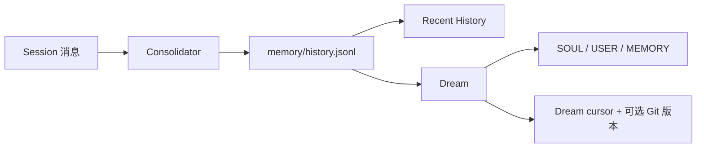

# 第 3 章：记忆与上下文

> 让 Agent 有记忆、有个性、能管理上下文窗口。

## 这一章一次解决 3 个问题

如果你觉得这一章信息量突然变大，这是正常的。因为它不是只补一个点，而是同时补齐了 3 个在上一章已经暴露出来的缺口：

- 对话重启后会失忆
- system prompt 太薄，Bot 没有稳定个性
- 历史消息会不断增长，最终撑爆上下文窗口

所以读这一章时，最好始终问自己：**当前这一段代码是在解决“记不住”、 “不像自己”，还是“放不下”这三个问题里的哪一个？**

## 三个问题

上一章的 Agent 有三个硬伤：

1. **没有持久记忆**——重启后什么都不记得
2. **没有个性**——system prompt 就一句话
3. **上下文会爆**——对话越长，messages 越大，最终超出 LLM 窗口

nanobot 用三个机制解决这些问题：**Session 持久化**、**Context Builder**、**Memory / Dream 整合**。

## 第一步：Session 持久化

对应 v0.2.2 的 [`Session` / `SessionManager`](https://github.com/HKUDS/nanobot/blob/e2e75c913f3524d4bc5b23487a4eed5329eef182/nanobot/session/manager.py)。核心思路：每个对话存为一个 JSONL 文件，每行一条消息。

```python
import json
from pathlib import Path
from dataclasses import dataclass, field
from datetime import datetime

@dataclass
class Session:
    """一次对话的所有状态——教学简化版"""
    key: str
    messages: list[dict] = field(default_factory=list)
    created_at: str = field(default_factory=lambda: datetime.now().isoformat())

    def get_history(self, max_messages: int = 50) -> list[dict]:
        """取最近的 N 条消息，供 LLM 使用"""
        recent = self.messages[-max_messages:]
        # 确保从 user 消息开始（避免孤立的 tool_result）
        for i, m in enumerate(recent):
            if m.get("role") == "user":
                return recent[i:]
        return recent


class SessionManager:
    """管理多个会话的持久化——教学简化版"""

    def __init__(self, data_dir: Path):
        self.dir = data_dir / "sessions"
        self.dir.mkdir(parents=True, exist_ok=True)
        self._cache: dict[str, Session] = {}

    def get_or_create(self, key: str) -> Session:
        if key in self._cache:
            return self._cache[key]
        session = self._load(key) or Session(key=key)
        self._cache[key] = session
        return session

    def save(self, session: Session):
        path = self.dir / f"{session.key.replace(':', '_')}.jsonl"
        with open(path, "w", encoding="utf-8") as f:
            for msg in session.messages:
                f.write(json.dumps(msg, ensure_ascii=False) + "\n")
        self._cache[session.key] = session

    def _load(self, key: str) -> Session | None:
        path = self.dir / f"{key.replace(':', '_')}.jsonl"
        if not path.exists():
            return None
        messages = []
        for line in path.read_text(encoding="utf-8").splitlines():
            if line.strip():
                messages.append(json.loads(line))
        return Session(key=key, messages=messages)
```

现在重启后对话历史不会丢了。nanobot 的实现还支持 metadata 行、legacy 路径迁移等，但核心就是 JSONL 持久化。

## 第二步：Context Builder——组装 System Prompt

这是 nanobot 最精巧的设计之一。v0.2.2 的 [`ContextBuilder`](https://github.com/HKUDS/nanobot/blob/e2e75c913f3524d4bc5b23487a4eed5329eef182/nanobot/agent/context.py)不会把 System Prompt 写死，而是按当前 turn 动态组装：

```
System Prompt = 身份
              + AGENTS.md / SOUL.md / USER.md
              + 内置 Tool Contract
              + 非模板的 MEMORY.md
              + Always Skills / Skills 摘要
              + 未被 Dream 处理的 Recent History
              + 当前 Session 的归档摘要（如果有）
```

```python
class ContextBuilder:
    """组装 System Prompt——对应 nanobot/agent/context.py"""

    BOOTSTRAP_FILES = ["AGENTS.md", "SOUL.md", "USER.md"]

    def __init__(self, workspace: Path):
        self.workspace = workspace

    def build_system_prompt(self) -> str:
        parts = [self._get_identity()]

        # 加载 Bootstrap 文件（用户可编辑的个性化文件）
        for filename in self.BOOTSTRAP_FILES:
            path = self.workspace / filename
            if path.exists():
                content = path.read_text(encoding="utf-8")
                parts.append(f"## {filename}\n\n{content}")

        # 加载长期记忆（真实实现会跳过空白或未定制模板）
        memory_file = self.workspace / "memory" / "MEMORY.md"
        if memory_file.exists():
            memory = memory_file.read_text(encoding="utf-8")
            if memory.strip():
                parts.append(f"# Memory\n\n{memory}")

        return "\n\n---\n\n".join(parts)

    def _get_identity(self) -> str:
        return f"""# Mini Agent

你是一个有帮助的 AI 助手。

## Workspace
工作区: {self.workspace}
长期记忆: {self.workspace}/memory/MEMORY.md

## Guidelines
- 先说意图，再调工具
- 修改文件前先读取
- 任务模糊时主动询问"""

    def build_messages(
        self, history: list[dict], user_message: str
    ) -> list[dict]:
        """组装完整的 messages 列表"""
        now = datetime.now().strftime("%Y-%m-%d %H:%M (%A)")
        runtime = f"[Runtime Context]\nCurrent Time: {now}"

        return [
            {"role": "system", "content": self.build_system_prompt()},
            *history,
            {"role": "user", "content": f"{runtime}\n\n{user_message}"},
        ]
```

### 为什么不把 system prompt 写死？

因为**用户要能定制 Bot 的行为**。通过 `SOUL.md` 改性格、`AGENTS.md` 改规则、`USER.md` 告诉 Bot 你是谁——全部是 Markdown 文件，改完下次对话自动生效。工具约束来自 nanobot 内置 Tool Contract；`TOOLS.md` 不是 v0.2.2 自动加载的 Bootstrap 文件。

`build_messages` 每次调用都重新读取这些文件，所以用户编辑后不需要重启。

### Agent 工作区与项目工作区

默认 CLI/Channel 没有另选项目时，同一个配置工作区同时承担 Agent 状态和工具工作目录。WebUI 选择项目目录后，两者才需要明确区分：

| 状态 | 所有者与位置 | 生命周期 |
|---|---|---|
| 默认 `AGENTS.md`、`SOUL.md`、`USER.md`、`memory/`、`skills/` | 配置的 Agent 工作区 | 实例的持久状态；Dream 只整理这里的 `SOUL.md`、`USER.md` 和 `MEMORY.md`，不改 `AGENTS.md` |
| 项目级 `AGENTS.md`、`SOUL.md`、`USER.md` | WebUI 当前选择的项目工作区 | 选择项目后，ContextBuilder 从项目根读取这三个文件，不再自动叠加 Agent 工作区同名文件；Dream 不管理这些项目文件 |
| `sessions/*.jsonl` 与会话 metadata | Agent 工作区的 SessionManager | 按 session key 持久化；WebUI 项目路径作为会话 scope metadata 保存 |
| 项目源码和产物 | 当前项目工作区 | 由文件/命令工具在当前访问模式下操作，不属于长期记忆文件 |

不要让 Dream 把项目源码事实写进 `SOUL.md`，也不要把个人偏好散落到每个项目的 `AGENTS.md`。长期项目事实可以进入 `MEMORY.md`，但应写清适用项目和过期条件。

## 第三步：持久化记忆

对应 v0.2.2 的 [`MemoryStore` 与 `Consolidator`](https://github.com/HKUDS/nanobot/blob/e2e75c913f3524d4bc5b23487a4eed5329eef182/nanobot/agent/memory.py)。当前实现是分层设计：

| 层 | 文件或状态 | 特点 |
|---|---|---|
| 原始会话 | `sessions/<key>.jsonl` | 保存消息和 metadata；是否重写取决于压缩路径 |
| 摘要归档 | `memory/history.jsonl` | Consolidator 追加旧对话摘要；失败时追加受限长度的 `[RAW]` 归档 |
| 长期记忆 | `memory/MEMORY.md` | Dream 可整理的重要事实；只有非空且不再等于初始模板时才注入 |
| 游标 | `memory/.cursor` / `memory/.dream_cursor` | 前者分配摘要序号，后者记录 Dream 已成功处理到的位置 |
| 记忆版本 | Agent 工作区根的 `.git/`（可选） | 只在能初始化独立版本库时跟踪 `SOUL.md`、`USER.md`、`MEMORY.md` 和 Dream cursor |

```python
class MemoryStore:
    """分层记忆——对应 nanobot/agent/memory.py（简化版）"""

    def __init__(self, workspace: Path):
        mem_dir = workspace / "memory"
        mem_dir.mkdir(parents=True, exist_ok=True)
        self.memory_file = mem_dir / "MEMORY.md"
        self.history_file = mem_dir / "history.jsonl"
        self.cursor_file = mem_dir / ".cursor"

    def read_memory(self) -> str:
        if self.memory_file.exists():
            return self.memory_file.read_text(encoding="utf-8")
        return ""

    def write_memory(self, content: str):
        self.memory_file.write_text(content, encoding="utf-8")

    def append_history(self, entry: str):
        cursor = self._next_cursor()
        record = {
            "cursor": cursor,
            "timestamp": datetime.now().strftime("%Y-%m-%d %H:%M"),
            "content": entry.rstrip(),
        }
        with open(self.history_file, "a", encoding="utf-8") as f:
            f.write(json.dumps(record, ensure_ascii=False) + "\n")
        self.cursor_file.write_text(str(cursor), encoding="utf-8")

    def _next_cursor(self) -> int:
        if self.cursor_file.exists():
            return int(self.cursor_file.read_text(encoding="utf-8").strip()) + 1
        return 1
```

### 两层生命周期：Consolidator 归档，Dream 整理

真实 nanobot 不让一次脆弱的 JSON 输出同时决定“删哪些对话”和“长期相信什么”。它把生命周期拆成两层：



#### 第一层：Consolidator 只做摘要归档

v0.2.2 的 [`Consolidator`](https://github.com/HKUDS/nanobot/blob/e2e75c913f3524d4bc5b23487a4eed5329eef182/nanobot/agent/memory.py)有两条压缩路径：

| 触发方式 | 对 Session 做什么 | 共同结果 |
|---|---|---|
| token 压力触发的软整合 | 选择完整对话轮次作为边界，推进 `last_consolidated`；原始 Session 文件仍保留 | 把被移出当前上下文的内容总结到 `history.jsonl` |
| 空闲会话自动压缩 | 保留最近的合法消息后缀，重写 Session，并保存归档摘要 metadata | 同样把被移除内容总结到 `history.jsonl` |

Consolidator **不会**直接改 `SOUL.md`、`USER.md` 或 `MEMORY.md`。如果摘要模型失败，它会写入受限长度的 `[RAW]` 归档，避免因为一次整理失败中断正常对话。

下面的教学函数只演示“旧消息 → 摘要归档”这一层。它直接裁掉旧消息是为了缩短代码；真实 token 软整合会推进游标而保留原始 Session：

```python
async def archive_old_messages(
    client: OpenAI, model: str,
    session: Session, memory: MemoryStore,
    keep_recent: int = 25,
):
    """教学版 Consolidator：只归档摘要，不改长期记忆文件。"""
    if len(session.messages) <= keep_recent:
        return

    old = session.messages[:-keep_recent]
    prompt = f"""Summarize the durable facts and decisions in this conversation.

{json.dumps(old, ensure_ascii=False, indent=2)[:8000]}

Return only a concise archival summary."""

    resp = client.chat.completions.create(
        model=model,
        messages=[
            {"role": "system", "content": "You archive conversation history."},
            {"role": "user", "content": prompt},
        ],
        temperature=0,
    )

    summary = (resp.choices[0].message.content or "").strip()
    if summary:
        memory.append_history(summary)
        session.messages = session.messages[-keep_recent:]
```

#### 第二层：Dream 整理持久文件

[`MemoryStore.build_dream_prompt()`](https://github.com/HKUDS/nanobot/blob/e2e75c913f3524d4bc5b23487a4eed5329eef182/nanobot/agent/memory.py)只读取 `.dream_cursor` 之后的新归档。Gateway 的定时任务或 `/dream` 会启动一次临时 Dream Session，让模型用受限文件工具审阅这些摘要，并在确有必要时编辑 **Agent 工作区**中的 `SOUL.md`、`USER.md` 和 `memory/MEMORY.md`。

只有 Dream 正常完成，`.dream_cursor` 才前移；失败或中止会留下待处理摘要，供下次重试。若 Agent 工作区能够初始化独立 Git 仓库，Dream 还会提交这些持久文件的变化。它不会整理 `AGENTS.md`，也不会修改 WebUI 当前选择的项目级 Bootstrap 文件。

#### 每轮究竟会注入什么

[`ContextBuilder`](https://github.com/HKUDS/nanobot/blob/e2e75c913f3524d4bc5b23487a4eed5329eef182/nanobot/agent/context.py)会区分四种上下文，不要把它们都叫作“长期记忆”：

| 内容 | 注入条件 |
|---|---|
| 当前 Session 历史 | 从未被软整合的消息开始，并受当前历史窗口限制 |
| Session 归档摘要 | 当前 Session metadata 中已有摘要时，以 `Archived Context Summary` 注入 |
| recent history（Recent History） | 仅非临时运行启用；读取 Dream cursor 之后的待处理归档，最多取最近 50 条并受 token 上限限制；普通模式只取当前 session key，统一会话模式还会合并其他非内部会话 |
| `MEMORY.md` | 文件非空，且内容不再等于初始模板时才注入 |

因此，短对话还没触发 Consolidator 时，`/dream` 可能提示没有新历史；Dream 成功消费摘要后，同一批内容也不会继续以 Recent History 重复注入。临时 Dream 运行本身不会再套入这段 pending history。

#### Dream 命令

v0.2.2 的 [`builtin command router`](https://github.com/HKUDS/nanobot/blob/e2e75c913f3524d4bc5b23487a4eed5329eef182/nanobot/command/builtin.py)提供以下入口：

| 命令 | 行为 |
|---|---|
| `/dream` | 异步启动一次整理；没有 cursor 之后的新归档时不会改文件 |
| `/dream-log`、`/dream-log <sha>` | 查看最近一次或指定 Dream 提交的 diff；需要 Agent 工作区已启用版本记录 |
| `/dream-restore` | 列出最近可恢复的 Dream 版本 |
| `/dream-restore <sha>` | 撤销该提交引入的变化，并创建一条新的安全恢复提交 |
| `/dream-prompt` | **v0.2.2 不支持**，[固定对照的 `main@b189a376`](https://github.com/HKUDS/nanobot/blob/b189a37648e4fa64f662b15de4f78ffd0bab403b/nanobot/command/builtin.py)也未注册此命令；Dream prompt 是内部模板，不能把这项写成可执行步骤 |

### 先别把这些概念混在一起

| 概念 | 它解决什么 | 它保存或处理什么 |
|---|---|---|
| `Session` | 当前会话历史别丢 | 原始对话消息与 metadata |
| `Context Builder` | 决定每轮发给模型什么 | Bootstrap、工具约束、历史、摘要、长期记忆与运行时信息 |
| `Consolidator` | 上下文放不下时归档旧内容 | Session 边界与 `history.jsonl` 摘要 |
| `Dream` | 定期清理和沉淀 Agent 状态 | 根据新摘要谨慎修改 SOUL、USER、MEMORY，并推进 Dream cursor |
| `Memory` | 跨会话保留经过筛选的事实 | `MEMORY.md`；不是全部原始对话的副本 |

很多初学者会把“重启后还记得”和“长期记忆已经整合”混成一件事。实际上这是两层不同机制。

## 本章你真正学到的抽象

这一章真正引入了 4 个长期有效的设计点：

- `Session Persistence`：把对话状态从内存搬到磁盘
- `Context Builder`：把静态配置、动态记忆、运行时信息拼成统一上下文
- `Consolidator`：把离开当前上下文的旧消息变成可追踪摘要
- `Dream`：异步筛选摘要，再谨慎维护长期 Agent 状态

从这里开始，Agent 不再只是“会调用工具的聊天循环”，而是一个有稳定人格、跨轮状态和上下文预算意识的系统。

## 最小验证步骤

建议按顺序做下面 5 个验证：

1. 跑一次程序并完成几轮对话，确认会生成 `sessions/` 和 `memory/` 相关文件
2. 重启程序，再问一个延续上一轮的问题，确认至少 session 历史仍然存在
3. 修改 `SOUL.md` 或 `AGENTS.md`，确认下一次对话的风格或流程发生变化
4. 构造足够长的对话，观察 Consolidator 向 `memory/history.jsonl` 追加摘要；短对话没有摘要是正常现象
5. 在真实 nanobot 中发送 `/dream`，完成后用 `/dream-log` 检查 diff；恢复前先用 `/dream-restore` 查看版本列表和目标 SHA

## 常见失败点

- 重启后“没有记忆”：先区分是 session 历史没保存，还是长期记忆没写入，这是两套机制
- 改了 `SOUL.md` 没效果：通常是 build_messages 没有重新读取文件，或 system prompt 没重新构建
- `/dream` 没有可处理内容：先确认 `history.jsonl` 中存在 `.dream_cursor` 之后的新摘要；短对话可能尚未触发 Consolidator
- `/dream-log` 没有版本：Agent 工作区可能无法初始化独立 Git 仓库，或 Dream 还没有产生文件变化
- 上下文仍然爆掉：说明你只有“保存历史”，没有真正限制传给模型的历史窗口

## 完整代码

在看完整代码前，先记住本章新增的职责切分：

- `SessionManager`：负责把会话历史保存和读回来
- `ContextBuilder`：负责把静态文件、记忆和运行时信息拼成完整上下文
- `MemoryStore`：负责长期记忆与摘要归档的文件读写；前面的 `archive_old_messages()` 只演示 Consolidator 的归档职责

带着这 3 个职责去看代码，会比直接从头扫到尾轻松很多。为保持示例可独立阅读，下面的教学 Agent 只实现 Session、Context Builder 和 MemoryStore；生产版的异步 Dream 生命周期应继续交给 nanobot。

```python
"""mini_agent.py — 带记忆和个性的教学 Agent"""

import asyncio
import json
from abc import ABC, abstractmethod
from dataclasses import dataclass, field
from datetime import datetime
from pathlib import Path
from typing import Any

from openai import OpenAI

# ── 配置 ─────────────────────────────────────────────
API_BASE  = "https://openrouter.ai/api/v1"
API_KEY   = "sk-or-v1-你的密钥"
MODEL     = "your-provider-supported-model"
WORKSPACE = Path("~/.mini-agent/workspace").expanduser()

client = OpenAI(base_url=API_BASE, api_key=API_KEY)

# ── 初始化工作区 ─────────────────────────────────────
def init_workspace():
    WORKSPACE.mkdir(parents=True, exist_ok=True)
    (WORKSPACE / "memory").mkdir(exist_ok=True)

    defaults = {
        "SOUL.md": "# Soul\n\n我是 Mini Agent，一个有帮助的 AI 助手。\n\n友善、简洁、准确。",
        "AGENTS.md": "# Agent Instructions\n\n- 先说意图，再调工具\n- 修改文件前先读取\n- 不确定时主动询问",
        "USER.md": "# User Profile\n\n（请编辑此文件来告诉 Bot 你的信息）",
    }
    for name, content in defaults.items():
        path = WORKSPACE / name
        if not path.exists():
            path.write_text(content, encoding="utf-8")

# ── 工具系统（同第 2 章）────────────────────────────

class Tool(ABC):
    @property
    @abstractmethod
    def name(self) -> str: ...
    @property
    @abstractmethod
    def description(self) -> str: ...
    @property
    @abstractmethod
    def parameters(self) -> dict[str, Any]: ...
    @abstractmethod
    async def execute(self, **kwargs) -> str: ...
    def to_schema(self) -> dict:
        return {"type": "function", "function": {
            "name": self.name, "description": self.description,
            "parameters": self.parameters,
        }}

class ExecTool(Tool):
    @property
    def name(self): return "exec"
    @property
    def description(self): return "Execute a shell command."
    @property
    def parameters(self):
        return {"type": "object", "properties": {
            "command": {"type": "string", "description": "Shell command"},
        }, "required": ["command"]}
    async def execute(self, command: str, **kw) -> str:
        for bad in ["rm -rf", "mkfs", "dd if=", "shutdown"]:
            if bad in command.lower():
                return f"Error: Blocked ({bad})"
        try:
            proc = await asyncio.create_subprocess_shell(
                command, stdout=asyncio.subprocess.PIPE, stderr=asyncio.subprocess.PIPE)
            out, err = await asyncio.wait_for(proc.communicate(), timeout=30)
            r = out.decode(errors="replace")
            if err: r += f"\nSTDERR:\n{err.decode(errors='replace')}"
            return (r or "(no output)")[:10000]
        except Exception as e:
            return f"Error: {e}"

class ReadFileTool(Tool):
    @property
    def name(self): return "read_file"
    @property
    def description(self): return "Read file contents."
    @property
    def parameters(self):
        return {"type": "object", "properties": {
            "path": {"type": "string", "description": "File path"},
        }, "required": ["path"]}
    async def execute(self, path: str, **kw) -> str:
        p = Path(path).expanduser()
        if not p.exists(): return f"Error: Not found: {path}"
        try: return p.read_text(encoding="utf-8")[:50000]
        except Exception as e: return f"Error: {e}"

class WriteFileTool(Tool):
    @property
    def name(self): return "write_file"
    @property
    def description(self): return "Write content to a file."
    @property
    def parameters(self):
        return {"type": "object", "properties": {
            "path": {"type": "string", "description": "File path"},
            "content": {"type": "string", "description": "Content"},
        }, "required": ["path", "content"]}
    async def execute(self, path: str, content: str, **kw) -> str:
        try:
            p = Path(path).expanduser()
            p.parent.mkdir(parents=True, exist_ok=True)
            p.write_text(content, encoding="utf-8")
            return f"Wrote {len(content)} bytes to {p}"
        except Exception as e:
            return f"Error: {e}"

class ToolRegistry:
    def __init__(self):
        self._tools: dict[str, Tool] = {}
    def register(self, tool: Tool):
        self._tools[tool.name] = tool
    def get_definitions(self) -> list[dict]:
        return [t.to_schema() for t in self._tools.values()]
    async def execute(self, name: str, params: dict) -> str:
        tool = self._tools.get(name)
        if not tool: return f"Error: Unknown tool '{name}'"
        try: return await tool.execute(**params)
        except Exception as e: return f"Error: {e}"

# ── Session ──────────────────────────────────────────

@dataclass
class Session:
    key: str
    messages: list[dict] = field(default_factory=list)

    def get_history(self, max_messages: int = 50) -> list[dict]:
        recent = self.messages[-max_messages:]
        for i, m in enumerate(recent):
            if m.get("role") == "user":
                return recent[i:]
        return recent

class SessionManager:
    def __init__(self, workspace: Path):
        self.dir = workspace / "sessions"
        self.dir.mkdir(parents=True, exist_ok=True)
        self._cache: dict[str, Session] = {}

    def get_or_create(self, key: str) -> Session:
        if key in self._cache: return self._cache[key]
        session = self._load(key) or Session(key=key)
        self._cache[key] = session
        return session

    def save(self, session: Session):
        path = self.dir / f"{session.key.replace(':', '_')}.jsonl"
        with open(path, "w", encoding="utf-8") as f:
            for msg in session.messages:
                f.write(json.dumps(msg, ensure_ascii=False) + "\n")

    def _load(self, key: str) -> Session | None:
        path = self.dir / f"{key.replace(':', '_')}.jsonl"
        if not path.exists(): return None
        msgs = [json.loads(l) for l in path.read_text("utf-8").splitlines() if l.strip()]
        return Session(key=key, messages=msgs)

# ── Context Builder ──────────────────────────────────

class ContextBuilder:
    BOOTSTRAP_FILES = ["AGENTS.md", "SOUL.md", "USER.md"]

    def __init__(self, workspace: Path):
        self.workspace = workspace

    def build_system_prompt(self) -> str:
        parts = [f"# Mini Agent\n\n你是一个有帮助的 AI 助手。\n\n"
                 f"工作区: {self.workspace}\n"
                 f"长期记忆: {self.workspace}/memory/MEMORY.md"]
        for fn in self.BOOTSTRAP_FILES:
            p = self.workspace / fn
            if p.exists():
                parts.append(f"## {fn}\n\n{p.read_text('utf-8')}")
        mem = self.workspace / "memory" / "MEMORY.md"
        if mem.exists() and (t := mem.read_text("utf-8").strip()):
            parts.append(f"# Memory\n\n{t}")
        return "\n\n---\n\n".join(parts)

    def build_messages(self, history: list[dict], user_msg: str) -> list[dict]:
        now = datetime.now().strftime("%Y-%m-%d %H:%M")
        return [
            {"role": "system", "content": self.build_system_prompt()},
            *history,
            {"role": "user", "content": f"[Time: {now}]\n\n{user_msg}"},
        ]

# ── ReAct 循环 ───────────────────────────────────────

async def agent_loop(messages: list[dict], tools: ToolRegistry) -> str:
    for _ in range(10):
        resp = client.chat.completions.create(
            model=MODEL, messages=messages,
            tools=tools.get_definitions() or None, temperature=0.1,
        )
        msg = resp.choices[0].message
        if msg.tool_calls:
            messages.append({"role": "assistant", "content": msg.content, "tool_calls": [
                {"id": tc.id, "type": "function",
                 "function": {"name": tc.function.name, "arguments": tc.function.arguments}}
                for tc in msg.tool_calls
            ]})
            for tc in msg.tool_calls:
                print(f"  [Tool] {tc.function.name}({tc.function.arguments[:80]})")
                result = await tools.execute(tc.function.name, json.loads(tc.function.arguments))
                messages.append({"role": "tool", "tool_call_id": tc.id, "content": result})
        else:
            return msg.content or ""
    return "Max iterations reached."

# ── 主程序 ───────────────────────────────────────────

async def main():
    init_workspace()
    print(f"Mini Agent (workspace: {WORKSPACE})\n输入 exit 退出 | 输入 /new 清空会话\n")

    tools = ToolRegistry()
    tools.register(ExecTool())
    tools.register(ReadFileTool())
    tools.register(WriteFileTool())

    ctx = ContextBuilder(WORKSPACE)
    sessions = SessionManager(WORKSPACE)
    session = sessions.get_or_create("cli:direct")

    while True:
        user_input = input("You: ").strip()
        if not user_input:
            continue
        if user_input.lower() in ("exit", "quit"):
            break
        if user_input == "/new":
            session = Session(key="cli:direct")
            sessions.save(session)
            print("New session started.\n")
            continue

        history = session.get_history(max_messages=50)
        messages = ctx.build_messages(history, user_input)

        reply = await agent_loop(messages, tools)

        # 保存本轮对话到 session
        session.messages.append({"role": "user", "content": user_input,
                                  "timestamp": datetime.now().isoformat()})
        session.messages.append({"role": "assistant", "content": reply,
                                  "timestamp": datetime.now().isoformat()})
        sessions.save(session)

        print(f"\nBot: {reply}\n")

if __name__ == "__main__":
    asyncio.run(main())
```

## 试一试

```bash
python mini_agent.py

# 第一次运行
You: 记住我叫小明，我喜欢用 Python

# 退出后再运行（对话历史被保留了！）
You: 我叫什么名字？
Bot: 你叫小明，你喜欢用 Python。
```

编辑 `~/.mini-agent/workspace/SOUL.md` 改成任何你想要的风格，下次对话自动生效。

## 关键对比

| 概念 | 我们的代码 | nanobot 的代码 |
|------|-----------|---------------|
| Session 持久化 | JSONL 简单序列化 | JSONL + metadata 行 + 缓存 + legacy 迁移 |
| Context Builder | 拼接 3 个 Bootstrap 文件 + 非空 Memory | 同上 + 内置 Tool Contract + Skills + Runtime Context + 条件式 Recent History |
| 记忆生命周期 | 片段只演示摘要归档 | Consolidator 写入 `history.jsonl`；Dream 再整理 `SOUL.md` / `USER.md` / `MEMORY.md` |
| Bootstrap 文件 | `AGENTS.md`、`SOUL.md`、`USER.md` | 同样 3 个，并支持模板同步；工具约束由内置 contract 提供 |

## 还缺什么？

Agent 现在有记忆、有个性，但它只能在终端里用。如果想让它在 Telegram / Discord 上工作呢？

下一章：消息总线——解耦 Agent 和 I/O。

## 配套示例

- 对应代码快照：[examples/hero/ch03-mini-agent-with-memory.py](../examples/hero/ch03-mini-agent-with-memory.py)
- 配套目录说明：[examples/hero/README.md](../examples/hero/README.md)
