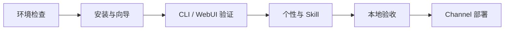

# 第 0 章：开始之前

> 目标：用 5 分钟确认教程是否适合你，并准备好运行 nanobot v0.2.2 的最小环境。

## 0.1 你将完成什么

走完新手村后，你会得到一个可以在 CLI 或 WebUI 中使用的 Agent，并能继续接入聊天平台：

```text
用户：查看当前项目并告诉我下一步应该做什么。
Bot：先读取项目规则和目录，再给出带依据的建议。

用户：查询一个需要实时数据的问题。
Bot：调用合适的工具；成功时说明来源，失败时说明限制。

用户：记住我偏好中文和简短回复。
Bot：在后续会话中使用这个稳定偏好。
```

关键能力包括：

- 用 `AGENTS.md`、`SOUL.md`、`USER.md` 定义项目规则、行为与用户偏好；
- 用 Skill 添加可复用流程；
- 用 Memory 与 Session 保持上下文；
- 通过 Gateway 连接 WebUI 和聊天 Channel；
- 让模型在授权边界内调用文件、命令或网络工具。

示例中的回复内容不是固定输出，实时天气、汇率和模型调用也不是自动化验收的一部分。

## 0.2 选择阅读路线

### 路线 A：先把 nanobot 用起来

适合会运行终端命令、能编辑 JSON/Markdown，希望先完成 CLI 与 WebUI 闭环的人。



预计需要 2–3 小时。

### 路线 B：理解 nanobot 的设计

先完成新手村，再阅读进阶营，理解 Provider、AgentRunner、Memory、MessageBus 和 Channel 的职责边界。

### 路线 C：手写教学版 Agent

适合熟悉 Python、异步编程和类设计的读者。可以直接从[进阶营导读](../hero/README.md)开始，再回看新手村理解真实使用入口。

不确定时先走路线 A。先拿到一次正常回复，后续排错会简单很多。

## 0.3 必须满足的条件

### Python 3.11 或更高

```bash
python3 --version
python3 -m pip --version
```

如果系统把 Python 3 命名为 `python` 或 Windows 的 `py`，后续把命令中的 `python3` 替换成对应名称即可。

### 一个可调用的模型端点

任选一种：

- nanobot 支持的托管 Provider；
- 公司或订阅提供的兼容端点；
- 本机运行的兼容模型服务。

你需要知道 Provider 名称、模型的完整 ID，以及必要时的 API base URL。模型展示名不一定等于 API 使用的模型 ID，请从对应服务的控制台或文档确认。

### 安全提供凭据

本教程不会把真实密钥写进 `config.json`。配置示例统一引用环境变量：

```json
{
  "providers": {
    "custom": {
      "apiKey": "${PROVIDER_API_KEY}",
      "apiBase": "https://api.example.com/v1"
    }
  }
}
```

在启动 nanobot 的同一个终端或服务环境中设置 `PROVIDER_API_KEY`。不要把真实值提交到 Git、贴进 Issue、截图或诊断日志。

### 可选工具

```bash
command -v curl
command -v git
command -v jq
```

- `curl`：部分 Skill 或人工 API 冒烟会用到；
- `git`：从源码安装或使用 GitHub 工作流时需要；
- `jq`：运行本教程的 JSON 配置诊断脚本时需要。

## 0.4 运行仓库自带的预检

在本教程仓库根目录执行：

```bash
bash scripts/check-env.sh
```

脚本只检查本地命令、版本和 `nanobot status`，不会调用模型、外部 API 或打印密钥。

也可以手动检查：

```bash
python3 --version
python3 -m pip --version
nanobot --version
nanobot status
```

`nanobot status` 读取默认配置，显示配置路径、Agent 工作区、活动模型/preset 和 Provider 摘要，但不向模型发送请求。

如果 nanobot 尚未安装，前两项成功就可以继续第 1 章。更完整的系统问题见[环境预检附录](../appendix/environment-precheck.md)。

## 0.5 开始前的检查清单

- [ ] Python 版本不低于 3.11
- [ ] 能在受控环境中安装 Python 包
- [ ] 知道要使用的 Provider 和准确模型 ID
- [ ] 凭据保存在环境变量或密钥管理系统中
- [ ] 明白正文固定使用 nanobot v0.2.2
- [ ] 能编辑 `~/.nanobot/config.json`，但不会用示例覆盖未知的现有配置

!!! info "已有 nanobot 配置怎么办"

    先备份配置，再运行向导或只合并需要的字段。`nanobot onboard` 可以补齐缺失默认值，但教程中的 JSON 通常是局部片段，不应直接覆盖整个文件。

## 0.6 常见问题

### 没有托管模型的 API Key，还能跟做吗？

可以使用本地兼容模型服务，但需要自己准备模型、硬件和 endpoint。教程不会替你选择具体服务，也不会假设某个平台存在免费额度。

### 完全不懂 Python，可以跟做吗？

新手村不要求写 Python，但需要会运行命令、阅读错误信息并编辑 JSON/Markdown。进阶营会用到 Python 基础。

### Windows 可以跟做吗？

可以。常见差异是：

- 虚拟环境激活命令为 `.venv\Scripts\activate`；
- 路径使用 Windows 形式；
- 推荐 PowerShell；若运行 shell 诊断脚本，可使用 Git Bash 或 WSL。

### 需要先了解机器学习吗？

不需要。本教程关注如何调用和编排现有模型，不讲模型训练。

## 0.7 求助时提供什么

先删除密钥、令牌、Cookie 和私有 URL，再提供：

```markdown
**环境**
- OS：
- Python：
- nanobot：

**执行的命令**
（可复现的完整命令，不含凭据）

**错误信息**
（文本形式；密钥已打码）

**已完成的检查**
- nanobot status：
- JSON 语法检查：
- 已尝试的修复：
```

不要粘贴完整 `config.json`。通常只需提供相关字段，并把所有敏感值替换为 `${ENV_NAME}`。

## 0.8 开始

- 想先跑起来 → [第 1 章：5 分钟看到效果](01-quick-start.md)
- 想先检查系统 → [附录：环境预检](../appendix/environment-precheck.md)
- 想直接理解实现 → [进阶营导读](../hero/README.md)
