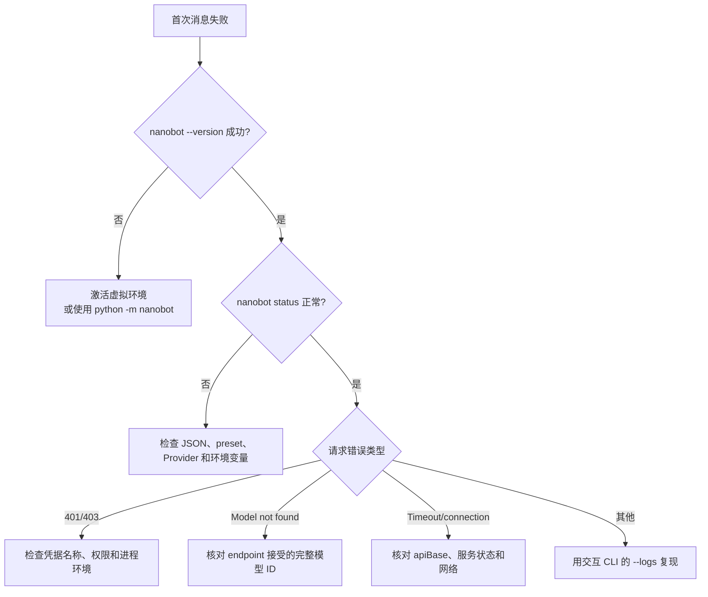
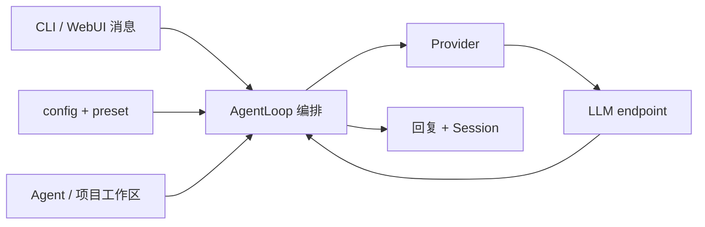

# 第 1 章：5 分钟看到效果

> 目标：安装 nanobot v0.2.2，通过向导完成最小配置，并在 CLI 或 WebUI 得到第一次正常回复。

如果环境还没检查，先读[第 0 章](00-before-you-start.md)。

## 1.1 推荐路线：向导完成首次配置

### 第一步：创建隔离环境并安装固定版本

```bash
mkdir nanobot-demo
cd nanobot-demo
python3 -m venv .venv
source .venv/bin/activate  # Windows PowerShell: .venv\Scripts\activate
python -m pip install "nanobot-ai==0.2.2"
nanobot --version
```

版本输出应包含 `0.2.2`。如果终端找不到 `nanobot`，先确认虚拟环境已激活，再尝试：

```bash
python -m nanobot --version
```

### 第二步：运行配置向导

```bash
nanobot onboard --wizard
```

向导会引导你完成 Provider、模型和必要功能的选择，并创建：

| 路径 | 用途 |
|---|---|
| `~/.nanobot/config.json` | Provider、model preset、Channel、工具和 Gateway 配置 |
| `~/.nanobot/workspace/` | Agent 的 Bootstrap、Memory、Session、Skill 和运行状态 |

选择需要凭据的 Provider 时，可以在输入处使用 `${PROVIDER_API_KEY}`，或在向导完成后把生成配置中的凭据替换为这个环境变量引用。不要把真实值保存在教程仓库。若你希望使用 WebUI，在向导里启用 WebSocket Channel 并设置认证信息。

### 第三步：先做无模型诊断

```bash
nanobot status
```

你应该看到：

- Config 和 Workspace 可用；
- 活动 preset/模型符合预期；
- 该 preset 对应的 Provider 已配置凭据、OAuth 状态或本地 URL。

`status` 不会调用模型。它成功只能证明配置能够读取，不能证明 Provider 一定能回答。

### 第四步：选择一个入口验证

CLI 一次性消息：

```bash
nanobot agent -m "你好，请用一句话介绍你自己"
```

或者在向导已启用 WebSocket Channel 时启动 Gateway：

```bash
nanobot gateway
```

保持终端运行，浏览器打开 `http://127.0.0.1:8765`，使用向导设置的认证信息登录，再发送第一条消息。`18790` 默认是 Gateway 健康端口，不是 WebUI 页面端口。

回复文案会随模型变化。只要收到正常的 assistant 回复，而不是认证、模型或网络错误，首次闭环就成功了。

## 1.2 手动路线：理解配置结构

如果不使用向导，先初始化默认文件：

```bash
nanobot onboard
```

然后编辑 `~/.nanobot/config.json`。下面都是局部片段，请合并进现有 JSON，不要直接覆盖整份配置。

### Provider 凭据与 endpoint

```json
{
  "providers": {
    "custom": {
      "apiKey": "${PROVIDER_API_KEY}",
      "apiBase": "https://api.example.com/v1"
    }
  }
}
```

- `custom` 适合 OpenAI-compatible endpoint；
- 使用 nanobot 已知默认 endpoint 的托管 Provider 时，通常不需要 `apiBase`；
- 使用本地服务、公司网关、代理或区域 endpoint 时，按服务文档填写完整 base URL；
- 环境变量必须在启动 `agent` 或 `gateway` 的进程环境中存在。

### 命名 `modelPresets`

```json
{
  "modelPresets": {
    "primary": {
      "label": "Primary",
      "provider": "custom",
      "model": "model-id-from-your-provider"
    }
  },
  "agents": {
    "defaults": {
      "modelPreset": "primary"
    }
  }
}
```

`modelPresets.primary.provider` 必须与 `providers` 中的配置键匹配，`model` 必须是该 endpoint 接受的准确模型 ID。命名 preset 是推荐方式，也为会话内模型切换和 fallback 配置提供统一入口。只有从模型文档确认后，才覆盖 `maxTokens`、`contextWindowTokens`、`temperature` 等可选字段。

!!! note "兼容方式：直接配置 provider/model"

    v0.2.2 仍支持旧配置把模型直接放在 `agents.defaults`：

    ```json
    {
      "agents": {
        "defaults": {
          "provider": "custom",
          "model": "model-id-from-your-provider"
        }
      }
    }
    ```

    这会形成隐式的 `default` preset，适合迁移旧配置；新配置优先使用命名 `modelPresets`。

### 检查 JSON 与 nanobot 状态

```bash
jq empty ~/.nanobot/config.json
nanobot status
nanobot agent -m "只回复：配置已连通"
```

如果没有 `jq`，可用 Python 只检查 JSON 语法：

```bash
python -m json.tool ~/.nanobot/config.json > /dev/null
```

## 1.3 什么时候用 CLI，什么时候用 WebUI

| 入口 | 启动方式 | 最适合 |
|---|---|---|
| 单次 CLI | `nanobot agent -m "..."` | 安装和 Provider 的最小冒烟 |
| 交互 CLI | `nanobot agent` | 终端连续对话与诊断 |
| WebUI | `nanobot gateway`，浏览器访问 `127.0.0.1:8765` | 多聊天、项目工作区和可视化配置 |

交互 CLI 使用 `exit`、`/exit`、`:q` 或 `Ctrl+D` 退出。前台 Gateway 使用 `Ctrl+C` 停止；后台服务流程会在部署章节说明。

## 1.4 快速诊断



### 常见症状

| 症状 | 优先检查 |
|---|---|
| `nanobot: command not found` | 虚拟环境、PATH，或 `python -m nanobot` |
| `401` / `403` | 环境变量是否传给当前进程、Key 权限、Provider 是否匹配 |
| `Model not found` | preset 中的模型 ID 与 endpoint 是否一致 |
| `Connection timeout` | `apiBase`、本地服务进程、DNS/代理与防火墙 |
| `modelPreset ... not found` | `agents.defaults.modelPreset` 是否对应 `modelPresets` 的键 |

### 查看 Agent 运行日志

v0.2.2 的交互式 Agent 使用 `--logs`：

```bash
nanobot agent --logs
```

在交互会话里复现失败，并只分享已经脱敏的相关日志。不要照搬旧教程中的 Agent 详细日志参数或未定义的日志级别环境变量。

配置层也可以运行仓库脚本：

```bash
bash scripts/verify-config.sh
```

脚本不会打印 API Key。提交 Issue 前仍要人工检查日志中的私有 URL、用户名、文件路径和会话内容。

## 1.5 成功标准

- [ ] `nanobot --version` 显示 v0.2.2
- [ ] `nanobot status` 显示预期的配置、工作区和活动 preset/模型
- [ ] CLI 或 WebUI 至少一个入口得到正常回复
- [ ] `config.json` 中没有明文密钥，只有 `${ENV_NAME}` 引用
- [ ] 知道 WebUI 端口与 Gateway 健康端口不是同一个端口

只要前三项成立，你已经完成最小可用闭环。

## 1.6 原理速览



- Config 决定 Provider、模型、Channel 和工具能力；
- Agent 工作区保存 Bootstrap、Memory、Session 和 Skill；
- AgentLoop 负责会话与完整消息编排；
- Provider 处理特定模型服务的协议差异。

默认 Agent 工作区的核心结构：

```text
~/.nanobot/workspace/
├── AGENTS.md
├── SOUL.md
├── USER.md
├── memory/
│   ├── MEMORY.md
│   └── history.jsonl
├── sessions/
└── skills/
```

三个 Bootstrap 文件会进入 System Prompt；Memory、Skills、Session 和 Runtime Context 有各自的注入规则，下一章会详细拆开。

## 1.7 第一次先不要做什么

- 不要同时切换安装方式、Provider、模型和工作区；
- 不要用局部示例覆盖整个 `config.json`；
- 不要在 CLI 未通过时同时调试 Telegram、Docker 或 systemd；
- 不要把真实凭据贴进命令历史、Markdown 或 Issue。

## 下一步

✅ 已看到正常回复 → [第 2 章：让 Bot 有个性](02-soul.md)

❌ 仍然失败 → [附录：常见坑与排障](../appendix/troubleshooting.md)

🤔 想先看模型请求的最小实现 → [进阶营第 1 章：最简 Agent](../hero/01-simplest-agent.md)
