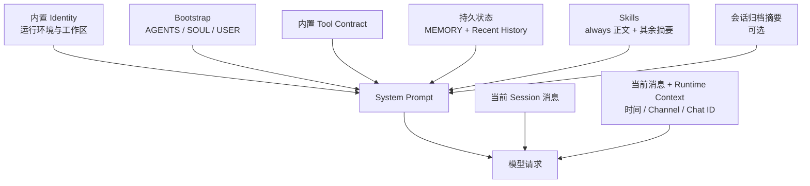

# 第 2 章：让 Bot 有个性

> 目标：通过编辑 Agent 工作区里的 Markdown 文件，定制 Bot 的行为、风格和对你的认知，并分清项目规则、长期状态与会话上下文。

## 2.1 先做一个反差实验

先编辑默认 Agent 工作区里的 `~/.nanobot/workspace/SOUL.md`：

```markdown
# Soul

我是 CaptainBot，一个海盗风格的 AI 助手。

## Personality

- 说话像一个老练的海盗船长
- 把用户称为“船员”
- 回答问题时喜欢用航海比喻

## Communication Style

- 回复开头使用海盗风格的问候
- 技术结论仍要准确，不为了角色效果编造事实
- 回复结尾使用 ⚓
```

测试：

```bash
nanobot agent -m "用一句话解释什么是 API"
```

然后把同一个文件改成专业顾问风格：

```markdown
# Soul

我是 FinBot，一个谨慎、专业、结构清晰的个人财务顾问。

## Behavior

- 面对不完整信息时明确假设
- 不夸大收益，不故作确定
- 涉及投资决策时提示风险和适用边界

## Communication Style

- 先给结论摘要，再列依据
- 涉及金额时注明币种
- 重要风险单独列出
```

再次问同一个问题。你会看到语气和组织方式明显变化，但不需要修改 Python 代码。

!!! note "角色设定不是事实来源"

    `SOUL.md` 可以改变表达和行为策略，不能让模型凭空获得实时天气、行情或专业资质。需要外部事实时仍要使用可靠工具并说明来源。

## 2.2 真实模型：不是“四文件”，而是分层上下文

在 nanobot v0.2.2 中，自动读取的 Bootstrap 文件只有三个：

```python
BOOTSTRAP_FILES = ["AGENTS.md", "SOUL.md", "USER.md"]
```

`TOOLS.md` **不是**自动 Bootstrap 文件。工具的通用能力、调用约定和边界来自 nanobot 内置的 tool contract；领域操作流程适合写成 Skill，硬权限则必须由配置、工具实现或系统沙箱执行。

一轮对话实际会组合这些来源：



| 来源 | 谁维护 | 适合放什么 |
|---|---|---|
| `AGENTS.md` | 你 | 当前工作区的项目规则、协作约定、验收流程 |
| `SOUL.md` | 你；Dream 可整理 | Agent 的行为策略、护栏、互动方式、语气 |
| `USER.md` | 你；Dream 可整理 | 用户身份、稳定偏好、习惯、语言和表达偏好 |
| `memory/MEMORY.md` | 主要由 Dream 管理 | 项目目标、架构、重要决策等长期事实 |
| Skills | 内置或你编写 | 只在相关任务中需要的可复用操作流程 |
| 内置 tool contract | nanobot 源码 | 工具能力、通用调用约定和模型可见边界 |
| Session / Runtime Context | nanobot 运行时 | 最近对话、当前消息、时间和 Channel 元数据 |

上游实现可对照 [`ContextBuilder`](https://github.com/HKUDS/nanobot/blob/e2e75c913f3524d4bc5b23487a4eed5329eef182/nanobot/agent/context.py) 和 [`MemoryStore`](https://github.com/HKUDS/nanobot/blob/e2e75c913f3524d4bc5b23487a4eed5329eef182/nanobot/agent/memory.py)。

## 2.3 内容应该放在哪里

先问“这条信息属于谁、要保持多久、何时才需要”。

| 内容 | 推荐位置 | 原因 |
|---|---|---|
| “这个仓库提交前必须跑严格文档构建” | `AGENTS.md` | 项目级工作约定 |
| “回答要谨慎；查证后再下结论” | `SOUL.md` | 长期行为策略 |
| “用户偏好中文和简短回复” | `USER.md` | 用户稳定偏好 |
| “项目采用 PostgreSQL，迁移方案已确定” | `memory/MEMORY.md` | 长期项目事实；交给 Dream 整理 |
| “查询汇率时如何校验输入和处理超时” | Skill | 特定领域的可复用流程 |
| “只允许访问某个目录” | 配置、工具边界或系统沙箱 | 提示词不是硬安全边界 |
| “这一次只比较两个文件” | 当前消息 | 一次性要求不应污染长期状态 |

### 三个 Bootstrap 文件的分工

`AGENTS.md` 回答“这个工作区里的任务应该如何完成”：

```markdown
# Project Instructions

- 修改文档后运行 `python -m mkdocs build --strict`
- 不改动与当前任务无关的文件
- 提交前说明验证结果
```

`SOUL.md` 回答“Agent 应该如何判断和表达”：

```markdown
# Soul

- 诚实说明不确定性，不编造来源
- 对破坏性操作保持谨慎
- 先给结论，再给必要依据
```

`USER.md` 回答“正在服务谁”：

```markdown
# User Profile

- 默认语言：中文
- 时区：Asia/Shanghai
- 偏好：简洁结论；复杂比较使用表格
```

!!! warning "软约束与硬边界不同"

    写在 Markdown 里的“不要访问系统目录”仍是给模型看的指令。真正的目录限制应使用 `tools.restrictToWorkspace`、工具本身的路径校验或操作系统级沙箱；本章的文件不能替代这些控制。

## 2.4 Agent 工作区和项目工作区

这两个“工作区”名称相近，但所有权不同。

### Agent 工作区：Bot 的持久家目录

默认路径是 `~/.nanobot/workspace/`，也可以通过 `agents.defaults.workspace` 或 CLI 的 `--workspace` 改成另一个目录。它归当前 nanobot 实例所有，通常包含：

```text
agent-workspace/
├── AGENTS.md
├── SOUL.md
├── USER.md
├── memory/
│   ├── MEMORY.md
│   └── history.jsonl
├── skills/
├── sessions/
└── cron/
```

Memory、Dream、Session 和 Agent 级 Skill 都以这个目录为持久状态边界。CLI 的 `--workspace` 是替换整个 Agent 工作区，不只是临时改变当前命令的 `cwd`。

### 项目工作区：当前聊天正在处理的项目

v0.2.2 的 WebUI 可以给一个聊天选择已有的项目目录。这个目录成为该聊天的有效项目根和工具操作根；`ContextBuilder` 会从这个项目根读取当轮的 `AGENTS.md`、`SOUL.md`、`USER.md`。它不会再把 Agent 工作区里的同名文件自动叠加进来。

项目工作区不接管 Agent 的 MemoryStore：Dream、`memory/history.jsonl` 和版本化的长期文件仍属于配置中的 Agent 工作区。实践中建议：

- 项目仓库自己的规则写入项目根 `AGENTS.md`；
- 只有需要项目级覆盖时，才在项目根增加 `SOUL.md` 或 `USER.md`；
- 不要假设 Agent 工作区的同名 Bootstrap 会自动覆盖或补齐项目根；
- 不要把 `~/.nanobot/workspace/` 当成随意存放业务仓库的公共目录；
- WebUI 的项目选择是每个聊天的作用域，CLI `--workspace` 则是实例级工作区覆盖。

!!! warning "WebUI 项目选择不自动等于系统沙箱"

    项目根会影响工具解析路径和应用层边界，但是否有操作系统级隔离还取决于部署方式。安全边界会在部署章节单独说明。

## 2.5 实操：定制一个财务顾问 Bot

下面只使用三个 Bootstrap 文件；后续再把领域流程拆成 Skill。

### `SOUL.md`

```markdown
# Soul

我是 FinBot，一个谨慎、清晰的个人财务教育助手。

## Behavior

- 不承诺收益，不把猜测写成事实
- 信息不足时先说明假设
- 涉及具体投资决策时说明风险和专业咨询边界

## Communication Style

- 先总结问题，再分析，再给可执行的下一步
- 涉及金额时注明币种
- 重要风险单独列出
```

### `AGENTS.md`

```markdown
# Project Instructions

## 回答验收

1. 区分已知事实、用户提供的信息和假设
2. 使用外部数据时标注来源与查询时间
3. 不输出未经用户确认的破坏性命令
4. 回复结构使用“问题理解 / 分析 / 建议 / 风险”
```

### `USER.md`

```markdown
# User Profile

- 默认语言：中文
- 默认币种：人民币（CNY）
- 风险偏好：稳健型
- 输出偏好：喜欢表格和分点说明
```

复杂的“查询行情、换算汇率、校验数据”流程不要继续堆进这三个文件。把它写成下一章的 Skill，只有相关问题出现时才加载。

### 另外两个风格模板

<details>
<summary>📋 个人助理</summary>

`SOUL.md`：

```markdown
# Soul

- 主动、高效、注意隐私
- 简洁直接，用清单和时间线表达
- 不替用户发送消息或执行外部操作，除非用户明确授权
```

`AGENTS.md`：

```markdown
# Project Instructions

- 涉及时间时写明时区
- 涉及文件时说明保存路径
- 先确认目标，再整理待办和验收条件
```

</details>

<details>
<summary>🛠️ 技术支持</summary>

`SOUL.md`：

```markdown
# Soul

- 耐心、准确，不假设用户的技术水平
- 安全优先；不把危险操作当作第一方案
- 解释原因，同时给出可验证的步骤
```

`AGENTS.md`：

```markdown
# Project Instructions

1. 收集系统、版本和完整错误信息
2. 给出最小复现或只读诊断
3. 分步修复并逐步验证
4. 记录预防措施
```

</details>

## 2.6 验证配置是否生效

### 第 1 轮：看行为与格式

```bash
nanobot agent -m "我每个月能存 5000 元，应该先做什么理财准备？"
```

- [ ] 回复区分了事实与假设
- [ ] 没有承诺收益
- [ ] 结构符合 `AGENTS.md`
- [ ] 语气符合 `SOUL.md`

### 第 2 轮：看用户画像

```bash
nanobot agent -m "按我的风险偏好，你会先关注哪些方向？"
```

- [ ] 提到“稳健型”或等价表述
- [ ] 金额默认使用 CNY
- [ ] 输出符合 `USER.md` 的偏好

### 第 3 轮：看信息边界

```bash
nanobot agent -m "告诉我此刻美元兑人民币的准确汇率"
```

- [ ] 没有把训练数据中的旧数值冒充实时行情
- [ ] 若使用工具，说明来源和查询时间
- [ ] 无法取得实时数据时明确说明限制

模型输出不是确定性断言。某次没有完全遵循风格时，先把规则写得更短、更具体，再开一个新会话验证，避免旧 Session 消息干扰判断。

## 2.7 System Prompt 怎样组装

`ContextBuilder.build_system_prompt()` 在 v0.2.2 中按下面的次序组装：

```text
内置 identity
---
AGENTS.md + SOUL.md + USER.md（存在才读取）
---
内置 tool contract
---
Memory（MEMORY.md 有非模板内容时）
---
always Skills 的正文
---
其他可用 Skills 的摘要
---
Recent History（启用且有尚未被 Dream 消费的条目时）
---
Archived Context Summary（当前 Session 有归档摘要时）
```

随后，当前 Session 消息和本轮用户消息进入模型请求；时间、Channel、Chat ID 等运行时信息作为 metadata-only 区块附在当前消息后。

这解释了几个常见现象：

- 文件不存在时，对应 Bootstrap 层会被跳过；
- 未修改的默认 `MEMORY.md` 模板不会重复注入；
- Skill 通常先出现摘要，模型选择后才读取完整正文；
- 旧消息可能被归档为摘要，而不是永远逐字放进上下文；
- Runtime Context 是运行元数据，不是用户可伪造的长期规则。

## 2.8 Memory 和 Dream 的所有权

Agent 工作区中的长期状态分成两类：

| 文件 | 用途 | 默认管理者 |
|---|---|---|
| `memory/history.jsonl` | Consolidator 产生的追加式历史摘要 | nanobot |
| `SOUL.md` | 行为策略与互动方式 | 用户初始化；Dream 可整理 |
| `USER.md` | 用户身份与稳定偏好 | 用户初始化；Dream 可整理 |
| `memory/MEMORY.md` | 项目目标、架构和长期决策 | Dream |

Dream 会读取新增历史，再对 `SOUL.md`、`USER.md`、`memory/MEMORY.md` 做一次有边界的整理；这些文件由 GitStore 记录版本，因此可以审计和恢复。Dream 不管理 `AGENTS.md`，也不会把提示词变成操作系统权限。

不要把每条聊天记录手工塞进 `MEMORY.md`。短期对话属于 Session，可复用操作属于 Skill，只有仍然成立的长期事实才应该进入持久记忆。完整生命周期会在进阶营记忆章节展开。

## 2.9 常见错误

### 把所有内容都写进 `SOUL.md`

结果是人格、项目规则、用户事实和操作流程混在一起，既占上下文，也难以更新。按“行为 / 项目 / 用户 / 事实 / 流程”重新分类。

### 用提示词代替权限控制

“绝不运行危险命令”是有价值的行为护栏，但不是强制隔离。文件范围、网络范围和命令执行必须由相应配置与运行环境限制。

### 把默认 Agent 工作区当作当前项目目录

`~/.nanobot/workspace/` 保存 Agent 状态；你要处理的代码仓库可能是另一个项目工作区。先确认当前有效根目录，再让工具读写文件。

### 直接维护自动记忆文件

手工编辑可能与 Dream 的分类和版本游标冲突。优先通过对话纠正事实，并用 Dream 日志与恢复命令检查自动变更。

## 2.10 小结

| 你想改变什么 | 放在哪里 |
|---|---|
| 项目规则和验收流程 | `AGENTS.md` |
| Agent 行为、护栏和语气 | `SOUL.md` |
| 用户身份和稳定偏好 | `USER.md` |
| 长期项目事实 | 由 Dream 整理到 `memory/MEMORY.md` |
| 可复用领域流程 | Skill |
| 工具硬边界 | 配置、工具实现、系统沙箱 |
| 临时要求 | 当前消息 / Session |

三个 Bootstrap 文件会在每轮构建上下文时重新读取；修改后通常无需重启，但已有 Session 的对话内容仍可能影响结果。

## 下一步

✅ **如果验证成功** → 继续 [第 3 章：教 Bot 新技能](03-skills.md)

❌ **如果风格没有明显变化** → 确认文件位于当前有效工作区、内容足够具体，并用新会话重试。

🤔 **如果想理解更深层原理** → 去 [进阶营第 3 章：记忆与上下文](../hero/03-memory-and-context.md)
