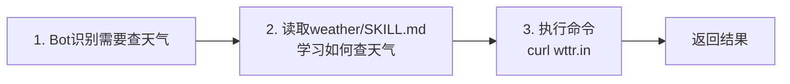
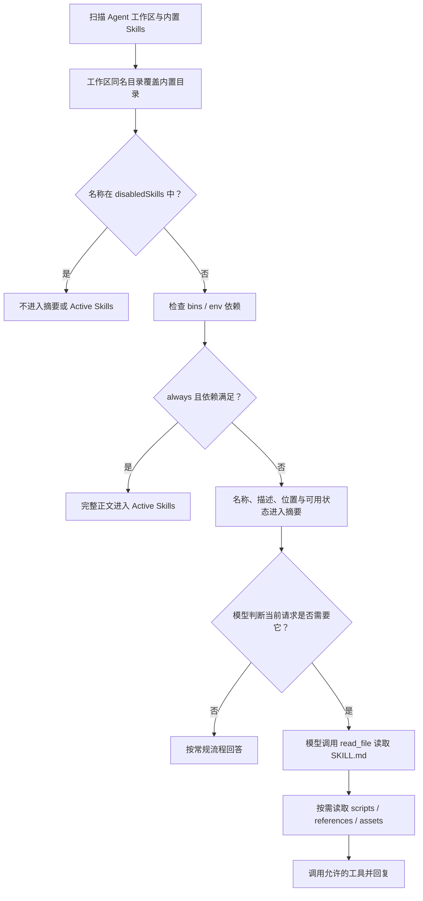
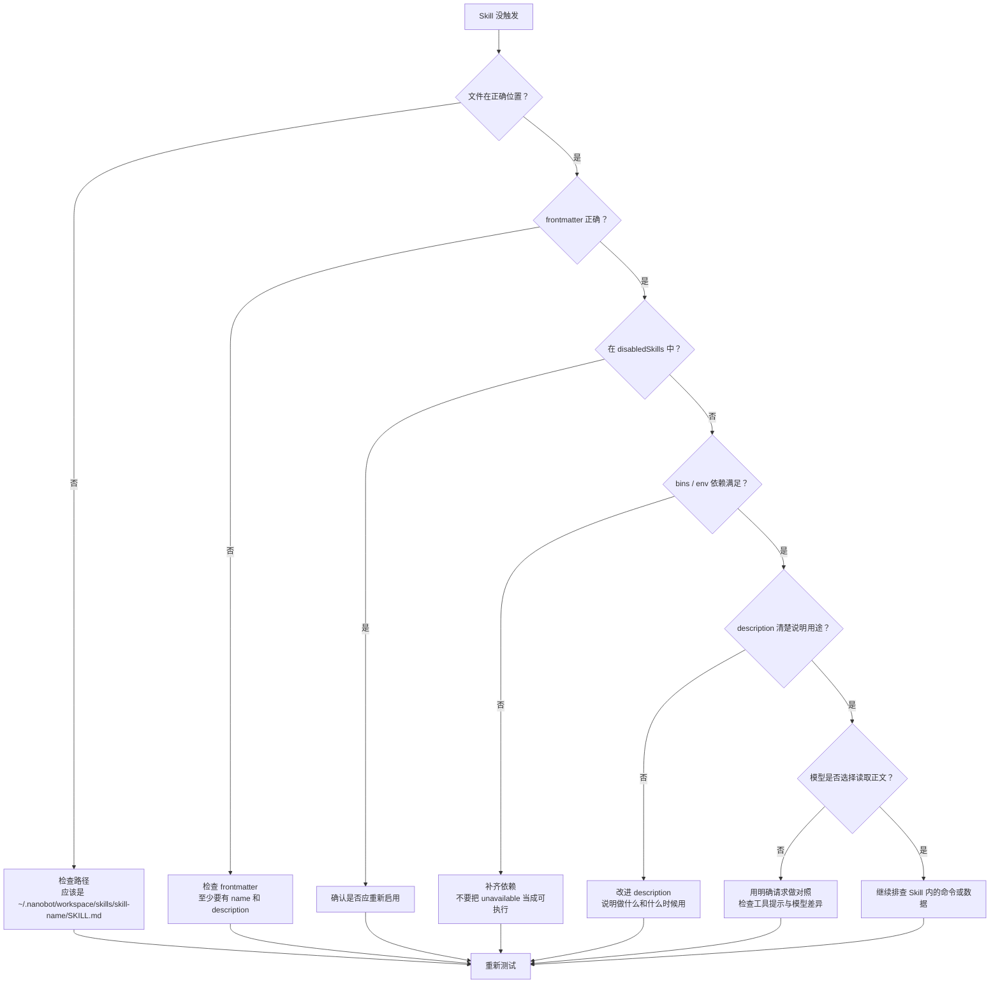

# 第 3 章：教 Bot 新技能

> 目标：理解 Skill 系统的设计原理，创建自己的第一个 Skill。

## 3.1 先看一个内置 Skill 怎么工作

在解释原理之前，我们先观察一个真实的 Skill 运作过程。

### 体验：weather Skill

nanobot 内置了一个 `weather` 技能，我们先看看它是怎么工作的：

```bash
nanobot agent -m "北京今天天气怎么样？"
```

**观察这几个关键时刻：**

```
用户：北京今天天气怎么样？
  ↓
Bot：判断 weather Skill 可能有用
  ↓
[终端显示] 🔧 Tool: read_file(path="<skills 摘要列出的路径>")
  ↓
[终端显示] 🔧 Tool: exec(command="<Skill 指定的查询命令>")
  ↓
Bot：转述本次查询实际返回的天气和数据时间。
```

这只是流程示意。是否读取 Skill、具体工具参数和天气值都由当前模型、Skill 内容与实时响应共同决定，不能把示例输出当成固定结果。

### 🎯 三个关键观察点



**这就是普通按需 Skill 的核心流程：**
1. **模型选择** → Bot 从 skills 摘要中判断 `weather` 是否与当前请求有关
2. **按需学习** → Bot 决定读取完整的 `SKILL.md`，学习具体怎么做
3. **执行行动** → Bot 按照 Skill 中的指示调用工具

---

## 3.2 什么是 Skill？

Skill 是一个 Markdown 文件，**教会 Bot 如何做某件特定的事**。

### 类比理解

| 对比项 | 作用 |
|--------|------|
| `SOUL.md` | Bot **是谁**（性格） |
| `AGENTS.md` | Bot **怎么做事**（通用规则） |
| `Skill` | Bot **会做什么**（具体能力） |

### 最简单的形式

一个 Skill 最简单就是一个文件夹 + 一个 `SKILL.md`：

```
skills/
└── my-skill/
    └── SKILL.md
```

---

## 3.3 Skill 的选择与加载机制（重要！）

这是理解 Skill 系统的关键。

### 从发现到执行的生命周期

大多数 Skill 不会一开始就把全文塞进上下文。nanobot 先扫描配置的 Agent 工作区和内置目录，再按覆盖、禁用、依赖与 `always` 状态决定如何展示：



### 各阶段加载什么

| 阶段 | 内容 | 进入上下文的条件 | 成本取决于 |
|------|------|------------------|------------|
| 摘要 | 非禁用 Skill 的目录名、`description`、位置和可用状态 | 普通 Skill；依赖缺失时会标为 `unavailable` | Skill 数量、描述和路径长度 |
| Active Skills | 去掉 frontmatter 后的完整 `SKILL.md` | `always` 为真、未禁用且依赖满足 | 正文实际长度 |
| 按需正文 | 模型通过 `read_file` 读取的普通 `SKILL.md` | 模型认为当前请求需要它 | 被读取文件的实际长度 |
| 附加资源 | `scripts/`、`references/`、`assets/` | Skill 指示且模型确实需要 | 实际读取或执行的内容 |

这里没有代码级的关键词匹配器。`description` 是放进 Prompt 的选择线索，最终是否读取正文由当前模型结合用户请求判断，因此“触发”不是确定性事件。

### 为什么这么设计？

**问题：** 如果把大量 Skill 的完整内容全塞进 System Prompt，会发生什么？
- 光 Skills 就占了几万个 token
- 留给对话历史的空间所剩无几
- 响应速度变慢，成本增加

**解决方案：** 渐进式加载
- 普通 Skill 先只提供摘要，正文按需读取
- `always` 只留给确实必须随每轮提供的短指令
- 依赖缺失会显式标注，不伪装成可执行能力

不要给 Skill 数量套固定 token 公式：模型 tokenizer、描述长度、绝对路径、frontmatter 和实际读取的资源都会改变占用。

---

## 3.4 动手：创建你的第一个 Skill

现在轮到你了。我们分三个难度等级来创建 Skill。

### Level 1：最简 Skill（验证发现与选择）

先创建一个超简单的 Skill，目标是验证“摘要可见 → 模型选择 → 读取正文”，而不是做复杂功能。

**步骤 1：创建文件**

```bash
mkdir -p ~/.nanobot/workspace/skills/hello
```

**步骤 2：创建 `~/.nanobot/workspace/skills/hello/SKILL.md`**

```markdown
---
name: hello
description: Say hello in a special way when the user asks you to greet them.
---

# Hello Skill

When the user asks you to say hello, respond with:

"🎉 Hello from your custom skill! This is proof that Skill loading works!"
```

**步骤 3：测试**

```bash
nanobot agent -m "请用 hello skill 向我打招呼"
```

**预期输出：**
```
🎉 Hello from your custom skill! This is proof that Skill loading works!
```

✅ **如果成功了** → 你已经走通了 Skill 的基本发现与按需加载流程！

❌ **如果没有触发** → 往下看"Skill 没触发？诊断树"

---

### Level 2：真正有用的 Skill（集成工具调用）

现在做一个查询“数据源最近一次发布汇率”的 Skill。汇率和覆盖币种会变化，所以示例不写死结果。

**步骤 1：创建目录**

```bash
mkdir -p ~/.nanobot/workspace/skills/exchange-rate
```

**步骤 2：创建 `~/.nanobot/workspace/skills/exchange-rate/SKILL.md`**

```markdown
---
name: exchange-rate
description: Query the latest published exchange rate between ISO currency codes and convert an amount. Use for currency conversion or exchange-rate questions that require a cited, current data source.
metadata: {"nanobot":{"requires":{"bins":["curl","python3"]}}}
---

# Exchange Rate

Use the public ExchangeRate-API endpoint. Treat it as an external, fallible data source.

## Convert an amount

\```bash
# Replace only after validating the user's request. Never splice raw user text
# into a URL or shell fragment.
FROM="USD"
TO="CNY"
AMOUNT="1000"

case "$FROM" in [A-Z][A-Z][A-Z]) ;; *) echo "Error: invalid source currency" >&2; exit 2 ;; esac
case "$TO" in [A-Z][A-Z][A-Z]) ;; *) echo "Error: invalid target currency" >&2; exit 2 ;; esac

RESPONSE_FILE="$(mktemp)"
trap 'rm -f "$RESPONSE_FILE"' EXIT

if ! curl --fail --silent --show-error --location \
  --connect-timeout 5 --max-time 15 \
  --output "$RESPONSE_FILE" \
  "https://open.er-api.com/v6/latest/${FROM}"; then
  echo "Error: exchange-rate request failed" >&2
  exit 1
fi

python3 - "$RESPONSE_FILE" "$FROM" "$TO" "$AMOUNT" <<'PY'
from decimal import Decimal, InvalidOperation
import json
import sys

path, source, target, amount_text = sys.argv[1:]

try:
    with open(path, encoding="utf-8") as stream:
        data = json.load(stream)
    if data.get("result") != "success":
        raise ValueError(data.get("error-type", "API returned failure"))
    rates = data.get("rates")
    if not isinstance(rates, dict) or target not in rates:
        raise ValueError(f"unsupported target currency: {target}")
    amount = Decimal(amount_text)
    rate = Decimal(str(rates[target]))
    if not amount.is_finite() or amount < 0:
        raise ValueError("amount must be a finite, non-negative number")
    if not rate.is_finite() or rate <= 0:
        raise ValueError("API returned an invalid rate")
except (OSError, json.JSONDecodeError, InvalidOperation, TypeError, ValueError) as exc:
    print(f"Error: {exc}", file=sys.stderr)
    raise SystemExit(1)

print(f"{amount:f} {source} = {amount * rate:.2f} {target}")
print(f"Rate returned: 1 {source} = {rate} {target}")
print(f"Published at: {data.get('time_last_update_utc', 'not supplied')}")
print(f"Currencies in this response: {len(rates)}")
print("Data source: ExchangeRate-API")
PY
\```

## Rules

- Accept only three-letter currency codes and normalize them to uppercase before composing the command.
- Reject missing, non-numeric, non-finite, or negative amounts.
- If curl, JSON parsing, API status, or currency lookup fails, report the failure; never invent a rate.
- Report the source and the update timestamp returned by this response.
- Derive the available-currency count from `len(rates)`; do not hard-code a total.
- Exchange-rate output is informational, not financial advice.
```

**步骤 3：测试**

```bash
nanobot agent -m "1000 美元等于多少人民币？"
```

**预期输出：**
```
让我查询最新汇率...
[工具调用过程]
根据数据源本次返回的汇率，给出换算结果、数据更新时间和来源；具体数值随响应变化。
```

---

### Level 3：更稳健的教学版（补齐边界）

<details>
<summary>点击展开：为什么这仍然不是“生产可用”</summary>

Level 2 已经加入依赖声明、输入校验、连接/总超时、HTTP 失败、JSON/API 状态检查和临时文件清理，适合作为**更稳健的教学版**。真实生产服务还需要结合自己的风险模型补齐：

- 对第三方服务的条款、限流、可用性和数据许可证做审查
- 用确定性脚本或 Tool 接收结构化参数，避免模型拼接 Shell
- 对网络出口、代理、DNS 与 SSRF 做硬隔离
- 设计缓存、重试退避、监控和备用数据源
- 为成功、超时、错误 JSON、未知币种与异常金额写离线测试
- 对金融场景增加精度、舍入、时区和合规规则

因此教程不承诺固定更新频率、固定币种总数或固定换算值。CI 也不访问这个公共端点；真实查询只作为可选人工冒烟测试。

</details>

---

## 3.5 Skill 没触发？用这个诊断树

如果你的 Skill 没有被触发，不要慌，按这个流程逐一排查：



### 诊断步骤详解

#### 问题 1：文件在正确位置吗？

**检查命令：**
```bash
ls -la ~/.nanobot/workspace/skills/exchange-rate/
# 应该看到 SKILL.md
```

**常见错误：**
- ❌ `~/.nanobot/skills/exchange-rate/SKILL.md`（少了 workspace）
- ❌ `~/.nanobot/workspace/exchange-rate/SKILL.md`（少了 skills）
- ❌ `~/.nanobot/workspace/skills/SKILL.md`（少了子目录）

---

#### 问题 2：frontmatter 正确吗？

**检查命令：**
```bash
head -n 5 ~/.nanobot/workspace/skills/exchange-rate/SKILL.md
```

**必须包含：**
```yaml
---
name: exchange-rate
description: Query the latest published exchange rate and convert an amount...
---
```

**常见错误：**
- ❌ 缺少前后的 `---`
- ❌ `description` 是空的或太简短
- ❌ `name` 和目录名不一致（虽然允许，但容易混淆）

---

#### 问题 3：Skill 被禁用了吗？

`agents.defaults.disabledSkills` 按**目录名**同时排除内置和工作区 Skill。先用 WebUI 查看 Agent 默认配置；手工检查时只确认名称，不要打印包含凭据的完整配置。

禁用是“不要向模型展示/加载这个 Skill”，不是文件权限或工具沙箱。即使禁用了 Skill，底层 Tool 是否能访问网络或执行命令仍由工具配置和系统隔离决定。

---

#### 问题 4：依赖命令和环境变量存在吗？

**检查命令：**
```bash
command -v curl
command -v python3
test -n "${REQUIRED_ENV_NAME:-}" && echo "依赖变量已设置" || echo "依赖变量未设置"
```

`requires.bins` 使用当前进程可找到的命令，`requires.env` 只检查环境变量是否有值。缺失时，普通 Skill 仍会出现在摘要里但标为 `unavailable`；缺失依赖的 `always` Skill 也不会完整注入。不要回显环境变量的值。

**如果缺少：**
```bash
# Ubuntu/Debian
sudo apt install curl python3

# macOS
brew install curl python3

# Windows
# 使用 Git Bash 或 WSL
```

---

#### 问题 5：description 足够清晰吗？

**❌ 坏示例：**
```yaml
description: Exchange rate tool
```

**✅ 好示例：**
```yaml
description: Query the latest published exchange rate and convert an amount. Use when the user needs a cited current data source.
```

**改进原则：**
- 说明"做什么"
- 说明"什么时候用"
- 包含关键词（如 "currency", "exchange", "conversion"）

---

#### 问题 6：模型是否选择了这个 Skill？

**低触发率问法：**
```bash
"美元对人民币是多少？"  # 太简短，模型可能直接猜答案
```

**用于诊断的明确问法：**
```bash
"请用 exchange-rate skill 查询 1000 美元等于多少人民币，并说明数据来源"
```

**可用于对照的 3 类问法：**

1. **直接点名 Skill**
   ```
   请用 exchange-rate skill 查询...
   ```

2. **点名任务 + 数据来源**
   ```
   请查询当前 USD/CNY 汇率，并告诉我你使用了什么来源
   ```

3. **点名动作**
   ```
   请先读取相关 Skill，再完成汇率换算
   ```

---

### 快速诊断脚本

从本教程仓库根目录运行现有的只读检查，不要再复制一份容易漂移的脚本：

```bash
bash scripts/check-skill.sh exchange-rate
```

它只检查目录、`SKILL.md` 和基础 frontmatter，并预览文件开头；不要在 Skill 中保存密钥或个人数据。`disabledSkills`、依赖满足情况和模型是否读取正文仍需按上面的生命周期逐层确认。

---

## 3.6 Skill 的高级结构

简单 Skill 只需要一个 `SKILL.md`。复杂 Skill 可以带资源文件：

```
my-skill/
├── SKILL.md           ← 必须有（入口）
├── scripts/           ← 可执行脚本（确定性操作）
│   └── process.py
├── references/        ← 参考文档（按需读取）
│   ├── api-docs.md
│   └── schema.md
└── assets/            ← 资源文件（模板、图片等）
    └── template.html
```

### 何时使用各个目录

| 目录 | 用途 | 何时使用 | 示例 |
|------|------|---------|------|
| `scripts/` | 确定性的可执行代码 | 同样的操作需要反复执行 | PDF 旋转、数据格式转换 |
| `references/` | 文档参考资料 | Agent 需要查阅的专业知识 | API 文档、数据库 Schema |
| `assets/` | 输出资源 | 需要被复制/使用的文件 | 模板、图标 |

### 什么时候写进 Skill，什么时候下沉成 Tool 或 scripts/

这是最容易混淆的边界。

**适合写进 `SKILL.md` 正文的：**
- ✅ 什么时候该用某种能力
- ✅ 一段任务说明或工作方法
- ✅ 少量可直接执行的命令模板
- ✅ 某个领域里的操作顺序和注意事项

**不适合只写在 `SKILL.md` 里的：**
- ❌ 稳定、反复执行的解析逻辑 → `scripts/`
- ❌ 需要强输入输出约束的步骤 → Tool
- ❌ 很长的 shell one-liner → `scripts/`
- ❌ 容易因为模型改写而出错的核心计算 → Tool 或 `scripts/`

**经验法则：**
- 如果你在教 Agent **"什么时候做、怎么做"** → 优先写 `SKILL.md`
- 如果你在追求 **"稳定地做对"** → 优先下沉成 Tool 或 `scripts/`

---

## 3.7 Frontmatter 详解

```yaml
---
name: my-skill               # 应提供：便于人和模型理解
description: ...             # 应提供：模型选择 Skill 的主要线索
always: true                 # 可选：满足条件时完整注入
metadata: {"nanobot": {...}} # 可选：依赖、图标、always 等
---
```

运行时覆盖、禁用和加载使用的是 **Skill 目录名**。frontmatter 的 `name` 最好与目录一致，但不能靠改 `name` 来改变目录优先级。

### description 是最重要的字段

`description` 是模型判断“这个 Skill 是否可能有用”的**主要线索**。它会与名称、用户请求和模型本身一起进入判断，不是确定性的路由表达式。

**好的写法：**
```yaml
description: Query the latest published exchange rate and convert an amount. Use when the user needs a cited current data source.
```

**差的写法：**
```yaml
description: Exchange rate tool
```

**原则：** 告诉 Agent "这个 Skill 干什么" + "什么情况下该用它"

### always 标记

设置 `always: true`（或 `metadata.nanobot.always`）后，Skill 在**未禁用且依赖满足**时会把去掉 frontmatter 的完整正文放入 `Active Skills`，并从普通摘要中排除。

**何时使用：**
- 很短、确实需要每轮提供的操作说明
- 无法仅靠摘要再按需读取的基础流程

**何时不用：**
- 大多数 Skill 不需要，按需加载效率更高
- 安全权限不能靠 `always` Prompt 强制，必须下沉到 Tool 配置和系统隔离

!!! info "版本差异：不要假设 memory 永远是 always"
    v0.2.2 固定源码中的 [`memory/SKILL.md`](https://github.com/HKUDS/nanobot/blob/e2e75c913f3524d4bc5b23487a4eed5329eef182/nanobot/skills/memory/SKILL.md) 和 `my` 带有 `always: true`。审计的 [`main@b189a376` memory/SKILL.md](https://github.com/HKUDS/nanobot/blob/b189a37648e4fa64f662b15de4f78ffd0bab403b/nanobot/skills/memory/SKILL.md) 已移除这一标记，改由摘要和模型按需选择。`always` 是具体版本中具体 Skill 的元数据，不是“memory 类 Skill 永远完整加载”的规则。

### metadata 字段

```yaml
metadata: {
  "nanobot": {
    "emoji": "🌤️",
    "requires": {
      "bins": ["curl", "python3"],
      "env": ["API_KEY"]
    }
  }
}
```

**用途：**
- 声明依赖（`requires.bins`、`requires.env`）
- `bins` 检查当前进程的可执行命令，`env` 只检查环境变量是否有非空值
- 依赖不满足时，普通 Skill 在摘要中标为 `unavailable`；`always` Skill 不会完整注入

依赖声明是可用性提示，不是安全控制。它不会限制底层 Tool，也不会验证外部服务一定健康。

---

## 3.8 覆盖、禁用与加载优先级

nanobot 会从当前配置的 Agent 工作区和安装包查找 Skill。默认工作区如下；若你配置了自定义 Agent 工作区，请替换第一条路径：

```
1. ~/.nanobot/workspace/skills/  ← 用户自定义（优先级高）
2. nanobot 安装目录/skills/      ← 内置（优先级低）
```

处理顺序以 [`SkillsLoader`](https://github.com/HKUDS/nanobot/blob/e2e75c913f3524d4bc5b23487a4eed5329eef182/nanobot/agent/skills.py) 为准：

1. 收集工作区中含 `SKILL.md` 的目录。
2. 同目录名的内置 Skill 被工作区版本覆盖。
3. `agents.defaults.disabledSkills` 再按目录名排除 Skill。
4. 检查 `requires.bins` / `requires.env`，决定可用状态。
5. 满足条件的 `always` Skill 注入全文，其余进入摘要，由模型决定是否读取。

因此，一个依赖缺失的工作区同名 Skill 仍会遮住内置版本；它会显示为 `unavailable`，不会自动回退到内置 Skill。

要禁用某些 Skill，优先在 WebUI 修改 Agent 默认配置。手工编辑时把下面字段**合并**进现有配置，不要覆盖整个文件：

```json
{
  "agents": {
    "defaults": {
      "disabledSkills": ["weather", "exchange-rate"]
    }
  }
}
```

禁用同时作用于工作区和内置同名 Skill，但它不是删除文件，也不是阻止底层工具执行相似操作的权限边界。

你可以用这个机制覆盖内置 Skill 的行为。

!!! info "main 差异：摘要路径更清楚，选择机制不变"
    v0.2.2 的摘要在每个条目里给出完整路径；[`main@b189a376` 的 `SkillsLoader`](https://github.com/HKUDS/nanobot/blob/b189a37648e4fa64f662b15de4f78ffd0bab403b/nanobot/agent/skills.py) 改为按 Workspace/Built-in 分组，先给绝对根目录，再给相对 `SKILL.md` 路径。两者都只是把候选信息放进 Prompt，仍由模型决定是否调用 `read_file`。

---

## 3.9 练习

### 入门练习

创建一个 `translator` Skill，让 Bot 在翻译时遵循特定规则（比如保留专有名词不翻译）。

<details>
<summary>点击查看参考答案</summary>

```markdown
---
name: translator
description: Translate text between languages while preserving proper nouns and technical terms. Use when the user asks to translate text.
---

# Translator Skill

## Rules

1. Preserve proper nouns (names, places, brands)
2. Preserve technical terms (API, HTTP, JSON, etc.)
3. Maintain formatting (markdown, code blocks)
4. Provide both literal and contextual translations when needed

## Example

User: "Translate to Chinese: Apple released the new iPhone with improved API."

Output:
- Literal: "Apple 发布了新的 iPhone，改进了 API。"
- Contextual: "苹果公司发布了新款 iPhone，改进了应用程序接口。"

Note: "Apple" (company name), "iPhone" (product name), and "API" (technical term) are preserved.
```

</details>

---

### 进阶练习

创建一个带 `scripts/` 的 Skill，比如一个自动格式化 JSON 的工具。

<details>
<summary>点击查看参考答案</summary>

**目录结构：**
```
skills/json-format/
├── SKILL.md
└── scripts/
    └── format.py
```

**SKILL.md：**
```markdown
---
name: json-format
description: Format and validate JSON text. Use when the user provides JSON that needs to be prettified or validated.
metadata: {"nanobot":{"requires":{"bins":["python3"]}}}
---

# JSON Format Skill

Use the format script to prettify and validate JSON.

## Usage

\```bash
python3 ~/.nanobot/workspace/skills/json-format/scripts/format.py <input.json>
\```

The script will:
- Validate JSON syntax
- Pretty-print with 2-space indentation
- Report errors if invalid
```

**scripts/format.py：**
```python
#!/usr/bin/env python3
import json
import sys

def format_json(input_file):
    try:
        with open(input_file) as f:
            data = json.load(f)
        print(json.dumps(data, indent=2, ensure_ascii=False))
    except json.JSONDecodeError as e:
        print(f"Error: Invalid JSON - {e}", file=sys.stderr)
        sys.exit(1)
    except FileNotFoundError:
        print(f"Error: File not found - {input_file}", file=sys.stderr)
        sys.exit(1)

if __name__ == "__main__":
    if len(sys.argv) < 2:
        print("Usage: format.py <input.json>", file=sys.stderr)
        sys.exit(1)
    format_json(sys.argv[1])
```

</details>

---

## 小结

| 概念 | 核心要点 |
|------|---------|
| **Skill 是什么** | 教 Bot 如何做某件事的 Markdown 文件 |
| **选择与加载** | 生命周期：覆盖/禁用/依赖 → 摘要或 Active Skills → 模型按需读取资源 |
| **最小结构** | 一个目录 + 一个 SKILL.md（包含 frontmatter） |
| **最重要的字段** | `description`（给模型的主要选择线索，不是硬路由） |
| **调试思路** | 路径 → frontmatter → 依赖 → description → 问法 |

---

## 下一步

✅ **如果 Skill 成功触发** → 继续 [第 4 章：本地完整验收](04-local-integration.md)

❌ **如果还是没触发** → 去 [附录：常见坑与排障](../appendix/troubleshooting.md) 查看 Skill 排障专题

🤔 **如果想理解更深层原理** → 去 [进阶营第 5 章：技能与扩展](../hero/05-skills-and-beyond.md)
