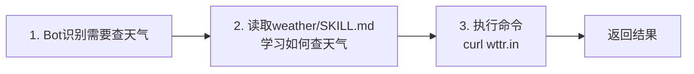
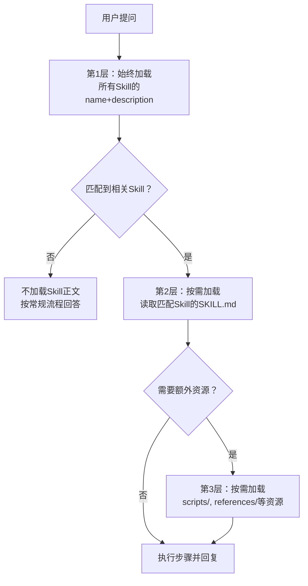

# 第 3 章：教 Bot 新技能

> 目标：理解 Skill 系统的设计原理，创建自己的第一个 Skill。

## 3.1 先看一个内置 Skill 怎么工作

在解释原理之前，我们先观察一个真实的 Skill 运作过程。

### 体验：weather Skill

nanobot 内置了一个 `weather` 技能，我们先看看它是怎么工作的：

```bash
nanobot agent -m "北京今天天气怎么样？"
```

**观察这几个关键时刻：**

```
用户：北京今天天气怎么样？
  ↓
Bot：让我查一下天气...
  ↓
[终端显示] 🔧 Tool: read_file(path="~/.nanobot/skills/weather/SKILL.md")
  ↓
[终端显示] 🔧 Tool: exec(command="curl -s 'wttr.in/Beijing?format=3'")
  ↓
Bot：北京今天多云，温度 15°C，空气质量良好。
```

### 🎯 三个关键观察点



**这就是 Skill 的核心流程：**
1. **识别场景** → Bot 从 skills 摘要中发现"有个 weather skill 可以查天气"
2. **按需学习** → Bot 读取完整的 `SKILL.md`，学习具体怎么做
3. **执行行动** → Bot 按照 Skill 中的指示调用工具

---

## 3.2 什么是 Skill？

Skill 是一个 Markdown 文件，**教会 Bot 如何做某件特定的事**。

### 类比理解

| 对比项 | 作用 |
|--------|------|
| `SOUL.md` | Bot **是谁**（性格） |
| `AGENTS.md` | Bot **怎么做事**（通用规则） |
| `Skill` | Bot **会做什么**（具体能力） |

### 最简单的形式

一个 Skill 最简单就是一个文件夹 + 一个 `SKILL.md`：

```
skills/
└── my-skill/
    └── SKILL.md
```

---

## 3.3 Skill 的触发机制（重要！）

这是理解 Skill 系统的关键。

### 渐进式加载

**Agent 不会一次性读取所有 Skill 的完整内容**——那样会占满上下文窗口。它用的是**渐进式加载**：



### 三层加载详解

| 层级 | 内容 | 何时加载 | 成本 |
|------|------|---------|------|
| 第 1 层 | 所有 Skill 的 `name` + `description` | 每次对话都加载 | ~1000 tokens |
| 第 2 层 | 被触发的 Skill 的 `SKILL.md` 正文 | 只有匹配时才加载 | ~500-2000 tokens |
| 第 3 层 | Skill 附带的 `scripts/`、`references/` | 只有需要时才加载 | 视具体文件而定 |

### 为什么这么设计？

**问题：** 如果把 100 个 Skill 的完整内容全塞进 System Prompt，会发生什么？
- 光 Skills 就占了几万个 token
- 留给对话历史的空间所剩无几
- 响应速度变慢，成本增加

**解决方案：** 渐进式加载
- 100 个 Skill 只占约 1000 个 token（只有名字和描述）
- 每次对话最多加载 1-2 个相关 Skill 的完整内容
- 用户感知不到任何延迟

---

## 3.4 动手：创建你的第一个 Skill

现在轮到你了。我们分三个难度等级来创建 Skill。

### Level 1：最简 Skill（验证触发机制）

先创建一个超简单的 Skill，目标是**验证触发机制**，而不是做复杂功能。

**步骤 1：创建文件**

```bash
mkdir -p ~/.nanobot/workspace/skills/hello
```

**步骤 2：创建 `~/.nanobot/workspace/skills/hello/SKILL.md`**

```markdown
---
name: hello
description: Say hello in a special way when the user asks you to greet them.
---

# Hello Skill

When the user asks you to say hello, respond with:

"🎉 Hello from your custom skill! This is proof that Skill loading works!"
```

**步骤 3：测试**

```bash
nanobot agent -m "请用 hello skill 向我打招呼"
```

**预期输出：**
```
🎉 Hello from your custom skill! This is proof that Skill loading works!
```

✅ **如果成功了** → 你已经掌握了 Skill 的基本触发机制！

❌ **如果没有触发** → 往下看"Skill 没触发？诊断树"

---

### Level 2：真正有用的 Skill（集成工具调用）

现在做一个真正有用的 Skill：查询实时汇率。

**步骤 1：创建目录**

```bash
mkdir -p ~/.nanobot/workspace/skills/exchange-rate
```

**步骤 2：创建 `~/.nanobot/workspace/skills/exchange-rate/SKILL.md`**

```markdown
---
name: exchange-rate
description: Query real-time exchange rates between currencies. Use when the user asks about currency conversion, exchange rates, or foreign currency prices.
---

# Exchange Rate

Use the free ExchangeRate API (no key required).

## Query current rate

\```bash
# Get rates from USD to other currencies
curl -s "https://open.er-api.com/v6/latest/USD" | python3 -c "
import sys, json
data = json.load(sys.stdin)
rates = data['rates']
print(f\"1 USD = {rates['CNY']} CNY\")
print(f\"1 USD = {rates['EUR']} EUR\")
print(f\"1 USD = {rates['JPY']} JPY\")
"
\```

## Convert amount

To convert a specific amount, replace $FROM, $TO, $AMOUNT:

\```bash
curl -s "https://open.er-api.com/v6/latest/USD" | python3 -c "
import sys, json
data = json.load(sys.stdin)
rate = data['rates']['CNY']
amount = 1000
print(f'{amount} USD = {amount * rate:.2f} CNY (rate: {rate})')
"
\```

## Supported currencies

Common: USD, CNY, EUR, GBP, JPY, KRW, HKD, TWD, SGD, AUD, CAD

Full list: https://open.er-api.com/v6/latest/USD
```

**步骤 3：测试**

```bash
nanobot agent -m "1000 美元等于多少人民币？"
```

**预期输出：**
```
让我查询最新汇率...
[工具调用过程]
根据当前汇率，1000 美元约等于 7,234 人民币（数据来源：ExchangeRate-API，查询时间：2026-06-15）
```

---

### Level 3：生产可用的 Skill（添加错误处理）

<details>
<summary>点击展开：添加错误处理和边界情况</summary>

完整的生产级 Skill 应该考虑：
- ✅ 网络请求失败
- ✅ 不支持的货币代码
- ✅ API 返回格式变化
- ✅ 数据源说明和时效性提示

```markdown
---
name: exchange-rate
description: Query real-time exchange rates between currencies. Use when the user asks about currency conversion, exchange rates, or foreign currency prices.
metadata: {"nanobot":{"requires":{"bins":["curl","python3"]}}}
---

# Exchange Rate

Use the free ExchangeRate API (no key required).

## Query current rate

\```bash
# Get rates with error handling
curl -s "https://open.er-api.com/v6/latest/USD" | python3 -c "
import sys, json
try:
    data = json.load(sys.stdin)
    if data.get('result') != 'success':
        print('Error: API returned failure')
        sys.exit(1)
    rates = data['rates']
    print(f\"1 USD = {rates['CNY']:.2f} CNY\")
    print(f\"1 USD = {rates['EUR']:.4f} EUR\")
    print(f\"1 USD = {rates['JPY']:.2f} JPY\")
    print(f\"Data source: ExchangeRate-API\")
    print(f\"Last updated: {data.get('time_last_update_utc', 'unknown')}\")
except json.JSONDecodeError:
    print('Error: Invalid JSON response')
    sys.exit(1)
except KeyError as e:
    print(f'Error: Currency not found: {e}')
    sys.exit(1)
"
\```

## Convert amount

\```bash
# Example: convert 1000 USD to CNY
FROM="USD"
TO="CNY"
AMOUNT=1000

curl -s "https://open.er-api.com/v6/latest/$FROM" | python3 -c "
import sys, json
try:
    data = json.load(sys.stdin)
    if data.get('result') != 'success':
        print('Error: API returned failure')
        sys.exit(1)
    rate = data['rates']['$TO']
    amount = $AMOUNT
    result = amount * rate
    print(f'{amount} $FROM = {result:.2f} $TO')
    print(f'Exchange rate: 1 $FROM = {rate:.4f} $TO')
    print(f'Data source: ExchangeRate-API')
except (json.JSONDecodeError, KeyError) as e:
    print(f'Error: {e}')
    sys.exit(1)
"
\```

## Notes

- Data updates every 24 hours
- Free tier has no authentication
- For production use, consider caching results
- Supported currencies: 161 total (see API docs)
```

</details>

---

## 3.5 Skill 没触发？用这个诊断树

如果你的 Skill 没有被触发，不要慌，按这个流程逐一排查：

```mermaid
flowchart TD
    start[Skill 没触发] --> q1{文件在正确位置？}
    q1 -- 否 --> fix1[检查路径<br/>应该是 ~/.nanobot/workspace/skills/skill-name/SKILL.md]
    q1 -- 是 --> q2{frontmatter 正确？}
    
    q2 -- 否 --> fix2[检查 frontmatter<br/>至少要有 name 和 description]
    q2 -- 是 --> q3{依赖命令存在？}
    
    q3 -- 否 --> fix3[安装依赖<br/>如 curl, python3, gh 等]
    q3 -- 是 --> q4{description 足够清晰？}
    
    q4 -- 否 --> fix4[改进 description<br/>说明"做什么"和"什么时候用"]
    q4 -- 是 --> q5{提问方式明确？}
    
    q5 -- 否 --> fix5[用更明确的问法<br/>如"请用 XXX skill 完成..."]
    q5 -- 是 --> fix6[可能是模型问题<br/>换个模型或调整 temperature]
    
    fix1 --> verify[重新测试]
    fix2 --> verify
    fix3 --> verify
    fix4 --> verify
    fix5 --> verify
    fix6 --> verify
```

### 诊断步骤详解

#### 问题 1：文件在正确位置吗？

**检查命令：**
```bash
ls -la ~/.nanobot/workspace/skills/exchange-rate/
# 应该看到 SKILL.md
```

**常见错误：**
- ❌ `~/.nanobot/skills/exchange-rate/SKILL.md`（少了 workspace）
- ❌ `~/.nanobot/workspace/exchange-rate/SKILL.md`（少了 skills）
- ❌ `~/.nanobot/workspace/skills/SKILL.md`（少了子目录）

---

#### 问题 2：frontmatter 正确吗？

**检查命令：**
```bash
head -n 5 ~/.nanobot/workspace/skills/exchange-rate/SKILL.md
```

**必须包含：**
```yaml
---
name: exchange-rate
description: Query real-time exchange rates...
---
```

**常见错误：**
- ❌ 缺少前后的 `---`
- ❌ `description` 是空的或太简短
- ❌ `name` 和目录名不一致（虽然允许，但容易混淆）

---

#### 问题 3：依赖命令存在吗？

**检查命令：**
```bash
which curl
which python3
```

**如果缺少：**
```bash
# Ubuntu/Debian
sudo apt install curl python3

# macOS
brew install curl python3

# Windows
# 使用 Git Bash 或 WSL
```

---

#### 问题 4：description 足够清晰吗？

**❌ 坏示例：**
```yaml
description: Exchange rate tool
```

**✅ 好示例：**
```yaml
description: Query real-time exchange rates between currencies. Use when the user asks about currency conversion, exchange rates, or foreign currency prices.
```

**改进原则：**
- 说明"做什么"
- 说明"什么时候用"
- 包含关键词（如 "currency", "exchange", "conversion"）

---

#### 问题 5：提问方式明确吗？

**低触发率问法：**
```bash
"美元对人民币是多少？"  # 太简短，模型可能直接猜答案
```

**高触发率问法：**
```bash
"请用 exchange-rate skill 查询 1000 美元等于多少人民币，并说明数据来源"
```

**稳定触发的 3 类问法：**

1. **直接点名 Skill**
   ```
   请用 exchange-rate skill 查询...
   ```

2. **点名任务 + 数据来源**
   ```
   请查询当前 USD/CNY 汇率，并告诉我你使用了什么来源
   ```

3. **点名动作**
   ```
   请先读取相关 Skill，再完成汇率换算
   ```

---

### 快速诊断脚本

```bash
#!/bin/bash
# 保存为 check-skill.sh

SKILL_NAME=$1
SKILL_PATH=~/.nanobot/workspace/skills/$SKILL_NAME

echo "=== Skill 诊断 ==="
echo "Skill名称: $SKILL_NAME"
echo

# 检查1：路径
if [ -d "$SKILL_PATH" ]; then
    echo "✓ 目录存在: $SKILL_PATH"
else
    echo "✗ 目录不存在: $SKILL_PATH"
    exit 1
fi

# 检查2：SKILL.md
if [ -f "$SKILL_PATH/SKILL.md" ]; then
    echo "✓ SKILL.md 存在"
else
    echo "✗ SKILL.md 不存在"
    exit 1
fi

# 检查3：frontmatter
if head -n 1 "$SKILL_PATH/SKILL.md" | grep -q "^---$"; then
    echo "✓ frontmatter 格式正确"
else
    echo "✗ frontmatter 格式错误（应该以 --- 开头）"
fi

# 检查4：name 和 description
if grep -q "^name:" "$SKILL_PATH/SKILL.md"; then
    echo "✓ 包含 name 字段"
else
    echo "✗ 缺少 name 字段"
fi

if grep -q "^description:" "$SKILL_PATH/SKILL.md"; then
    echo "✓ 包含 description 字段"
else
    echo "✗ 缺少 description 字段"
fi

echo
echo "=== Skill 内容预览 ==="
head -n 10 "$SKILL_PATH/SKILL.md"
```

**使用方法：**
```bash
bash check-skill.sh exchange-rate
```

---

## 3.6 Skill 的高级结构

简单 Skill 只需要一个 `SKILL.md`。复杂 Skill 可以带资源文件：

```
my-skill/
├── SKILL.md           ← 必须有（入口）
├── scripts/           ← 可执行脚本（确定性操作）
│   └── process.py
├── references/        ← 参考文档（按需读取）
│   ├── api-docs.md
│   └── schema.md
└── assets/            ← 资源文件（模板、图片等）
    └── template.html
```

### 何时使用各个目录

| 目录 | 用途 | 何时使用 | 示例 |
|------|------|---------|------|
| `scripts/` | 确定性的可执行代码 | 同样的操作需要反复执行 | PDF 旋转、数据格式转换 |
| `references/` | 文档参考资料 | Agent 需要查阅的专业知识 | API 文档、数据库 Schema |
| `assets/` | 输出资源 | 需要被复制/使用的文件 | 模板、图标 |

### 什么时候写进 Skill，什么时候下沉成 Tool 或 scripts/

这是最容易混淆的边界。

**适合写进 `SKILL.md` 正文的：**
- ✅ 什么时候该用某种能力
- ✅ 一段任务说明或工作方法
- ✅ 少量可直接执行的命令模板
- ✅ 某个领域里的操作顺序和注意事项

**不适合只写在 `SKILL.md` 里的：**
- ❌ 稳定、反复执行的解析逻辑 → `scripts/`
- ❌ 需要强输入输出约束的步骤 → Tool
- ❌ 很长的 shell one-liner → `scripts/`
- ❌ 容易因为模型改写而出错的核心计算 → Tool 或 `scripts/`

**经验法则：**
- 如果你在教 Agent **"什么时候做、怎么做"** → 优先写 `SKILL.md`
- 如果你在追求 **"稳定地做对"** → 优先下沉成 Tool 或 `scripts/`

---

## 3.7 Frontmatter 详解

```yaml
---
name: my-skill              # 必填：Skill 名称
description: ...             # 必填：描述（触发依据！）
always: true                 # 可选：始终加载到上下文
metadata: {"nanobot": {...}} # 可选：依赖声明、图标等
---
```

### description 是最重要的字段

`description` 是 Agent 判断"要不要读这个 Skill"的**首要线索**。

**好的写法：**
```yaml
description: Query real-time exchange rates between currencies. Use when the user asks about currency conversion, exchange rates, or foreign currency prices.
```

**差的写法：**
```yaml
description: Exchange rate tool
```

**原则：** 告诉 Agent "这个 Skill 干什么" + "什么情况下该用它"

### always 标记

设置 `always: true` 的 Skill 会在每次对话时**完整加载**到 System Prompt 中。

**何时使用：**
- 记忆管理规则（如内置的 `memory` skill）
- 必须时刻遵守的约束

**何时不用：**
- 大多数 Skill 不需要，按需加载效率更高

### metadata 字段

```yaml
metadata: {
  "nanobot": {
    "emoji": "🌤️",
    "requires": {
      "bins": ["curl", "python3"],
      "env": ["API_KEY"]
    }
  }
}
```

**用途：**
- 声明依赖（`requires.bins`、`requires.env`）
- 如果依赖不满足，Skill 会被标记为 unavailable

---

## 3.8 Skill 的加载优先级

nanobot 会从两个地方查找 Skill：

```
1. ~/.nanobot/workspace/skills/  ← 用户自定义（优先级高）
2. nanobot 安装目录/skills/      ← 内置（优先级低）
```

**如果两个地方有同名 Skill，workspace 中的优先。**

你可以用这个机制覆盖内置 Skill 的行为。

---

## 3.9 练习

### 入门练习

创建一个 `translator` Skill，让 Bot 在翻译时遵循特定规则（比如保留专有名词不翻译）。

<details>
<summary>点击查看参考答案</summary>

```markdown
---
name: translator
description: Translate text between languages while preserving proper nouns and technical terms. Use when the user asks to translate text.
---

# Translator Skill

## Rules

1. Preserve proper nouns (names, places, brands)
2. Preserve technical terms (API, HTTP, JSON, etc.)
3. Maintain formatting (markdown, code blocks)
4. Provide both literal and contextual translations when needed

## Example

User: "Translate to Chinese: Apple released the new iPhone with improved API."

Output:
- Literal: "Apple 发布了新的 iPhone，改进了 API。"
- Contextual: "苹果公司发布了新款 iPhone，改进了应用程序接口。"

Note: "Apple" (company name), "iPhone" (product name), and "API" (technical term) are preserved.
```

</details>

---

### 进阶练习

创建一个带 `scripts/` 的 Skill，比如一个自动格式化 JSON 的工具。

<details>
<summary>点击查看参考答案</summary>

**目录结构：**
```
skills/json-format/
├── SKILL.md
└── scripts/
    └── format.py
```

**SKILL.md：**
```markdown
---
name: json-format
description: Format and validate JSON text. Use when the user provides JSON that needs to be prettified or validated.
metadata: {"nanobot":{"requires":{"bins":["python3"]}}}
---

# JSON Format Skill

Use the format script to prettify and validate JSON.

## Usage

\```bash
python3 ~/.nanobot/workspace/skills/json-format/scripts/format.py <input.json>
\```

The script will:
- Validate JSON syntax
- Pretty-print with 2-space indentation
- Report errors if invalid
```

**scripts/format.py：**
```python
#!/usr/bin/env python3
import json
import sys

def format_json(input_file):
    try:
        with open(input_file) as f:
            data = json.load(f)
        print(json.dumps(data, indent=2, ensure_ascii=False))
    except json.JSONDecodeError as e:
        print(f"Error: Invalid JSON - {e}", file=sys.stderr)
        sys.exit(1)
    except FileNotFoundError:
        print(f"Error: File not found - {input_file}", file=sys.stderr)
        sys.exit(1)

if __name__ == "__main__":
    if len(sys.argv) < 2:
        print("Usage: format.py <input.json>", file=sys.stderr)
        sys.exit(1)
    format_json(sys.argv[1])
```

</details>

---

## 小结

| 概念 | 核心要点 |
|------|---------|
| **Skill 是什么** | 教 Bot 如何做某件事的 Markdown 文件 |
| **触发机制** | 三层渐进式加载：摘要 → 正文 → 资源 |
| **最小结构** | 一个目录 + 一个 SKILL.md（包含 frontmatter） |
| **最重要的字段** | `description`（决定是否触发） |
| **调试思路** | 路径 → frontmatter → 依赖 → description → 问法 |

---

## 下一步

✅ **如果 Skill 成功触发** → 继续 [第 4 章：本地完整验收](04-local-integration.md)

❌ **如果还是没触发** → 去 [附录：常见坑与排障](../appendix/troubleshooting.md) 查看 Skill 排障专题

🤔 **如果想理解更深层原理** → 去 [进阶营第 5 章：技能与扩展](../hero/05-skills-and-beyond.md)
