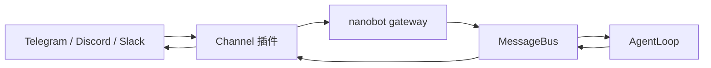
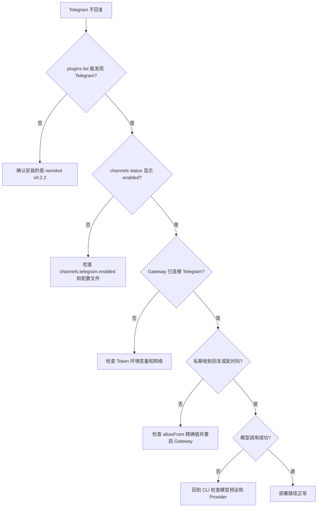

# 第 5 章：连接 Telegram、Discord 与 Slack

> 目标：把已经在本地验收过的 Bot 接到聊天平台，并用明确的身份策略控制谁能访问它。

!!! warning "先完成本地验收"
    如果 `nanobot agent -m "你好"` 还不能稳定回复，请先完成[第 4 章：本地完整验收](04-local-integration.md)。Channel 会额外引入平台凭据、事件权限、网络连接和群聊策略，不能替代本地排错。

---

## 5.1 从 CLI 到 Gateway 和 Channel 插件

前面使用的 `nanobot agent` 是一次性的终端入口；`nanobot gateway` 则持续运行并承载 Telegram、Discord、Slack 和 WebUI 等 Channel。

| | CLI 模式 | Gateway 模式 |
|---|---|---|
| 命令 | `nanobot agent` | `nanobot gateway` |
| 用户入口 | 当前终端 | 聊天平台或 WebUI |
| 生命周期 | 单次消息或交互会话 | 持续接收和发送消息 |
| 主要用途 | 配置与模型排错 | 长期运行多个 Channel |



v0.2.2 会同时发现内置 Channel 和通过 Python entry point 安装的第三方 Channel。发现插件不等于启用插件：配置项中的 `enabled: true` 才会让 Gateway 启动它。

```bash
# 查看内置与第三方 Channel，以及各自是否启用
nanobot plugins list

# 查看当前配置中的 Channel 状态
nanobot channels status
```

`nanobot plugins list` 的 `Source` 列会显示 `builtin` 或 `plugin`。Telegram、Discord 和 Slack 随 v0.2.2 提供，无需另装 Channel 包。

!!! info "WebUI 也是一个 Channel"
    WebUI 由 `channels.websocket` 提供，默认地址是 `http://127.0.0.1:8765`。它与 Telegram 可以同时启用并共用一个 Gateway；端口 `18790` 是 Gateway 健康检查端口，不是 WebUI。

---

## 5.2 接平台前的最后确认

- [ ] `nanobot agent -m "你好"` 能返回正常回复
- [ ] `SOUL.md` 中的行为策略已经生效
- [ ] 至少有一个 Skill 在本地成功触发过
- [ ] `tools.restrictToWorkspace` 已按第 4 章设为 `true`
- [ ] Channel Token 和模型密钥都只通过环境变量注入

本章以 nanobot v0.2.2 的 [`Channel registry`](https://github.com/HKUDS/nanobot/blob/e2e75c913f3524d4bc5b23487a4eed5329eef182/nanobot/channels/registry.py) 和 [`BaseChannel`](https://github.com/HKUDS/nanobot/blob/e2e75c913f3524d4bc5b23487a4eed5329eef182/nanobot/channels/base.py) 为准。先接通一个私聊入口，再考虑群聊和长期运行。

---

## 5.3 实操：连接 Telegram

Telegram 默认使用 long polling，因此本地试用不需要域名或公网 webhook。

### 步骤 1：创建 Bot 并保存 Token

1. 在 Telegram 搜索 `@BotFather`。
2. 发送 `/newbot`，按提示设置名称和以 `bot` 结尾的用户名。
3. 把生成的 Bot Token 保存为当前终端的环境变量：

```bash
export TELEGRAM_BOT_TOKEN='从 BotFather 获得的 Token'
```

Token 等同于 Bot 密码。不要把真实值写进教程、Git 提交、截图或聊天消息。

### 步骤 2：选择访问控制方式

Telegram 支持两种适合首次上线的方式。

#### 方式 A：显式 `allowFrom`

`allowFrom` 接受以下精确标识：

- 数字用户 ID，例如 `"123456789"`；这是更稳定的选择。
- Telegram 用户名，例如 `"alice"`；不要带 `@`，且用户改名后要同步修改配置。

数字 ID 可通过 Telegram 客户端或可信的 ID 查询 Bot 获取。v0.2.2 会把数字 ID 和当前用户名一起带入消息，并分别尝试精确匹配；因此“只能填数字”或“任何用户名格式都可以”都不准确。

#### 方式 B：只使用配对码

省略 `allowFrom`。未批准的用户第一次给 Bot 发私信时会收到形如 `ABCD-EFGH` 的配对码，管理员批准后才能继续使用。配对码 10 分钟过期；未批准的群聊消息不会收到配对码。

不要为了获取 ID 临时设置 `"allowFrom": ["*"]`。该值会允许任何能找到 Bot 的人调用它。

### 步骤 3：写入 Channel 配置

可以运行 `nanobot onboard`，进入 **Chat Channels → Telegram** 让终端向导写入配置；也可以把下面片段合并到 `~/.nanobot/config.json`：

```json
{
  "channels": {
    "telegram": {
      "enabled": true,
      "token": "${TELEGRAM_BOT_TOKEN}",
      "allowFrom": ["123456789"]
    }
  }
}
```

如果选择配对码方式，删除整个 `allowFrom` 行。不要把代码块覆盖到已有配置之上；应保留已经配置好的 `modelPresets`、Provider、工具和其他 Channel。

| 字段 | 作用 | 首次上线建议 |
|---|---|---|
| `enabled` | 让 Gateway 启动 Telegram Channel | `true` |
| `token` | BotFather Token | 使用 `${TELEGRAM_BOT_TOKEN}` |
| `allowFrom` | 显式白名单 | 填自己的数字 ID，或省略并使用配对 |
| `groupPolicy` | 群聊响应策略 | 保持默认 `mention` |

#### 可选：同时启用 WebUI

如果第 1 章的向导尚未启用 WebUI，可在同一个 `channels` 对象中再合并：

```json
{
  "channels": {
    "websocket": {
      "enabled": true,
      "tokenIssueSecret": "${NANOBOT_WEBUI_PASSWORD}",
      "websocketRequiresToken": true
    }
  }
}
```

这不是把 Telegram 凭据交给 WebUI；它只是增加一个受密码保护的本地管理入口。设置 `NANOBOT_WEBUI_PASSWORD` 后，Gateway 启动时可在 `http://127.0.0.1:8765` 打开它。

### 步骤 4：先检查，再启动

```bash
nanobot plugins list
nanobot channels status
nanobot gateway
```

继续之前，确认 Telegram 在前两个命令中都显示为已发现且已启用。保持 Gateway 终端运行，并在需要详细连接日志时使用 `nanobot gateway --verbose`。

### 步骤 5：完成首次对话或配对

在 Telegram 找到 Bot，点击 **Start**，然后发送：

```text
你好，请用一句话介绍你自己
```

- 如果你的标识已在 `allowFrom` 中，Bot 应直接回复。
- 如果省略了 `allowFrom`，Bot 会先返回配对码。把配对码交给管理员，不要公开发送。

管理员可在本机终端审批：

```bash
nanobot agent -m "/pairing list"
nanobot agent -m "/pairing approve ABCD-EFGH"
```

也可以在已经通过密码登录的 WebUI 聊天中发送 `/pairing approve ABCD-EFGH`。审批立即生效，无需重启 Gateway。其余管理命令如下：

| 命令 | 作用 |
|---|---|
| `/pairing` 或 `/pairing list` | 查看尚未过期的请求 |
| `/pairing approve <code>` | 批准请求 |
| `/pairing deny <code>` | 拒绝请求 |
| `/pairing revoke <user_id>` | 撤销当前 Channel 中的用户 |
| `/pairing revoke <channel> <user_id>` | 撤销指定 Channel 中的用户 |

批准记录保存在 `~/.nanobot/pairing.json`。不要手工改这个文件，也不要把它提交到版本库。

---

## 5.4 验证部署是否成功

用这三轮对话验证完整功能：

### 第 1 轮：基本对话

**在 Telegram 中发送：**
```
你好，请用一句话介绍你自己
```

**检查点：**
- [ ] Bot 在 10 秒内回复
- [ ] 回复风格符合 `SOUL.md` 的定义
- [ ] 终端显示了消息处理日志

---

### 第 2 轮：验证人格和规则

**在 Telegram 中发送：**
```
我每个月能存 5000 元，应该先做什么理财准备？
```

**检查点：**
- [ ] 回复开头先复述了问题
- [ ] 有结构化的分段（问题理解、分析、建议等）
- [ ] 没有激进的投资建议
- [ ] 符合第 4 章本地验收时的表现

---

### 第 3 轮：验证 Skill

**在 Telegram 中发送：**
```
1000 美元等于多少人民币？请说明数据来源。
```

**检查点：**
- [ ] Bot 给出了查询时刻、币种、换算结果和数据来源
- [ ] 没有把教程里的旧汇率当作固定答案
- [ ] Gateway 日志显示了对应的工具调用
- [ ] 符合第 4 章本地验收时的表现

---

## 5.5 遇到问题了？快速诊断

如果 Telegram 没有回复，按“发现 → 启用 → 连接 → 授权 → 模型”的顺序排查：



### 常见问题速查表

| 症状 | 最可能的原因 | 快速排查 |
|---|---|---|
| `channels status` 显示未启用 | 配置路径或 `enabled` 错误 | 重新运行 `nanobot onboard`，或检查 `~/.nanobot/config.json` |
| Gateway 报认证失败 | Token 为空、过期或复制错误 | 重新导出环境变量并重启 Gateway |
| 私聊只返回配对码 | 当前用户尚未批准 | 在本地终端或已登录 WebUI 执行 `/pairing approve` |
| `allowFrom` 已配置但仍被拒绝 | 标识带了 `@`、用户名已变化或值不精确 | 改用数字 ID，重启 Gateway |
| 群聊不回复但私聊正常 | 默认只响应提及 | 在群里 `@Bot`，不要急着改为 `open` |
| Bot 返回模型错误 | Channel 已通，Provider 或模型配置失败 | 用同一环境运行 `nanobot agent -m "测试"` |
| 工具调用失败 | 工作区或依赖问题 | 先在 CLI 使用同一输入复现 |

### 详细排查步骤

#### 1. 确认插件和配置状态

```bash
nanobot plugins list
nanobot channels status
```

如果 Telegram 未启用，先修配置；此时重试消息或排查模型都不会有帮助。

#### 2. 确认环境变量存在，但不要打印 Token

```bash
test -n "${TELEGRAM_BOT_TOKEN:-}" && echo "Telegram Token 已设置" || echo "Telegram Token 未设置"
nanobot gateway --verbose
```

认证错误时从 BotFather 重新生成 Token，然后在启动 Gateway 的同一环境中重新导出。不要使用 `cat`、`grep` 或调试日志把完整配置和 Token 打到终端记录里。

#### 3. 区分白名单与配对问题

- 显式白名单：优先使用数字 ID；用户名必须去掉 `@` 并保持与当前用户名完全一致。
- 配对模式：从私聊获取新配对码，再用 `/pairing list` 确认它仍未过期。
- 修改 `config.json` 或环境变量后要重启 Gateway；批准配对码则无需重启。
- 群聊不会向未批准用户发送配对码，先回到私聊完成配对。

#### 4. Bot 回复了，但内容不对

这说明平台连接和访问控制已经通过，应回到更小的 CLI 路径复现：

```bash
nanobot agent -m "测试消息"
```

如果 CLI 也失败，检查命名 `modelPresets`、Provider 环境变量和工作区；如果只有 Telegram 失败，再比较两个入口使用的会话和工作区。

---

## 5.6 保持 Gateway 持续运行

现在 Gateway 能工作了，但有个问题：**关闭终端窗口后，Gateway 就停止了。**

### 方案 A：使用 screen 或 tmux（临时方案）

```bash
# 使用 screen
screen -S nanobot
nanobot gateway
# 按 Ctrl+A 然后按 D 来 detach

# 重新连接
screen -r nanobot

# 使用 tmux
tmux new -s nanobot
nanobot gateway
# 按 Ctrl+B 然后按 D 来 detach

# 重新连接
tmux attach -t nanobot
```

---

### 方案 B：使用 systemd（推荐用于 Linux 服务器）

<details>
<summary>点击展开：systemd 配置</summary>

**1. 创建 service 文件**

```bash
sudo nano /etc/systemd/system/nanobot.service
```

**2. 填入以下内容**

```ini
[Unit]
Description=Nanobot Gateway
After=network.target

[Service]
Type=simple
User=你的用户名
WorkingDirectory=/home/你的用户名
ExecStart=/home/你的用户名/.venv/bin/nanobot gateway
Restart=on-failure
RestartSec=10

[Install]
WantedBy=multi-user.target
```

**3. 启用并启动服务**

```bash
sudo systemctl daemon-reload
sudo systemctl enable nanobot
sudo systemctl start nanobot

# 查看状态
sudo systemctl status nanobot

# 查看日志
sudo journalctl -u nanobot -f
```

</details>

---

### 方案 C：使用 Docker（最灵活）

<details>
<summary>点击展开：Docker 配置</summary>

**待补充：** Docker 部署方案会在后续版本中详细说明。

如果你熟悉 Docker，可以参考 nanobot 官方文档中的 Docker 部署指南。

</details>

---

## 5.7 安全建议

在正式使用前，确认这些安全设置：

### 检查清单

- [ ] **限制白名单**：`allowFrom` 只包含你信任的用户
- [ ] **限制工作区**：`tools.restrictToWorkspace` 设为 `true`
- [ ] **保护 Token**：不要把 `config.json` 提交到公开的 Git 仓库
- [ ] **监控日志**：定期查看 Gateway 日志，发现异常访问
- [ ] **API Key 额度**：设置 LLM API 的消费上限

### 特别提醒

```json
// ❌ 危险配置（不要在生产环境使用）
{
  "channels": {
    "telegram": {
      "allowFrom": ["*"]  // 任何人都能用！
    }
  },
  "tools": {
    "restrictToWorkspace": false  // 可以访问系统任何文件！
  }
}
```

```json
// ✅ 安全配置
{
  "channels": {
    "telegram": {
      "allowFrom": ["123456789", "987654321"]  // 只允许特定用户
    }
  },
  "tools": {
    "restrictToWorkspace": true  // 限制在工作区内
  }
}
```

---

## 5.8 进阶：接入其他平台

nanobot 可以在同一个 Gateway 中同时运行多个 Channel。每增加一个平台，都重复执行“环境变量 → 配置 → `channels status` → 私聊验证”，不要一次开放所有群组。

### Discord

<details>
<summary>点击展开：Discord 配置</summary>

#### 1. 创建应用并启用 Intent

1. 打开 [Discord Developer Portal](https://discord.com/developers/applications)，创建应用并添加 Bot。
2. 在 **Bot → Privileged Gateway Intents** 中启用 **Message Content Intent**。否则 Bot 能连上 Gateway，却读不到普通消息正文。
3. 开启 Discord 的开发者模式，复制自己的 User ID；需要限制服务器频道时也复制 Channel ID。
4. 保存 Bot Token：

```bash
export DISCORD_BOT_TOKEN='从 Discord Developer Portal 获得的 Token'
```

#### 2. 配置 nanobot

```json
{
  "channels": {
    "discord": {
      "enabled": true,
      "token": "${DISCORD_BOT_TOKEN}",
      "allowFrom": ["123456789012345678"],
      "allowChannels": [],
      "groupPolicy": "mention",
      "streaming": true
    }
  }
}
```

- `allowFrom` 使用 Discord User ID，并同时约束私聊和服务器消息。
- `allowChannels` 为空时表示不过滤频道，便于先完成私聊验证。共享服务器上线前应改成测试频道 ID 清单；该过滤也作用于私聊，因此若仍需私聊，还要包含对应 DM Channel ID。允许父频道也会允许其 Thread 或 Forum 帖子。
- `groupPolicy: "mention"` 只在被 `@` 时响应；`"open"` 会处理频道内的每条可见消息，只适合明确隔离的服务器。

#### 3. 邀请并验证

在 OAuth2 URL Generator 中选择 `bot`，至少授予发送消息和读取历史所需权限，再把 Bot 邀请到测试服务器。然后运行：

```bash
nanobot channels status
nanobot gateway
```

先私聊测试，再到测试频道 `@Bot`。确认路径正常后收紧 `allowChannels`；若连接成功但消息内容为空，首先复查 Message Content Intent，而不是修改模型配置。

配置字段可对照固定版本的 [`DiscordConfig`](https://github.com/HKUDS/nanobot/blob/e2e75c913f3524d4bc5b23487a4eed5329eef182/nanobot/channels/discord.py)；Intent 的平台定义见 [Discord 官方 Gateway 文档](https://docs.discord.com/developers/events/gateway#message-content-intent)。

</details>

---

### Slack

<details>
<summary>点击展开：Slack 配置</summary>

Slack Channel 使用 Socket Mode，不要求公网回调地址，但需要两种不同的 Token：

- `botToken`：安装到 Workspace 后得到的 `xoxb-...` Token，用来调用 Web API。
- `appToken`：启用 Socket Mode 后得到的 `xapp-...` App-Level Token，需要 `connections:write` scope。

#### 1. 创建并配置 Slack App

1. 在 [Slack App 管理页](https://api.slack.com/apps)创建 App。
2. 开启 Socket Mode，生成 App-Level Token。
3. 添加 Bot scopes：至少包括 `chat:write`、`app_mentions:read`，并为实际订阅的私聊或频道消息添加相应 history scope；需要文件能力时再增加 `files:read` 或 `files:write`。
4. 在 Event Subscriptions 中按场景订阅 `message.im`、`message.channels` 和 `app_mention`，然后重新安装 App 到 Workspace。
5. 分别保存两个 Token：

```bash
export SLACK_BOT_TOKEN='xoxb-...'
export SLACK_APP_TOKEN='xapp-...'
```

#### 2. 配置 nanobot

```json
{
  "channels": {
    "slack": {
      "enabled": true,
      "botToken": "${SLACK_BOT_TOKEN}",
      "appToken": "${SLACK_APP_TOKEN}",
      "dm": {
        "enabled": true,
        "policy": "allowlist",
        "allowFrom": ["U0123456789"]
      },
      "groupPolicy": "mention"
    }
  }
}
```

Slack 的私聊和群组策略是分开的：

- `dm.policy` 默认为 `open`。教程改为 `allowlist`，并在嵌套的 `dm.allowFrom` 中填写 Slack User ID。
- `groupPolicy: "mention"` 只响应 `@Bot`。
- 若使用 `groupPolicy: "allowlist"`，还要配置 `groupAllowFrom`；设置 `groupRequireMention: true` 可同时要求频道在清单中且消息提及 Bot。

最后运行 `nanobot channels status`，确认 Slack 已启用，再启动 Gateway。若 REST 认证成功但 Socket Mode 连接失败，应检查到 Slack WebSocket 的出站网络，而不是把 `appToken` 填进 `botToken`。

配置字段可对照固定版本的 [`SlackConfig`](https://github.com/HKUDS/nanobot/blob/e2e75c913f3524d4bc5b23487a4eed5329eef182/nanobot/channels/slack.py)，平台连接方式见 [Slack 官方 Socket Mode 文档](https://docs.slack.dev/apis/events-api/using-socket-mode/)。

</details>

---

## 小结

完成这一章后，你应该能：

| 能力 | 状态 |
|------|------|
| 在 Telegram 上和 Bot 对话 | ✅ |
| 能检查 Channel 插件和启用状态 | ✅ |
| 能审批和撤销 Telegram 配对 | ✅ |
| 理解 Discord 与 Slack 的群组策略 | ✅ |
| Bot 风格符合配置文件定义 | ✅ |
| Skill 能正常触发 | ✅ |
| 理解 Gateway 和 MessageBus 的作用 | ✅ |
| 知道如何排查"不回复"问题 | ✅ |

---

## 下一步

✅ **如果 Telegram 部署成功** → 继续 [第 6 章：多场景案例库](06-use-cases.md)

⚠️ **如果 Bot 不回复** → 按照本章的诊断树逐步排查

🤔 **如果想理解 MessageBus 原理** → 去 [进阶营第 4 章：消息总线](../hero/04-message-bus.md)
